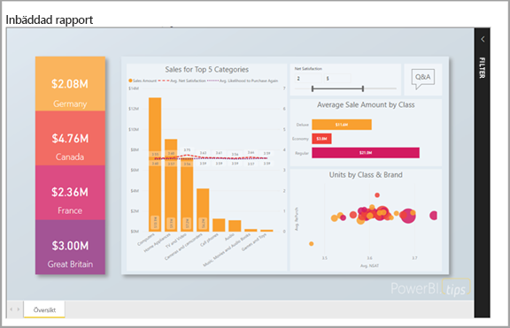
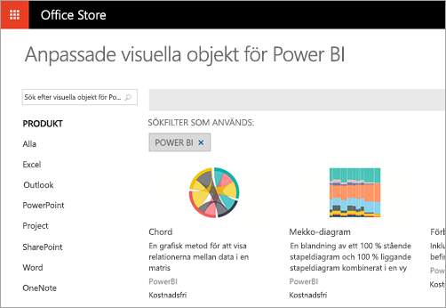
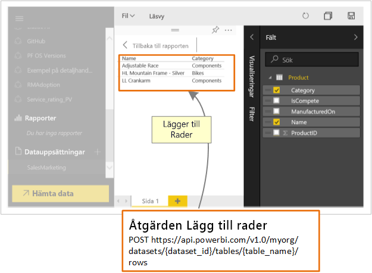

# Vad kan utvecklare göra med Power BI?

Utvecklare har olika alternativ som försöker inkludera Power BI-innehåll i program. Som utvecklare kan du använda alternativ, som inkluderar **bädda in med Power BI**, **anpassade visuella objekt** och **skicka data till Power BI**.

## Bädda in Power BI-innehåll

Power BI-tjänsten (SaaS) och Power BI Embedded-tjänsten i Azure (PaaS) har API:er för inbäddning av dina instrumentpaneler och rapporter. Det innebär att du får tillgång till de senaste funktionerna i Power BI när du bäddar in innehåll, till exempel instrumentpaneler, gatewayer och apparbetsytor.

Med [konfigurationsverktyget för inbäddning](https://aka.ms/embedsetup) kommer du snabbt igång och kan ladda ned ett exempelprogram.

Välj den lösning som passar dig:

* [Inbäddning för dina kunder](embedding.md#embedding-for-your-customers) ger dig möjlighet att bädda in instrumentpaneler och rapporter för användare som inte har något Power BI-konto. Kör lösningen [Embed for your customers](https://aka.ms/embedsetup/AppOwnsData) (Bädda in för dina kunder).

* [Inbäddning för din organisation](embedding.md#embedding-for-your-organization) låter dig utöka Power BI-tjänsten. Kör lösningen [Embed for your organization](https://aka.ms/embedsetup/UserOwnsData) (Bädda in för din organisation).

Läs mer om inbäddning med Power BI i [Inbäddning med Power BI](embedding.md).

## Utveckla anpassade visuella objekt

Du kan använda anpassade visuella objekt med Power BI om du vill skapa en unik form av visuella objekt som är skräddarsydd för dig. Dessa anpassade visuella objekt skapas ofta av utvecklare. De byggs när de visuella objekt som ingår i Power BI inte helt uppfyller dina behov.

Med anpassade visuell objekt kan du skapa visuell objekt för användning i Power BI-rapporter. Anpassade visuella objekt skrivs i TypeScript, som är en supermängd till JavaScript. TypeScript stöder vissa avancerade funktioner och snabb åtkomst till ES6-/ES7-funktioner. Visual formatering hanteras med sammanhängande formatmallar (CSS). För din bekvämlighet använder vi förkompileraren Less som stöder avancerade funktioner, som kapsling, variabler, villkor, slingor och fler. Du kan skriva vanlig CSS i Less-filen om du inte vill använda någon av dessa funktioner.

Om du vill börja lära dig mer om anpassad visuell utveckling kan du läsa [Utveckla ett anpassat visuellt objekt i Power BI](custom-visual-develop-tutorial.md).

## Använda API-automatisering

Power BI visar instrumentpaneler som är interaktiva och som kan skapas och uppdateras från många olika datakällor i realtid. Du kan skapa appar som integreras med en Power BI-instrumentpanel i realtid med alla programmeringsspråk som har stöd för REST-anrop. Du kan också integrera Power BI-paneler och -rapporter i appar.

Utvecklare kan också skapa egna datavisualiseringar som kan användas i interaktiva rapporter och instrumentpaneler.

Information om några av de saker du kan göra med Power BI-API:er finns i [Vad kan utvecklare göra med Power BI-API:er?](overview-of-power-bi-rest-api.md).

## Nästa steg

[Bädda in med Power BI](embedding.md)  

[Utveckla ett anpassat visuellt objekt i Power BI](https://microsoft.github.io/PowerBI-visuals/docs/step-by-step-lab/developing-a-power-bi-custom-visual/)

[Vad kan utvecklare göra med Power BI-API?](overview-of-power-bi-rest-api.md)

[Power BI Developer Center](https://powerbi.microsoft.com/developers/)