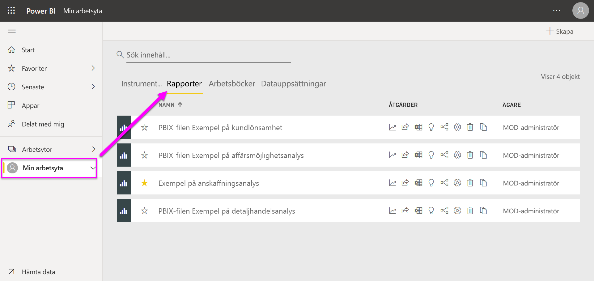
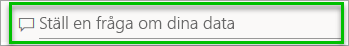
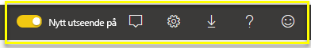
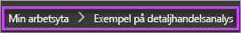
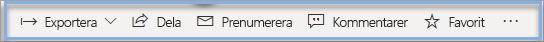

# Grundläggande begrepp för designers i Power BI-tjänsten

Syftet med den här artikeln är att ge en översikt över Power BI-tjänsten: tjänstens olika delar, hur de fungerar och hur du arbetar med dem. Du får mer ut ur artikeln om du först [registrerar dig för Power BI](service-self-service-signup-for-power-bi.md)-tjänsten och [lägger till några data](../connect-data/service-get-data.md). Som designer börjar ditt vanliga arbetsflöde vanligtvis med att skapa rapporter i Power BI Desktop. Sedan publicerar du dem till Power BI-tjänsten, där du kan fortsätta arbeta med dem. Du kan också skapa instrumentpaneler utifrån dina rapporter i Power BI-tjänsten. 

Om du inte ännu har egna rapporter kan du prova att installera ett [exempel för Power BI](../create-reports/sample-datasets.md).

När du öppnar Power BI-tjänsten i en webbläsare kommer du till din startskärm. De olika delarna i vyn är följande:

1. Navigeringsfönster
2. Microsoft 365-appstartprogram
3. Power BI-hemknapp
4. Ikonknappar, bland annat inställningar, hjälp och feedback
5. Sökruta
6. Favoriter och ofta använda instrumentpaneler, rapporter och arbetsytor
7. Senast använda instrumentpaneler, rapporter och arbetsytor
8. Dina arbetsytor

Du och slutanvändarna av dina rapporter och instrumentpaneler ser samma startskärm i Power BI-tjänsten i webbläsaren.

Vi går in på de här funktionerna senare, men först ska vi gå igenom några Power BI-begrepp. Du vill kanske se den här videon först.  Videon tar upp grundläggande begrepp och ger en genomgång av Power BI-tjänsten.

<iframe width="560" height="315" src="https://www.youtube.com/embed/B2vd4MQrz4M" frameborder="0" allowfullscreen></iframe>

## Power BI-begrepp
De fem huvudsakliga byggblocken i Power BI är *instrumentpaneler*, *rapporter*, *arbetsböcker*, *datauppsättningar* och *dataflöden*. De är alla uppdelade i *arbetsytor*, och de skapas i *kapaciteter*.  Det är viktigt att förstå sig på kapaciteterna och arbetsytorna innan vi går vidare till de fem byggstenarna, så vi börjar där.

## Kapacitet
Kapaciteter är ett grundläggande begrepp i Power BI som avser en uppsättning resurser (lagring, processor och minne) som används till att vara värd för och leverera ditt Power BI-innehåll. Kapaciteter är antingen _delade_ eller _dedikerade_. En delad kapacitet delas med andra Microsoft-kunder, medan en dedikerad kapacitet är helt tillägnad en enda kund. För dedikerade kapaciteter krävs en [prenumeration](../admin/service-premium-what-is.md). De beskrivs i sin helhet i artikeln [Hantera Premium-kapaciteter](../admin/service-premium-capacity-manage.md).

Arbetsytor skapas som standard i en delad kapacitet. I delad kapacitet körs arbetsbelastningar på dataresurser som delas med andra kunder. När kapaciteten måste dela resurser, införs begränsningar för att säkerställa ”sjyst spel”, till exempel maximal modellstorlek (1 GB) och maximal daglig uppdateringsfrekvens (åtta gånger per dag).

## Arbetsytor
Arbetsytor skapas i kapaciteter. De är i princip containrar för instrumentpaneler, rapporter, arbetsböcker, datauppsättningar och dataflöden i Power BI.

Det finns två typer av arbetsytor: *Min arbetsyta* och *arbetsytor*.

- *Min arbetsyta* är en personlig arbetsyta där vilken Power BI-kund som helst kan arbeta med sitt eget innehåll. Bara du har åtkomst till Min arbetsyta. Du kan dela instrumentpaneler och rapporter från Min arbetsyta. Om du vill samarbeta på instrumentpaneler och i rapporter, eller skapa en app, så vill du använda en arbetsyta.

-  *Arbetsytor* används till att samarbeta och dela innehåll med kollegor. Du kan lägga till kollegor på dina arbetsytor och samarbeta kring instrumentpaneler, rapporter, arbetsböcker och datamängder. Med ett undantag behöver alla arbetsytans medlemmar en Power BI Pro-licens. Läs mer om [de nya arbetsytorna](../collaborate-share/service-create-the-new-workspaces.md). 

    Arbetsytor är också där du skapar, publicerar och hanterar *appar* för din organisation. Du kan se arbetsytor som mellanlagringsområden och containrar för det innehåll som ska utgöra en Power BI-app. Så, vad är en *app*? En app är en samling av instrumentpaneler och rapporter som skapats för att leverera viktiga mått för Power BI-användarna i din organisation. Appar är interaktiva men användarna kan inte redigera dem. Appkonsumenterna, de kollegor som har tillgång till apparna, behöver inte nödvändigtvis Pro-licenser.  

Om du vill lära dig mer om delning överlag kan du börja med [olika sätt att dela ditt arbete via instrumentpaneler](../collaborate-share/service-how-to-collaborate-distribute-dashboards-reports.md).

Nu går vi vidare till de fem byggblocken i Power BI.

## Dataflöden
Ett *dataflöde* hjälper organisationer att förena data från olika källor. De är valfria och används ofta i komplexa eller större projekt. De representerar data som är förberedda och mellanlagrade för användning av datauppsättningar. De kan däremot inte användas direkt som en källa för rapportering. De utnyttjar den omfattande uppsättningen av Microsoft-datakopplingar och aktiverar inmatning av data från lokala och molnbaserade datakällor.

Dataflöden skapas och hanteras bara i arbetsytor (men inte *Min arbetsyta*), och de lagras som entiteter i Common Data Model (CDM) i Azure Data Lake Storage Gen2. Normalt kommer de att uppdateras regelbundet för att lagra aktuella data. De är mycket bra när du ska förbereda data för användning – och eventuell återanvändning – av dina datauppsättningar. Mer information finns i artikeln [Dataförberedelser med självbetjäning i Power BI](../transform-model/service-dataflows-overview.md).

Du kan inte ha instrumentpaneler och rapporter utan data (eller, du kan ha tomma instrumentpaneler och tomma rapporter, men de är inte användbara förrän de har data), så nu vi ska vi titta på **datauppsättningar**.

## Datauppsättningar
En *datauppsättning* är en samling data som du *importerar* eller *ansluter* till. Med Power Bi kan du ansluta till och importera alla typer av datauppsättningar och placera dem tillsammans på en och samma plats. Datauppsättningar kan också hämta data från dataflöden.

Datauppsättningar är associerade med *arbetsytor* och en enskild datauppsättning kan ingå i många arbetsytor. När du öppnar en arbetsyta, visas de associerade datauppsättningarna under fliken **Datauppsättningar**. Varje listad datauppsättning representerar en enskild datakälla, till exempel en Excel-arbetsbok på OneDrive, eller en lokal SSAS tabular-datauppsättning eller en Salesforce-datauppsättning. Det finns många olika datakällor som stöds och vi lägger till nya hela tiden. Se listan över [datamängdstyper som du kan använda med Power BI](../connect-data/service-get-data.md).

I exemplet nedan har jag markerat arbetsytan ”Sales and marketing” och klickat på fliken **Datamängder**.

**EN** datauppsättning ...

* kan användas flera gånger på en eller flera arbetsytor.
* kan användas i olika rapporter.
* Visualiseringar från denna enda datauppsättning kan visas på många olika instrumentpaneler.

  

Om du vill [ansluta till eller importera en datauppsättning](../connect-data/service-get-data.md) väljer du **Hämta data** längst ned i navigeringsfönstret. Följ instruktionerna för att ansluta till eller importera den specifika källan och lägga till datauppsättningen till den aktiva arbetsytan. Nya datauppsättningar markeras med en gul asterisk. Ditt arbete i Power BI ändrar inte den underliggande datamängden.

Datamängder som läggs till av en medlem i arbetsytan är tillgängliga för de andra medlemmarna i arbetsytan med rollen *administratör*, *medlem* eller *deltagare*.

Datauppsättningar kan uppdateras, döpas om, utforskas och tas bort. Du kan använda en datauppsättning för att skapa en rapport från grunden eller genom att köra [Quick Insights](../create-reports/service-insights.md).  Om du vill se vilka rapporter och instrumentpaneler som redan använder en datauppsättning, väljer du **Visa relaterade**. Välj datauppsättningen för att utforska den. Vad du faktiskt gör är att öppna datauppsättningen i rapportredigeraren där du verkligen kan börja utforska data genom att skapa visualiseringar.

Nu går vi vidare till nästa avsnitt – rapporter.

### Gå djupare
* [Datamängder i Power BI-tjänsten](../connect-data/service-datasets-understand.md)
* [Datamängdslägen i Power BI-tjänsten](../connect-data/service-dataset-modes-understand.md)
* [Vad är Power BI Premium?](../admin/service-premium-what-is.md)
* [Hämta data för Power BI](../connect-data/service-get-data.md)
* [Exempel på datauppsättningar för Power BI](../create-reports/sample-datasets.md)

## Rapporter
En Power BI-rapport är en eller flera sidor med visualiseringar som linjediagram, kartor och trädkartor. Visualiseringar kallas även **_visuella objekt_**. Alla visualiseringar i en rapport kommer från en enda datauppsättning. Du kan skapa rapporter från grunden i Power BI eller importera dem med instrumentpaneler som kollegor delar med dig. Alternativt kan Power BI skapa dem när du ansluter till datamängder från Excel, Power BI Desktop, databaser och SaaS-program.  När du ansluter till en Excel-arbetsbok med Power View-blad, skapar Power BI en rapport baserad på dessa blad. Och när du ansluter till ett SaaS-program, importerar Power BI en förskapad rapport.

Det finns två lägen för att visa och interagera med rapporter: *Läsvyn* och *redigeringsvyn*. När du öppnar en rapport öppnas den i läsvyn. Om du har redigeringsbehörigheter visas **Redigera rapport** i det övre vänstra hörnet, och du kan visa rapporten i redigeringsvyn.  Om en rapport finns på en arbetsyta kan alla med rollen *administratör*, *medlem* eller *deltagare* redigera den. De har tillgång till alla funktioner i redigeringsvyn för att utforska, designa, skapa och dela för den rapporten. De personer som de delar rapporten med kan utforska och interagera med rapporten i läsvyn.

När du öppnar en arbetsyta, visas de associerade rapporterna under fliken **Rapporter**. Varje listad rapport representerar en eller flera sidor med visualiseringar baserade på endast en av de underliggande datauppsättningarna. Om du vill öppna en rapport markerar du den.

När du öppnar en app visas en instrumentpanel.  För att komma åt en underliggande rapport väljer du en panel i instrumentpanelen (mer information om dessa senare) som har fästs från en rapport. Tänk på att inte alla paneler är fästa från rapporter, så du kan behöva klicka på några paneler för att hitta en rapport.

Som standard öppnas rapporten i Läsvy.  Du behöver bara välja **Redigera rapport** för att öppna den i redigeringsvyn (om du har nödvändig behörighet).

I exemplet nedan markerade jag arbetsytan ”Sales and marketing” och klickade på fliken **Rapporter**.

**EN** rapport ...

* ingår i en enda arbetsyta.
* kan associeras med flera instrumentpaneler på den arbetsytan. Paneler som fästs från den rapporten kan visas på flera instrumentpaneler.
* kan skapas med hjälp av data från en datauppsättning. Power BI Desktop kan kombinera fler än en datakälla till en enskild datamängd i en rapport, och den rapporten kan importeras till Power BI.

  

### Gå djupare
- [Skapa en rapport i Power BI-tjänsten genom att importera en datamängd](../create-reports/service-report-create-new.md)
- [Optimera rapporter för Power BI-mobilapparna](../create-reports/desktop-create-phone-report.md)

## Instrumentpaneler
En *instrumentpanel* är något som du skapar **i Power BI-tjänsten** eller något en kollega skapar **i Power BI-tjänsten** och delar med dig. Det är en enda arbetsyta som innehåller noll eller flera paneler och widgetar. Varje panel som fästs från en rapport eller från [Frågor och svar](../consumer/end-user-q-and-a.md) visar en enskild [visualisering](../visuals/power-bi-report-visualizations.md) som har skapats från en datauppsättning och fästs på instrumentpanelen. Hela rapportsidor kan också fästas på en instrumentpanel som en enskild panel. Det finns många sätt att lägga till paneler i instrumentpanelen; för många för att omfattas i det här översiktsavsnittet. Läs mer i [Paneler på instrumentpanelen i Power BI](../create-reports/service-dashboard-tiles.md).

Varför skapar man instrumentpaneler?  Här är några av orsakerna:

* för att få en överblick över all information som behövs för att fatta beslut
* för att övervaka den viktigaste informationen om verksamheten
* för att se till att alla kollegor är på samma sida och ser och använder samma information
* för att övervaka hälsotillståndet för ett företag, en produkt, en affärsenhet, en marknadsföringskampanj o.s.v.
* för att skapa en anpassad vy av en större instrumentpanel – alla mått som är viktiga för dig

När du öppnar en arbetsyta, visas de associerade instrumentpanelerna under fliken **Instrumentpaneler**. Välj en instrumentpanel för att öppna den. När du öppnar en app, visas en instrumentpanel.  Varje instrumentpanel representerar en anpassad vy av någon delmängd av den eller de underliggande datauppsättningarna.  Om du äger instrumentpanelen, har du också åtkomst för redigering till underliggande datauppsättning(ar) och rapporter.  Om instrumentpanelen har delats med dig kan du interagera med den och alla underliggande rapporter, men kan inte spara några ändringar.

Det finns många olika sätt som du eller en kollega kan [dela en instrumentpanel](../collaborate-share/service-share-dashboards.md). Power BI Pro krävs för att dela en instrumentpanel och kan krävas för att visa en delad instrumentpanel.

**EN** instrumentpanel ...

* är kopplad till en enskild arbetsyta
* kan visa visualiseringar från många olika datauppsättningar
* kan visa visualiseringar från många olika rapporter
* kan visa visualiseringar som fästs från andra verktyg (t.ex. Excel)

  

### Gå djupare
* [Skapa en tom instrumentpanel och hämta sedan data](../create-reports/service-dashboard-create.md).
* [Duplicera en instrumentpanel](../create-reports/service-dashboard-copy.md)
* [Skapa en telefonvy av en instrumentpanel](../create-reports/service-create-dashboard-mobile-phone-view.md)

## Arbetsböcker
Arbetsböcker är en särskild typ av datauppsättning. Om du har läst avsnittet **Datauppsättningar** ovan, vet du nästan allt du behöver veta om arbetsböcker. Men du kanske undrar varför Power BI ibland klassificerar en Excel-arbetsbok som **datauppsättning** och andra gånger som **arbetsbok**.

När du använder **Hämta data** för Excel-filer, har du möjlighet att *importera* eller *ansluta* till filen. När du väljer Anslut visas arbetsboken i Power BI precis som den skulle ha gjort i Excel Online. Men till skillnad från i Excel Online har du några bra funktioner som hjälper dig fästa element från kalkylbladen direkt på instrumentpanelerna.

Du kan inte redigera din arbetsbok i Power BI. Men om du behöver göra några ändringar kan du välja Redigera och sedan välja att redigera din arbetsbok i Excel Online eller öppna den i Excel på datorn. Alla ändringar du gör sparas i arbetsboken på OneDrive.

### Gå djupare
* [Hämta data från Excel-arbetsboksfiler](../connect-data/service-excel-workbook-files.md)
* [Publicera till Power BI från Excel](../connect-data/service-publish-from-excel.md)

## En instrumentpanel i Min arbetsyta
Vi har gått igenom arbetsytor och byggstenar. Nu sammanför vi det och granskar delarna som utgör instrumentpanelfunktionerna i Power BI-tjänsten.

### 1. **Navigeringsfönster**
Du använder navigeringsfönstret för att leta upp och flytta mellan arbetsytorna och Power BI-byggstenarna: instrumentpaneler, rapporter, arbetsböcker och datauppsättningar.  

  

* Välj **Hämta data** för att [lägga till datauppsättningar, rapporter och instrumentpaneler i Power BI](../connect-data/service-get-data.md).
* Visa och dölj navigeringsfönstret med den här ikonen .
* Öppna eller hantera ditt favoritinnehåll genom att välja **Favoriter**.
* Visa och öppna ditt senast besökta innehåll genom att välja **Senaste**.
* Visa, öppna eller ta bort en app genom att välja **Appar**.
* Har en kollega delat innehåll med dig? Välj **Delat med mig** för att söka efter och sortera innehållet för att hitta vad du behöver.
* Du kan visa och öppna dina arbetsytor genom att välja **Arbetsytor**.

Enkelklicka på dessa element:

* på en ikon eller rubrik för att öppna den i innehållsvyn
* på en högerpil (>) för att öppna en utfälld meny för Favoriter, Senaste och Arbetsytor.
* på en sparrikon för att visa den rullningsbara listan i **Min arbetsyta** över instrumentpaneler, rapporter, arbetsböcker och datauppsättningar

### 2. **Arbetsyta**
Eftersom vi har öppnat en instrumentpanel, visas visualiseringspaneler på arbetsytan. Om vi till exempel hade öppnat rapportredigeraren, skulle en rapportsida ha visats på arbetsytan.

Instrumentpaneler består av [paneler](../create-reports/service-dashboard-tiles.md).  Paneler skapas i rapportens redigeringsvy, Frågor och svar och andra instrumentpaneler och kan fästas från Excel, SSRS och andra platser. En särskild typ av panel som kallas en [widget](../create-reports/service-dashboard-add-widget.md) läggs till direkt på instrumentpanelen. Panelerna som visas på en instrumentpanel har särskilt placerats där av en rapportskapare/-ägare.  Att lägga till en panel på en instrumentpanel kallas *fästning*.

Mer information finns i [Instrumentpaneler](#dashboards) (ovan).

### 3. **Ruta för frågor och svar**
Ett sätt att utforska dina data är att ställa en fråga och låta Power BI:s frågor och svar ge ett svar i form av en visualisering. Frågor och svar kan användas för att lägga till innehåll på en instrumentpanel eller i en rapport.

Frågor och svar letar efter svar i den datauppsättning(ar) som är ansluten på instrumentpanelen.  En ansluten datauppsättning är en som har minst en panel fäst på instrumentpanelen.

När du börjar skriva en fråga, leder frågor och svar dig till sidan för frågor och svar. När du skriver hjälper frågor och svar dig att ställa rätt fråga och hitta det bästa svaret med omformuleringar, autofyll, förslag med mera. När du har en visualisering (ett svar) som du är nöjd med, fäster du den på instrumentpanelen. Mer information finns i [Frågor och svar i Power BI](../consumer/end-user-q-and-a.md).

### 4. **Ikoner i det svarta rubrikfältet**
Ikonerna i det övre högra hörnet är dina resurser för inställningar, meddelanden, nedladdningar, få hjälp, aktivera och inaktivera **Nytt utseende**, samt ge feedback till Power BI-teamet.  

### 5. **Instrumentpanelsrubrik** (navigeringssökväg, även kallat synlig sökväg)
Det är inte alltid lätt att klura ut vilken arbetsyta och instrumentpanel som är aktiv, så Power BI skapar en navigeringssökväg för dig.  I det här exemplet visas arbetsytan (Min arbetsyta) och instrumentpanelsrubriken (Exempel på detaljhandelsanalys).  Om vi öppnar en rapport, läggs rapportens namn till i slutet av navigeringssökvägen.  Varje del av sökvägen är en aktiv hyperlänk.  

Lägg märke till ”C”-ikonen efter instrumentpanelsrubriken. Den här instrumentpanelen har [dataklassificeringstaggen](../create-reports/service-data-classification.md) ”konfidentiellt”. Taggen identifierar aktuella datas känslighet och säkerhetsnivå. Om din administratör har aktiverat dataklassificering ställs en standardtagg in för alla instrumentpaneler. Instrumentpanelsägare bör ändra taggen så att den matchar instrumentpanelens korrekta skyddsnivå.

### 6. **Microsoft 365-appstartprogram**
Med appstartprogrammet är alla dina Microsoft 365-appar enkelt tillgängliga med ett enda klick. Härifrån kan du snabbt starta din e-post, dina dokument, din kalender och annat.

### 7. **Startsida för Power BI**
När du väljer **Power BI** kommer du tillbaka till din startsida i Power BI.

   

### 8. **Etiketterade ikoner i den grå menyraden**
Det här området på skärmen innehåller ytterligare alternativ för att interagera med innehållet (i det här fallet med instrumentpanelen).  Förutom de etiketterade ikonerna kan du välja **Fler alternativ (...)** . Då visas alternativ för att bland annat duplicera, skriva ut och uppdatera instrumentpanelen.

   

## Nästa steg
- [Vad är Power BI?](power-bi-overview.md)  
- [Power BI-videor](videos.md)  
- [Rapportredigeraren – ta en rundtur](../create-reports/service-the-report-editor-take-a-tour.md)
- Har du fler frågor? [Fråga Power BI Community](https://community.powerbi.com/)
