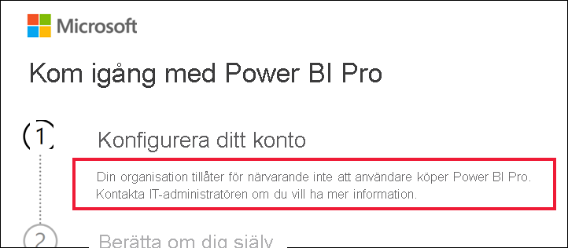

# Vad du gör om köp av Power BI Pro är avaktiverat

Du har försökt köpa Power BI Pro och fått ett meddelande om att organisationen inte tillåter användarna att göra detta. Det kan finnas flera orsaker till att organisationer blockerar medlemmarna från egna köp av Power BI Pro.  Organisationen kan till exempel ha en policy om att alla licenser och prenumerationer hanteras av en central IT-avdelning eller supportavdelning. 

## Lösning
Slutför köpet genom att kontakta IT-avdelningen eller supportavdelningen och be dem [följa instruktionerna för att ge dig en licens](../admin/service-admin-manage-licenses.md).

## Nästa steg
[Power BI-funktioner efter licenstyp](service-features-license-type.md)