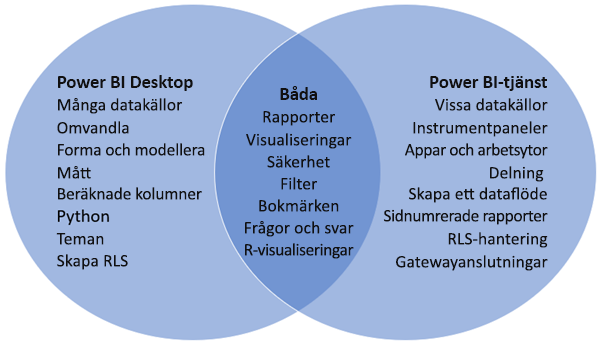

# Jämföra Power BI Desktop och Power BI-tjänsten

I ett Venndiagram där Power BI Desktop och Power BI-tjänsten jämförs visar området i mitten hur de två överlappar. Vissa uppgifter kan du utföra i både Power BI Desktop och i tjänsten. De två sidorna i Venndiagrammet visar de funktioner som är unika för programmet respektive tjänsten.  

**Power BI Desktop** är ett komplett verktyg för dataanalys och rapportskapande som du installerar kostnadsfritt på den lokala datorn. Det omfattar frågeredigeraren, där du kan ansluta till många olika datakällor och kombinera dem (detta kallas ofta modellering) till en datamodell. Sedan designar du en rapport baserat på den datamodellen. [Kom igång-guiden för Power BI Desktop](desktop-getting-started.md) går igenom processen.

**Power BI-tjänsten** är en molnbaserad tjänst. Den har stöd för enklare redigering av rapporter samt samarbete för team och organisationer. Du kan ansluta till datakällor i Power BI-tjänsten också men modelleringen är begränsad.

De flesta Power BI-rapportdesigners som arbetar i Business Intelligence-projekt använder **Power BI Desktop** för att skapa Power BI-rapporter och använder sedan **Power BI-tjänsten** för att samarbeta och distribuera sina rapporter.

Power BI-tjänsten är också värd för *sidnumrerade rapporter* på arbetsytor med Power BI Premium-kapacitet. Du skapar sidnumrerade rapporter med Power BI Report Builder. Mer information finns i [Jämför Power BI-rapporter och sidnumrerade rapporter](../paginated-reports/paginated-reports-report-builder-power-bi.md#compare-power-bi-reports-and-paginated-reports) i artikeln ”Vad är sidnumrerade rapporter i Power BI Premium?” för mer information.

## Redigera Power BI-rapporter

Du kan skapa och redigera Power BI-*rapporter* i både programmet och tjänsten. En rapport kan bestå av en eller flera sidor, med visuella objekt och samlingar med visuella objekt. Lägg till bokmärken, knappar, filter och detaljinformation för att förbättra navigeringen i rapporterna.

Rapportredigerarna i Power BI Desktop och i tjänsten liknar varandra. De består av tre avsnitt:  

1. De övre navigeringsfönstren ser olika ut i Power BI Desktop och tjänsten    
2. Rapportarbetsytan     
3. Fönstren **Fält**, **Visualiseringar** och **Filter**

I den här videon visas rapportredigeraren i Power BI Desktop. 

<iframe width="560" height="315" src="https://www.youtube.com/embed/IkJda4O7oGs" frameborder="0" allowfullscreen></iframe>

## Arbeta i Power BI-tjänsten

### Samarbeta

När du har skapat dina rapporter kan du spara dem på en *arbetsyta* i **Power BI-tjänsten**, där du och dina kollegor samarbetar. Du skapar *instrumentpaneler* på de rapporterna. Sedan delar du de instrumentpanelerna och rapporterna med rapportanvändare inom och utanför organisationen. Rapportanvändarna visar dem i Power BI-tjänsten i *läsvyn*, inte redigeringsvyn. De har inte åtkomst till alla funktioner som är tillgängliga för rapportskapare.  Du kan även dela dina datamängder och låta andra bygga egna rapporter utifrån dem. Läs mer om att [samarbeta i Power BI-tjänsten](../collaborate-share/service-new-workspaces.md).

### Dataförberedelser med självbetjäning för dataflöden

Dataflöden hjälper organisationer att samla data från olika källor och förbereda dem för modellering. Analytiker kan enkelt skapa dataflöden, med välbekanta självbetjäningsverktyg. Analytiker använder dataflöden för att mata in, transformera, integrera och utöka stordata genom att definiera datakällsanslutningar, ETL-logik, uppdateringsscheman och mer. Läs mer om [dataförberedelser med självbetjäning för dataflöden](../transform-model/service-dataflows-overview.md).

## Nästa steg

[Vad är Power BI Desktop?](desktop-what-is-desktop.md)

[Skapa en rapport](../create-reports/service-report-create-new.md) i Power BI-tjänsten

[Grundläggande begrepp för rapportdesigners](service-basic-concepts.md)

Har du fler frågor? [Prova Power BI Community](https://community.powerbi.com/)
