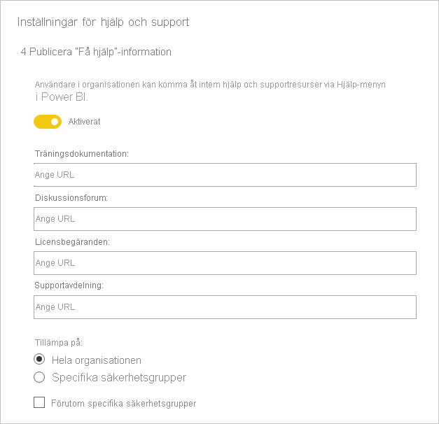
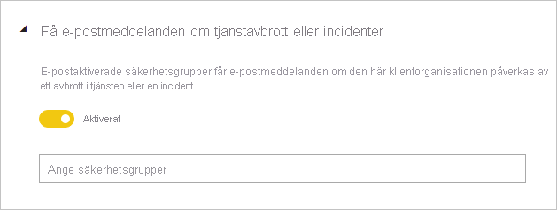
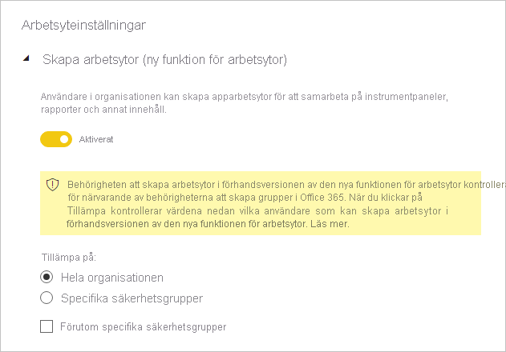
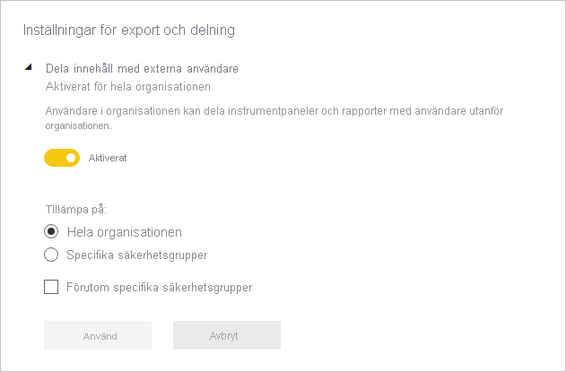
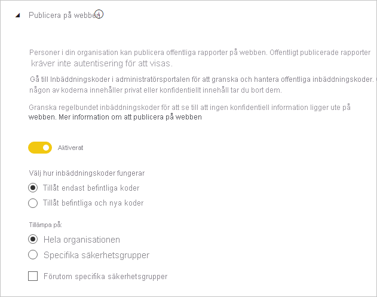
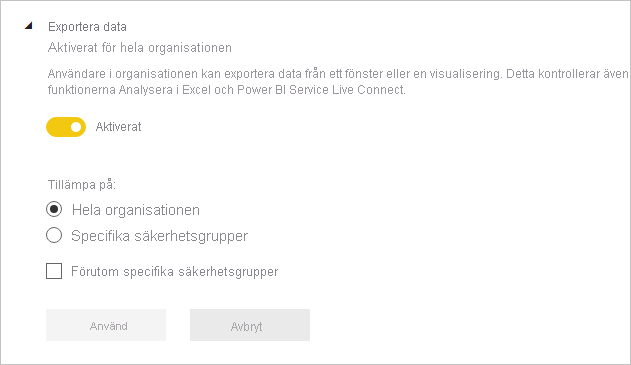
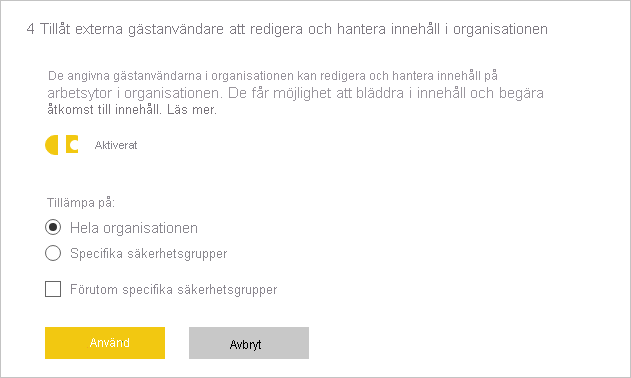

# Guide till administratörsinställningar för klientorganisationer

Den här artikeln är avsedd för Power BI-administratörer som ansvarar för att ställa in och konfigurera organisationens Power BI-miljö.

Vi ger vägledning kring specifika klientinställningar som bidrar till att förbättra Power BI-miljön, eller som kan innebära risker för din organisation. Du bör alltid konfigurera klientorganisationen i enlighet med organisationens policyer och processer.

[Klientinställningar](../admin/service-admin-portal.md#tenant-settings) hanteras i [administrationsportalen](https://app.powerbi.com/admin-portal/tenantSettings) och kan konfigureras av [administratörer för Power BI-tjänsten](../admin/service-admin-administering-power-bi-in-your-organization.md#administrator-roles-related-to-power-bi). Många klientinställningar kan begränsa olika funktioner till en begränsad uppsättning användare. Vi rekommenderar därför att du först bekantar dig med inställningarna så att du kan planera vilka säkerhetsgrupper du behöver. Du kanske kan använda samma säkerhetsgrupp för flera inställningar.

## Förbättra Power BI-miljön

### Publicera ”Få hjälp-information”

Vi rekommenderar att du konfigurerar interna Power BI-relaterade webbplatser med [Microsoft Teams](/microsoftteams)eller någon annan samarbetsplattform. Sådana webbplatser kan användas till att lagra utbildningsdokumentation, hålla diskussioner, begära licenser och att ge svar på frågor.

Om du gör det rekommenderar vi att du sedan aktiverar inställningen **Publicera "Få hjälp"-information** _för hela organisationen_. Du hittar den i gruppen **Hjälp- och supportinställningar**. Du kan ange webbadresser för:

- Träningsdokumentation
- Diskussionsforum
- Licensförfrågningar
- Supportavdelningen

De här webbadresserna blir tillgängliga som länkar på hjälpmenyn i Power BI.

> [!NOTE]
> Med länken **Licensieringsbegäranden** förhindrar du att enskilda användare registrerar sig för den 60-dagars kostnadsfria utvärderingsversionen av Power BI Pro. De dirigeras i stället till en inter webbplatsen med information om att skaffa en licens – kostnadsfri eller Pro.

## Hantera risk

### Få e-postmeddelanden om tjänstavbrott och incidenter

Du kan få ett meddelande via e-post om din klientorganisation påverkas av ett tjänstavbrott eller en incident. På så sätt kan du hantera incidenter proaktivt.

Vi rekommenderar att du aktiverar inställningen **Få e-postmeddelanden om tjänstavbrott och incidenter**. Du hittar den i gruppen **Hjälp- och supportinställningar**. Tilldela en eller flera _e-postaktiverade_ säkerhetsgrupper.

### Informationsskydd

Informationsskydd innebär att du kan tillämpa säkerhetsinställningar som kryptering eller vattenstämplar när du exporterar data från Power BI-tjänsten.

Det finns två inställningar relaterade till informationsskydd för klientorganisationer. Som standard är båda inställningarna inaktiverade för hela organisationen.

Vi rekommenderar att du aktiverar de här inställningarna när du behöver hantera och skydda känsliga data. Mer information finns i [Dataskydd i Power BI](../admin/service-security-data-protection-overview.md).

### Skapa arbetsytor

Du kan förhindra att användare skapar arbetsytor. På så sätt kan du styra vad som skapas i organisationen.

> [!NOTE]
> Här gäller en övergångsperiod mellan den gamla arbetsytemiljön och den nya. Den här klientinställningen gäller endast den nya miljön.

Inställningen **Skapa arbetsytor** är som standard aktiverad för hela organisationen. Du hittar den i gruppen **Arbetsyteinställningar**.

Vi rekommenderar att du tilldelar en eller flera säkerhetsgrupper. Dessa grupper kan beviljas _eller nekas_ behörighet att skapa arbetsytor.

Glöm inte att ta med anvisningar i dokumentationen som hjälper användare (som inte har behörighet att skapa arbetsytor) att begära en ny arbetsyta.

### Dela innehåll med externa användare

Användare kan dela rapporter och instrumentpaneler med personer utanför organisationen.

Inställningen **Dela innehåll med externa användare** är som standard aktiverad för hela organisationen. Du hittar den i gruppen **Inställningar för export och delning**.

Vi rekommenderar att du tilldelar en eller flera säkerhetsgrupper. Dessa grupper kan beviljas _eller nekas_ behörighet att dela innehåll med externa användare.

### Publicera på webben

Med funktionen [Publicera på webben](../collaborate-share/service-publish-to-web.md) kan du publicera offentliga rapporter på internet. Om den används felaktigt finns det risk att konfidentiell information görs tillgänglig live på internet.

Inställningen **Publicera på webben** är som standard aktiverad för hela organisationen, men begränsar möjligheten att skapa inbäddningskoder till administratörsanvändare. Du hittar den i gruppen **Inställningar för export och delning**.

Om du aktiverar inställningen rekommenderar vi att du tilldelar en eller flera säkerhetsgrupper. Dessa grupper kan beviljas _eller nekas_ behörighet att publicera rapporter.

Dessutom finns det ett alternativ för hur inbäddningskoderna fungerar. Standardvärdet är **Tillåt endast befintliga koder**. Det innebär att användarna uppmanas att kontakta en Power BI-administratör när de behöver skapa en inbäddningskod.

Vi rekommenderar också att du regelbundet besöker [Inbäddningskoder för publicering till webben](https://app.powerbi.com/admin-portal/embedCodes). Ta bort koder om de leder till att privat eller konfidentiell information publiceras.

### Exportera data

Du kan förhindra att användare exporterar data från instrumentpaneler och visuella objekt i rapporter.

Inställningen **Exportera data** är som standard aktiverad för hela organisationen. Du hittar den i gruppen **Inställningar för export och delning**.

Vi rekommenderar att du tilldelar en eller flera säkerhetsgrupper. Dessa grupper kan beviljas _eller nekas_ behörighet att publicera rapporter.

> [!IMPORTANT]
> Om du inaktiverar den här inställningen begränsas även användningen av funktionerna [Analysera i Excel](../collaborate-share/service-analyze-in-excel.md) och Power BI-tjänstens [liveanslutningar](../connect-data/desktop-report-lifecycle-datasets.md#using-a-power-bi-service-live-connection-for-report-lifecycle-management).

> [!NOTE]
> Om användarna tillåts att exportera data kan du lägga till extra säkerhet i form av [dataskydd](../admin/service-security-data-protection-overview.md). Det gör att obehöriga användare blockeras från att exportera innehåll med känslighetsmärkning.

### Tillåt externa gästanvändare att redigera och hantera innehåll i organisationen

Externa gästanvändare kan redigera och hantera Power BI-innehåll. Läs mer i [Distribuera Power BI-innehåll till externa gästanvändare med Azure AD B2B](../admin/service-admin-azure-ad-b2b.md).

Inställningen **Tillåt externa gästanvändare att redigera och hantera innehåll i organisationen** är som standard inaktiverad för hela organisationen. Du hittar den i gruppen **Inställningar för export och delning**.

Om du behöver ge externa användare behörighet att redigera och hantera innehåll rekommenderar vi att du tilldelar en eller flera säkerhetsgrupper. Dessa grupper kan beviljas _eller nekas_ behörighet att publicera rapporter.

### Inställningar för utvecklare

Det finns två inställningar för klientorganisationer relaterade till [inbäddning av Power BI-innehåll](../developer/embedded/embedding.md). De är:

- Bädda in innehåll i appar (aktiverat som standard)
- Tillåt tjänstens huvudkonton att använda Power BI API:er (inaktiverat som standard)

Om du inte har för avsikt att använda utvecklar-API:er till att bädda in innehåll rekommenderar vi att du inaktiverar dem. Annars bör du åtminstone konfigurera specifika säkerhetsgrupper som ska utföra det här arbetet.

## Nästa steg

Mer information om ämnet i den här artikeln finns i följande resurser:

- [Vad är Power BI-administration?](../admin/service-admin-administering-power-bi-in-your-organization.md)
- [Administrera Power BI i Admin-portalen](../admin/service-admin-portal.md)
- Har du några frågor? [Fråga Power BI Community](https://community.powerbi.com/)
- Har du förslag? [Bidra till att förbättra Power BI](https://ideas.powerbi.com)

