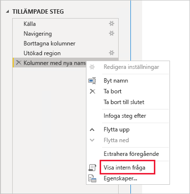
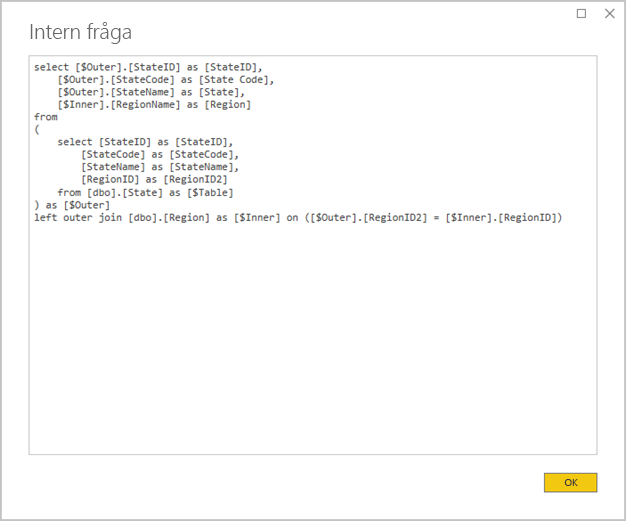
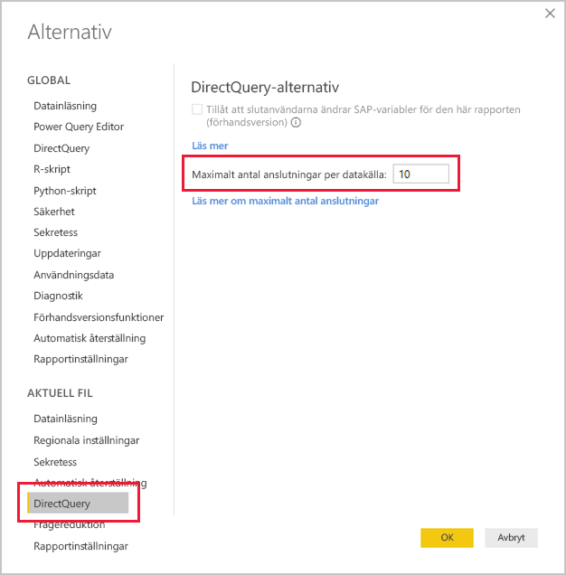
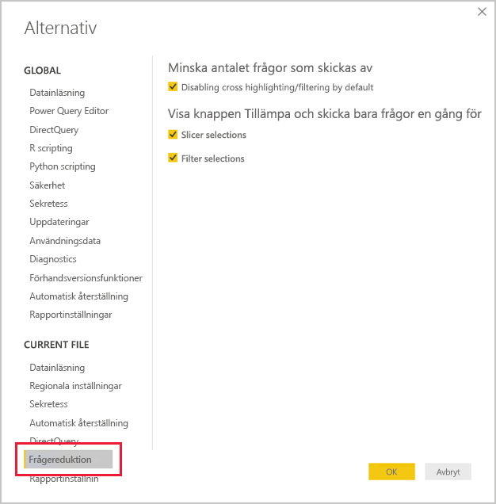

# <a name="directquery-model-guidance-in-power-bi-desktop"></a>Vägledning för DirectQuery-modell i Power BI Desktop

Den här artikeln är avsedd för datamodellerare som utvecklar DirectQuery-modeller i Power BI, antingen i Power BI Desktop eller i Power BI-tjänsten. I artikeln beskrivs användningsfall, begränsningar och vägledning för DirectQuery. Mer specifikt är vägledningen utformad som hjälp när du ska avgöra om DirectQuery är rätt läge för din modell, och när du ska förbättra prestanda för dina rapporter som är baserade på DirectQuery-modeller. Den här artikeln gäller DirectQuery-modeller som lagras i Power BI-tjänsten eller på en Power BI-rapportserver.

Den här artikeln är inte tänkt som en fullständig genomgång av hur du designar DirectQuery-modeller. En introduktion finns i artikeln [DirectQuery-modeller i Power BI Desktop](../desktop-directquery-about.md). En mer ingående diskussion finns i faktabladet [DirectQuery i SQL Server 2016 Analysis Services](https://download.microsoft.com/download/F/6/F/F6FBC1FC-F956-49A1-80CD-2941C3B6E417/DirectQuery%20in%20Analysis%20Services%20-%20Whitepaper.pdf). Tänk dock på att faktabladet beskriver hur du använder DirectQuery i SQL Server Analysis Services. Mycket av innehållet gäller ändå för DirectQuery-modeller i Power BI.

Den här artikeln går inte direkt igenom sammansatta modeller. En sammansatt modell består av minst en och eventuellt flera DirectQuery-källor. Vägledningen i den här artikeln är fortfarande relevant, åtminstone delvis, för design av sammansatta modeller. Konsekvenserna av att kombinera importtabeller med DirectQuery-tabeller ligger dock utanför ramen för den här artikeln. Mer information finns i [Använda sammansatta modeller i Power BI Desktop](../desktop-composite-models.md).

Det är viktigt att förstå att DirectQuery-modeller innebär en annan arbetsbelastning i Power BI-miljön (Power BI-tjänsten eller Power BI-rapportservern) och även i de underliggande datakällorna. Om du avgör att DirectQuery är rätt designmetod bör du se till att få med rätt personer i projektet. Det står ofta ett team med IT-personal som arbetar nära tillsammans bakom lyckade distributioner av DirectQuery-modeller. Teamet består vanligtvis av modellutvecklare och källdatabasens administratörer. Dessutom kan dataarkitekter och utvecklare inom datalager och ETL ingå i teamet. Ofta måste datakällan optimeras direkt för att få goda prestandaresultat.

## <a name="design-in-power-bi-desktop"></a>Design i Power BI Desktop

Både Azure SQL Data Warehouse- och Azure HDInsight Spark-datakällor kan anslutas direkt utan att du behöver använda Power BI Desktop. Det här gör du i Power BI-tjänsten genom att ”Hämta data” och välja panelen Databaser. Mer information finns i [Azure SQL Data Warehouse med DirectQuery](../service-azure-sql-data-warehouse-with-direct-connect.md).

Även om det är praktiskt med direktanslutning så rekommenderar vi inte att du använder den här metoden. Huvudorsaken är att du inte kan uppdatera modellstrukturen om den underliggande datakällans schema skulle ändras.

Vi rekommenderar att du använder Power BI Desktop till att skapa och hantera alla DirectQuery-modeller. Då får du fullständig kontroll och kan definiera den modell du behöver, inklusive att använda funktioner som hierarkier, beräknade kolumner, mått och mycket annat. Du kan också uppdatera modelldesignen om den underliggande datakällans schema skulle ändras.

## <a name="optimize-data-source-performance"></a>Optimera datakällans prestanda

Du kan optimera relationsdatabaskällan på flera sätt, vi går igenom dem i den här punktlistan.

> [!NOTE]
> Vi förstår att det inte är alla modellerare som har behörighet eller kompetens nog att optimera en relationsdatabas. Även om det är det bästa lagret när du ska förbereda data för en DirectQuery-modell, så kan du också göra vissa optimeringar i modelldesignen utan att behöva ändra källdatabasen. Optimeringen får dock normalt bäst resultat om du gör den på själva källdatabasen.

- **Se till att dataintegriteten är fullständig:** Det är särskilt viktigt att dimensionstabeller innehåller en kolumn med unika värden (dimensionsnyckel) som mappas till faktatabellerna. Det är också viktigt att dimensionskolumner av faktatyp innehåller giltiga dimensionsnyckelvärden. Då kan du konfigurera mer effektiva modellrelationer som förväntar sig att värdena på båda sidor av relationen matchar. När källdata saknar integritet bör du rätta till data genom att lägga till dimensionsposten ”okänd”. Du kan till exempel lägga till en rad i tabellen **Product** för att representera en okänd produkt och sedan tilldela den en nyckel utanför det giltiga intervallet, som -1. Om raderna i tabellen **Sales** saknar produktnyckel ersätter du värdet med -1. På så sätt har alla produktnyckelvärden i tabellen **Sales** en motsvarande rad i tabellen **Product**.
- **Lägg till index:** Definiera lämpliga index i tabeller och vyer så att du enkelt kan hämta data för filtrering och gruppering i rapporten. För SQL Server-, Azure SQL Database- och Azure SQL Data Warehouse-källor finns användbar information om indexdesign i artikeln [Guide till arkitektur och design för index i SQL Server](/sql/relational-databases/sql-server-index-design-guide?view=sql-server-2017). För obeständiga SQL Server- och Azure SQL Database-källor kan du läsa artikeln [Kom igång med Columnstore för driftanalys i realtid](/sql/relational-databases/indexes/get-started-with-columnstore-for-real-time-operational-analytics?view=sql-server-2017).
- **Designa distribuerade tabeller:** För Azure SQL Data Warehouse-källor som använder arkitekturen MPP (massivt parallell bearbetning) kan du konfigurera stora faktatabeller som hashdistribuerade, och att dimensionstabeller ska replikeras över samtliga beräkningsnoder. Mer information finns i [Vägledning för design av distribuerade tabeller i Azure SQL Data Warehouse](/azure/sql-data-warehouse/sql-data-warehouse-tables-distribute#what-is-a-distributed-table).
- **Se till att nödvändiga datatransformationer är materialiserade:** För relationsdatabaskällor i SQL Server (och andra relationsdatabaskällor) kan du lägga till beräknade kolumner i tabeller. Sådana kolumner baseras på ett uttryck, exempelvis **Quantity** multiplicerat med **UnitPrice**. Beräknade kolumner göras beständiga (materialiserade) och precis som vanliga kolumner kan de indexeras. Mer information finns i [Index för beräknade kolumner](/sql/relational-databases/indexes/indexes-on-computed-columns?view=sql-server-2017).

    Överväg även indexerade vyer som kan föraggregera data i faktatabeller på en högre detaljnivå. Om tabellen **Sales** till exempel lagrar data på orderradsnivå kan du skapa en vy för att summera dessa data. Vyn kan baseras på en SELECT-instruktion som grupperar data i tabellen **Sales** efter datum (på månadsnivå), kund och produkt, och sedan summerar måttvärden som försäljningar och antal. Vyn kan sedan indexeras. Information om SQL Server- och Azure SQL Database-källor finns i [Skapa indexerade vyer](/sql/relational-databases/views/create-indexed-views?view=sql-server-2017).
- **Materialisera en datumtabell:** Ett vanligt modelleringskrav handlar om att lägga till en datumtabell för hantering av tidsbaserad filtrering. För att organisationen ska kunna använda välbekanta tidsbaserade filter kan du skapa en tabell i källdatabasen och se till att den fylls med ett datumintervall som omfattar datumen i faktatabellen. Se också till att den har kolumner för användbara tidsperioder som år, kvartal, månad och vecka.

## <a name="optimize-model-design"></a>Optimera modelldesignen

Du kan optimera en DirectQuery-modell på många sätt, vi går igenom dem i den här punktlistan.

- **Undvik komplexa Power Query-frågor:** Du kan göra modelldesignen mer effektiv genom att se till att Power Query-frågorna inte behöver göra några transformationer. Det innebär att varje fråga mappas till en enda tabell eller vy i relationsdatabaskällan. Du kan förhandsgranska en representation av det faktiska SQL-frågeuttrycket i ett tillämpat Power Query-steg genom att välja alternativet **Visa intern fråga**.

    
    
    

- **Granska användningen av beräknade kolumner och datatypsändringar:** DirectQuery-modeller har stöd för att lägga till beräkningar och Power Query-steg för konvertering av datatyper. Du får dock ofta bättre prestanda genom att materialisera omvandlingsresultaten i relationsdatabaskällan om det går.
- **Använd inte relativ datumfiltrering i Power Query:** Du kan definiera relativ datumfiltrering i Power Query-frågor. Ett exempel kan vara att hämta försäljningsorder som skapats det senaste året (i förhållande till dagens datum). Sådana filter översätts till ineffektiva interna frågor, som den här:

    ```SQL
    …
    from [dbo].[Sales] as [_]
    where [_].[OrderDate] >= convert(datetime2, '2018-01-01 00:00:00') and [_].[OrderDate] < convert(datetime2, '2019-01-01 00:00:00'))  
    ```
    
    En bättre design metod är att ta med relativa tidskolumner i datumtabellen. Sådana kolumner lagrar förskjutningsvärden relativt det aktuella datumet. I kolumnen **RelativeYear** motsvarar till exempel värdet noll det aktuella året, -1 representerar föregående år och så vidare. Kolumnen **RelativeYear** ska helst materialiseras i datumtabellen. Även om det är mindre effektivt kan du också lägga till den som en beräknad kolumn i modellen baserat på uttrycket med DAX-funktionerna [TODAY](/dax/today-function-dax) och [DATE](/dax/date-function-dax).

- **Krångla inte till måtten:** Åtminstone till en början rekommenderar vi att du bara använder enkla mängdfunktioner som mått. Mängdfunktionerna är SUM, COUNT, MIN, MAX och AVERAGE. Om måtten är tillräckligt följsamma kan du experimentera med mer komplexa mått, men var uppmärksam på hur modellens prestanda påverkas. Även om du kan använda DAX-funktionen [CALCULATE](/dax/calculate-function-dax) till att skapa avancerade måttuttryck som manipulerar filterkontexten kan det leda till beräkningsintensiva interna frågor som inte fungerar bra.
- **Undvik relationer med beräknade kolumner:** Modellrelationer kan bara koppla en enda kolumn i en tabell med en enda kolumn i en annan tabell. Ibland kan du dock behöva relatera tabeller med hjälp av flera kolumner. Tabellerna **Sales** och **Geography** är till exempel relaterade via två kolumner: **Country** och **City**. När du ska skapa relationen mellan tabellerna måste du använda en enda kolumn, och den måste innehålla unika värden i tabellen **Geography**. Du kan uppnå detta genom att sammanfoga landet och staden med ett bindestreck.

    Du kan skapa den sammansatta kolumnen antingen med en anpassad kolumn i Power Query eller som en beräknad kolumn i modellen. Du bör dock undvika detta eftersom beräkningsuttrycket blir inbäddat i källfrågorna. Det här är både ineffektivt och gör att du inte kan använda index. Lägg i stället till materialiserade kolumner i relationsdatabaskällan och överväg att indexera dem. Du kan också överväga att lägga till surrogatnyckelkolumner i dimensionstabellerna. Det här är en vanlig metod i designen av relationsdatalager.
    
    Det finns ett undantag till det här rådet, och det gäller när du använder DAX-funktionen [COMBINEVALUES](/dax/combinevalues-function-dax). Syftet med den här funktionen är att ge stöd för modellrelationer med flera kolumner. Snarare än att generera ett uttryck som relationen använder så genereras ett SQL JOIN-predikat med flera kolumner.
- **Undvik relationer med kolumner av typen GUID (unik identifierare):** Power BI har inget inbyggt stöd för datatypen GUID (unik identifierare). När du definierar en relation mellan kolumner av den här typen kommer Power BI att generera en källfråga med en koppling som involverar en typkonvertering. Den här datakonverteringen utförs när frågan körs och ger normalt dåliga prestanda. Tills det här specifika fallet har optimerats är den enda lösningen att materialisera kolumner av en annan datatyp i den underliggande databasen.
- **Dölj kolumnen på en-sidan i relationer:** Kolumnen på en-sidan i en relation bör vara dold. (Detta är normalt den primära nyckelkolumnen i dimensionstabeller.) Om den är dold är den inte tillgänglig i rutan **Fält** och kan därför inte användas till att konfigurera ett visuellt objekt. Kolumnen på många-sidan kan vara synlig om det är användbart att gruppera eller filtrera rapporter efter kolumnvärdena. Tänk dig till exempel en modell där det finns en relation mellan tabellerna **Sales** och **Product**. Relationskolumnerna innehåller produkternas SKU-värden (lagerhållningsenheter). Om produktens SKU ska läggas till i visualiseringar ska den bara vara synlig i tabellen **Sales**. När den här kolumnen används till att filtrera eller gruppera i ett visuellt objekt genererar Power BI en fråga som inte behöver koppla tabellerna **Sales** och **Product**.
- **Ange relationer som framtvingar integritet:** Egenskapen **Anta referensintegritet** för DirectQuery-relationer avgör om Power BI ska generera källfrågor med en inre koppling i stället för en yttre koppling. Det här ger normalt bättre frågeprestanda, även om det beror på relationsdatabasens specifika egenskaper. Mer information finns i [Inställningar för att anta referensintegritet i Power BI Desktop](../desktop-assume-referential-integrity.md).
- **Undvik att filtrera på dubbelriktade relationer:** Om du filtrerar på dubbelriktade relationer kan frågornas prestanda försämras. Använd bara den här relationsfunktionen om det behövs, vilket ofta är fallet när du implementerar en många-till-många-relation i en bryggningstabell. Mer information finns i [Relationer med kardinaliteten många-många i Power BI Desktop](../desktop-many-to-many-relationships.md).
- **Begränsa parallella frågor:** Du kan ställa in det maximala antalet anslutningar som DirectQuery ska öppna för varje underliggande datakälla. Det här styr hur många frågor som skickas samtidigt till datakällan.

    
    
    Inställningen är bara aktiv när det finns minst en DirectQuery-källa i modellen. Värdet gäller för alla DirectQuery-källor och för alla nya DirectQuery-källor som läggs till i modellen.

    Genom att öka värdet för **Maximalt antal anslutningar per datakälla** kan du säkerställa att fler frågor (upp till det maximala antal som anges) kan skickas till den underliggande datakällan. Det här kan vara användbart när du har flera visuella objekt på samma sida eller om många användare använder rapporten samtidigt. När det maximala antalet anslutningar har nåtts placeras ytterligare frågor i kö tills en anslutning blir tillgänglig. Om du ökar den här gränsen ökar även belastningen på den underliggande datakällan. Därför är det inte säkert att inställningen förbättrar den allmänna prestandan.
    
    När modellen publiceras till Power BI beror det maximala antalet samtidiga frågor som skickas till den underliggande datakällan även på miljön. Olika miljöer (som Power BI, Power BI Premium eller en Power BI-rapportserver) kan ha olika begränsningar för dataflödet. Mer information om resursbegränsningar för Power BI Premium-kapaciteter finns i [Distribuera och hantera Power BI Premium-kapaciteter](https://docs.microsoft.com/power-bi/whitepaper-powerbi-premium-deployment#premium-capacities).

## <a name="optimize-report-designs"></a>Optimera rapportdesignen

Du kan optimera rapporter baserade på en DirectQuery-datamängd på många sätt, vi går igenom dem i den här punktlistan.

- **Aktivera metoder för frågereduktion:** _Alternativ och inställningar_ i Power BI Desktop innehåller en sida av typen Frågereduktion. Den här sidan har tre användbara alternativ. Du kan inaktivera korsmarkering och korsfiltrering som standard, även om detta kan åsidosättas genom redigering av interaktioner. Du kan också visa knappen Tillämpa på utsnitt och filter. Alternativen för utsnittet eller filtret tillämpas då inte förrän rapportanvändaren klickar på knappen. Om du aktiverar de här alternativen bör du göra det direkt när du skapar rapporten.

    
    
- **Använd filter först:** När du först utformar rapporter rekommenderar vi att du tillämpar eventuella filter, för rapporter, sidor eller visuella objekt, innan du mappar fälten till de visuella fälten. Snarare än att dra in måtten **Country** och **Sales** och sedan filtrera efter ett visst år bör du till exempel tillämpa filtret på fältet **Year** först. Det här beror på att varje steg i processen att skapa ett visuellt objekt skickar en fråga, och även om du kan göra ytterligare en ändring innan den första frågan har slutförts så innebär det en onödig belastning på den underliggande datakällan. Om du tillämpar filter tidigt blir de mellanliggande frågorna normalt mer kostnadseffektiva och snabbare. Om du inte tillämpar filter tidigt kan du också råka överskrida gränsen på en miljon rader som beskrivs ovan.
- **Begränsa antalet visuella objekt på en sida:** När du öppnar en rapportsida (när sidfilter används) uppdateras alla visuella objekt på sidan. Det finns dock en gräns för hur många frågor som kan skickas parallellt, baserat på Power BI-miljön och inställningen **Maximalt antal anslutningar per datakälla** för modellen, se beskrivningen ovan. När antalet visuella objekt på sidan ökar är det därmed högre risk att de uppdateras seriellt. Det här gör att det tar längre tid att uppdatera sidan, och risken ökar dessutom för att de visuella objekten på sidan visar inkonsekventa resultat (för obeständiga datakällor). Det här gör att du bör begränsa antalet visuella objekt på samma sida, och i stället använda fler och enklare sidor. Om du ersätter flera visuella kort med ett enda kort med flera rader kan du få en liknande sidlayout.
- **Stäng av interaktionen mellan visuella objekt:** Interaktioner med korsmarkering och korsfiltrering gör att frågor måste skickas till den underliggande källan. Om dessa interaktioner inte är nödvändiga bör de stängas av så att det inte tar orimligt lång tid att svara på användarnas val. Du kan stänga av sådana interaktioner antingen för hela rapporten (se beskrivningen av frågereduktion ovan), eller från fall till fall enligt beskrivningen i artikeln [Korsfiltrering mellan visuella objekt i en Power BI-rapport](../consumer/end-user-interactions.md).

Utöver listan med optimeringstekniker ovan bör du tänka på att följande rapportfunktioner kan orsaka prestandaproblem:

- **Måttfilter:** Visuella objekt som innehåller mått (eller kolumnaggregat) kan ha filter som tillämpas på måtten. Det visuella objektet nedan visar till exempel **Sales** per **Category**, men bara för kategorier med en försäljning som överstiger 15 miljoner USD.

    
    
    
    Det här kan leda till att två frågor skickas till den underliggande datakällan:
    
      - Den första frågan hämtar kategorierna som uppfyller villkoret (Sales > 15 miljoner USD)
      - Den andra frågan hämtar sedan nödvändig information för det visuella objektet, och lägger till kategorierna som uppfyllde villkoret i WHERE-satsen
    
    Detta fungerar i allmänhet bra om det finns hundratals eller tusentals kategorier, som i det här exemplet. Du kan dock få sämre prestanda om antalet kategorier är mycket större (och frågan riskerar faktiskt att misslyckas om det finns mer än en miljon kategorier som uppfyller villkoret, vilket beror på gränsen på en miljon rader som diskuterats ovan).
- **TopN-filter:** Du kan definiera avancerade filter för att endast filtrera de N översta (eller understa) värdena som rangordnas av ett mått. Du kan till exempel bara visa de fem översta kategorierna i ovanstående visuella objekt. Precis som för måttfilter så leder detta till att två frågor skickas till den underliggande datakällan. Den första frågan returnerar alla kategorier från den underliggande källan, och sedan fastställs de översta N värdena utifrån de returnerade resultaten. Beroende på kardinaliteten hos den aktuella kolumnen kan detta leda till problem med prestanda (eller till frågefel på grund av gränsen på en miljon rader).
- **Medianvärde:** Normalt skickas alla aggregeringar (som Sum och Count Distinct) till den underliggande källan. Men detta gäller inte för medianvärdet eftersom denna aggregering inte stöds av den underliggande källan. I sådana fall hämtas detaljerade data från den underliggande källan, och Power BI beräknar sedan medianvärdet utifrån de returnerade resultaten. Det här går bra när medianvärdet ska beräknas för ett relativt litet antal resultat, men du kan få prestandaproblem (eller frågefel beroende på begränsningen på en miljon rader) om kardinaliteten är stor. Ett medianvärde för befolkningar kan till exempel vara rimligt medan ett medianvärde för försäljningspris inte är det.
- **Flervalsutsnitt:** Du kan få prestandaproblem om du tillåter flerval i utsnitt och filter. Det här beror på att varje nytt val leder till att en ny fråga skickas till den underliggande källan när användaren väljer ytterligare utsnittsobjekt (ett exempel kan vara att klicka på fler produkter som ska jämföras). Samtidigt som du kan välja nästa objekt innan frågan slutförs, så leder detta till en extra belastning på den underliggande källan. Du kan undvika den här situationen genom att visa knappen Tillämpa som beskrivs i avsnittet om frågereduktion.
- **Summor för visuella objekt:** Som standard visar tabeller och matriser summor och delsummor. I många fall krävs det fler frågor till den underliggande källan för att hämta summorna. Det här gäller när du använder aggregeringarna Count Distinct eller Median, och alltid när du använder DirectQuery över SAP HANA eller SAP Business Warehouse. Du bör avaktivera sådana summor (i fönstret Format) om de inte är nödvändiga.

## <a name="convert-to-a-composite-model"></a>Konvertera till en sammansatt modell

Du kan kombinera fördelarna med importmodeller och DirectQuery-modeller i en enda modell genom att konfigurera modelltabellernas lagringsläge. Tabellagringsläget kan vara antingen Import, DirectQuery eller båda, vilket kallas för dubbelt läge. När en modell innehåller tabeller med olika lagringslägen kallas den för en sammansatt modell. Mer information finns i [Använda sammansatta modeller i Power BI Desktop](../desktop-composite-models.md).

Det kan få bättre funktion och prestanda genom att konvertera en DirectQuery-modell till en sammansatt modell. En sammansatt modell kan integrera fler än en DirectQuery-källa, och den kan även innehålla aggregeringar. Du kan lägga till aggregeringstabeller i DirectQuery-tabeller för att importera en summerad representation av tabellen. Det här kan ge betydande prestandaförbättringar när visuella objekt kör frågor mot mängder på högre nivå. Mer information finns i [Aggregeringar i Power BI Desktop](../desktop-aggregations.md).

## <a name="educate-users"></a>Utbilda användarna

Det är viktigt att användarna får lära sig att arbeta effektivt med rapporter baserade på DirectQuery-datamängder. De som skriver rapporterna måste känna till informationen i avsnittet [Optimera rapportdesignen](#optimize-report-designs).

Vi rekommenderar att de som ska använda rapporter baserade på DirectQuery-datamängder utbildas om rapporterna. Det kan vara bra att de förstår den allmänna dataarkitekturen, bland annat de relevanta begränsningar som beskrivs i den här artikeln. Berätta att de kan förvänta sig långa svarstider vid svarsuppdatering och interaktiv filtrering. När rapportanvändare förstår varför prestandaförsämringen inträffar är sannolikheten mindre att de förlorar förtroende för rapporterna och data.

När du levererar rapporter baserade på obeständiga datakällor måste du utbilda användarna om användningen av knappen Uppdatera. Berätta även att de kan se inkonsekventa resultat och att en uppdatering av rapporten kan lösa eventuella inkonsekvenser på rapportsidan.

## <a name="next-steps"></a>Nästa steg

Mer information om DirectQuery finns i följande resurser:

- [DirectQuery-modeller i Power BI Desktop](../desktop-directquery-about.md)
- [Använda DirectQuery i Power BI Desktop](../desktop-use-directquery.md)
- [Felsöka DirectQuery-modeller i Power BI Desktop](../desktop-directquery-troubleshoot.md)
- Har du några frågor? [Fråga Power BI Community](https://community.powerbi.com/)
