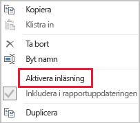

# Metoder för dataminskning för importmodellering

Den här artikeln vänder sig till Power BI Desktop-datamodellerare som utvecklar importmodeller. I den beskrivs olika tekniker för att hjälpa till att minska de data som läses in i importmodeller.

Importmodeller läses in med data som komprimeras och optimeras och sedan sparas till disk av VertiPaq-lagringsmotorn. När källdata läses in till minnet är det möjligt att få 10x komprimering, och därför är det rimligt att förvänta sig att 10 GB källdata kan komprimeras till en storlek på cirka 1 GB. När dessa data görs beständiga på en disk kan ytterligare 20 % minskning uppnås.

Trots den effektivitet som uppnås av VertiPaq-lagringsmotorn är det viktigt att du försöker minimera de data som ska läsas in i dina modeller. Detta gäller särskilt för stora modeller eller modeller som du tror kommer att växa sig stora över tid. Följande är fyra övertygande orsaker:

- Större modellstorlekar stöds kanske inte av din kapacitet. Delad kapacitet kan vara värd för modeller upp till 1 GB, medan Premium-kapaciteter kan vara värd för modeller upp till 13 GB i storlek. Mer information finns i artikeln[Power BI Premium-stöd för stora datamängder](../admin/service-premium-what-is.md).
- Mindre modellstorlekar minskar konkurrensen för kapacitetsresurser, särskilt vad gäller minne. Detta gör att fler modeller kan läsas in samtidigt under längre tidsperioder, vilket resulterar i lägre borttagningsfrekvenser. Mer information finns i [Hantera Premium-kapaciteter](../admin/service-premium-capacity-manage.md).
- Mindre modeller ger snabbare datauppdatering, vilket resulterar i rapporter med lägre svarstid, högre dataflöde för datamängdsuppdatering samt och mindre belastning på källsystem och kapacitetsresurser.
- Mindre antal tabellrader kan leda till snabbare beräkningsutvärdering, vilket kan ge bättre övergripande prestanda för frågor.

Åtta olika metoder för dataminskning beskrivs i den här artikeln. Dessa tekniker omfattar:

- [Ta bort onödiga kolumner](#remove-unnecessary-columns)
- [Ta bort onödiga rader](#remove-unnecessary-rows)
- [Gruppera efter och sammanfatta](#group-by-and-summarize)
- [Optimera kolumndatatyper](#optimize-column-data-types)
- [Preferens för anpassade kolumner](#preference-for-custom-columns)
- [Inaktivera inläsning av Power Query-fråga](#disable-power-query-query-load)
- [Inaktivera automatisk datum/tid](#disable-auto-datetime)
- [Växla till blandat läge](#switch-to-mixed-mode)

## Ta bort onödiga kolumner

Modelltabellkolumner har två huvudsakliga syften:

- **Rapportering** för att uppnå rapportdesign som på lämpligt sätt filtrerar, grupperar och sammanfattar modelldata
- **Modellstruktur** genom att stödja modellrelationer, modellberäkningar, säkerhetsroller och till och med datafärgsformatering

Kolumner som inte uppnår dessa syften kan förmodligen tas bort. Borttagning av kolumner kallas för _lodrät filtrering_.

Vi rekommenderar att du utformar modeller med exakt rätt antal kolumner baserat på de kända rapporteringskraven. Dina krav kan naturligtvis ändras med tiden, men tänk på att det är enklare att lägga till kolumner senare än att ta bort dem senare. Borttagning av kolumner kan förstöra rapporter eller modellstrukturen.

## Ta bort onödiga rader

Modelltabeller bör läsas in med så få rader som möjligt. Detta kan uppnås genom att filtrerade raduppsättningar läses in i modelltabeller av två olika anledningar: för att filtrera efter entitet eller tid. Borttagning av rader kallas _vågrät filtrering_.

**Filtrering efter entitet** omfattar inläsning av en delmängd av källdata till modellen. Det kan till exempel handla om att endast läsa in fakta för en enda region i stället för att läsa in försäljningsfakta för alla försäljningsregioner. Den här designmetoden resulterar i många mindre modeller, och den kan även eliminera behovet av att definiera säkerhet på radnivå (men kräver att du beviljar vissa behörigheter för datamängder i Power BI-tjänsten och skapar ”dubbletter” av rapporter som ansluter till varje datamängd). Du kan använda Power Query-parametrar och Power BI-mallfiler för att förenkla hantering och publicering. Mer information finns i blogginlägget [Deep Dive into Query Parameters and Power BI Templates](https://powerbi.microsoft.com/blog/deep-dive-into-query-parameters-and-power-bi-templates/) (Detaljerat om frågeparametrar och Power BI-mallar).

**Filtrering efter tid** innebär att begränsa den mängd _datahistorik_ som läses in till tabeller av faktatyp (och begränsa de datumrader som läses in till modelldatumtabellerna). Vi föreslår att du inte automatiskt läser in all tillgänglig historik, såvida inte det är ett känt rapporteringskrav. Det är bra att känna till att tidsbaserade Power Query-filter kan parametriseras och till och med anges att använda relativa tidsperioder (relativt uppdateringsdatumet, till exempel de senaste fem åren). Tänk även på att retroaktiva ändringar av tidsfilter inte förstör rapporter. Det resulterar bara i mindre (eller mer) datahistorik som är tillgänglig i rapporter.

## Gruppera efter och sammanfatta

Den kanske mest effektiva tekniken för att minska en modellstorlek att läsa in i förväg sammanfattade data. Den här tekniken kan användas till att minska kornigheten för tabeller av faktatyp. Det finns dock en betydande kompromiss i detta som leder till förlust av detaljnivå.

Till exempel lagrar en källfaktatabell med försäljning en rad per orderrad. Betydande dataminskning kan uppnås genom sammanfattning av alla försäljningsmått samt gruppering efter datum, kund och produkt. Tänk dig sedan att ännu högre dataminskning skulle kunna uppnås genom gruppering efter datum _på månadsnivå_. Det här skulle kunna uppnå en potentiell minskning på 99 % av modellstorleken, men då är det inte möjligt att rapportera på dagsnivå eller på enskild ordernivå. Sammanfattning av data av faktatyp inbegriper alltid kompromisser. Den här kompromissen kan minskas av en design för blandad modell, och alternativet beskrivs i tekniken [Växla till blandat läge](#switch-to-mixed-mode).

## Optimera kolumndatatyper

VertiPaq-lagringsmotorn använder separata datastrukturer för varje kolumn. Dessa datastrukturer uppnår enligt designen den högsta optimeringen för numeriska kolumndata, som använder värdekodning. Text och andra icke-numeriska data använder dock hash-kodning. Det kräver att lagringsmotorn tilldelar en numerisk identifierare till varje unikt textvärde i kolumnen. Det är den numeriska identifieraren som sedan lagras i datastrukturen, vilket kräver en hash-sökning under lagring och frågekörning.

I vissa fall kan du konvertera källtextdata till numeriska värden. Till exempel kan ett försäljningsordernummer konsekvent prefigeras med ett textvärde (till exempel ”SO123456”). Prefixet kan tas bort och ordernummervärdet konverteras till ett heltal. För stora tabeller kan detta leda till betydande dataminskning, särskilt när kolumnen innehåller unika värden eller värden med hög kardinalitet.

I det här exemplet rekommenderar vi att du anger kolumnens standardmässiga sammanfattningsegenskap till ”Summera inte”. På så sätt minimeras den olämpliga sammanfattningen av ordernummervärden.

## Preferens för anpassade kolumner

VertiPaq-lagringsmotorn lagrar modellberäknade kolumner (definierade i DAX) precis som vanliga Power Query-källkolumner. Datastrukturerna lagras dock på något annorlunda sätt och ger vanligtvis mindre effektiv komprimering. Dessutom skapas de när alla Power Query-tabeller har lästs in, vilket kan resultera i ökade tider för datauppdatering. Det är därför mindre effektivt att lägga till tabellkolumner som _beräknade_ kolumner än som _beräknade_ Power Query-kolumner (definieras i M).

Preferensen bör vara att skapa anpassade kolumner i Power Query. När källan är en databas kan du uppnå större belastningseffektivitet på två sätt. Beräkningen kan definieras i SQL-instruktionen (med hjälp av providerns interna frågespråk), eller så kan den materialiseras som en kolumn i datakällan.

Men i vissa fall kan modellberäknade kolumner vara det bästa valet. Detta kan vara fallet när formeln omfattar utvärdering av mått, eller om det krävs specifika modelleringsfunktioner som endast stöds i DAX-funktioner. Information om ett sådant exempel finns i artikeln [Förstå funktioner för överordnad-underordnad-hierarkier i DAX](/dax/understanding-functions-for-parent-child-hierarchies-in-dax).

## Inaktivera inläsning av Power Query-fråga

Power Query-frågor som avses stödja dataintegrering med andra frågor bör inte läsas in i modellen. För att undvika att läsa in frågan till modellen bör du se till att inaktivera frågebelastning i dessa fall.

## Inaktivera automatisk datum/tid

I Power BI Desktop finns det ett alternativ som heter _Automatisk datum/tid_. När det här alternativet är aktiverat skapas en dold tabell för automatisk datum/tid för datumkolumner som hjälper rapportförfattare när de konfigurerar filter, grupperar och ökar detaljnivån för kalenderns tidsperioder. De dolda tabellerna är egentligen beräknade tabeller som ökar modellens storlek. Anvisningar för hur du använder det här alternativet finns i artikeln [Vägledning för automatisk datum/tid i Power BI Desktop](../transform-model/desktop-auto-date-time.md).

## Växla till blandat läge

I Power BI Desktop skapar en design för blandad modell en sammansatt modell. I princip gör det att du kan välja lagringsläge _för varje tabell_. Därför kan varje tabell få egenskapen för lagringsläge angiven till Import eller DirectQuery (Dubbel är ett annat alternativ).

En effektiv teknik för att minska modellstorleken är att ange egenskapen Lagringsläge för större tabeller av faktatyp till DirectQuery. Den här designmetoden kan fungera väl tillsammans med tekniken [Gruppera efter och sammanfatta](#group-by-and-summarize), som introducerades tidigare. Till exempel kan sammanfattade försäljningsdata användas för att uppnå ”sammanfattningsrapportering” med höga prestanda. En detaljgranskningssida kan visa detaljerad försäljning för specifik (och begränsad) filterkontext, vilket visar alla försäljningsordrar inom kontexten. I det här exemplet skulle detaljgranskningssidan innehålla visuella objekt baserat på en DirectQuery-tabell för att hämta försäljningsorderdata.

Sammansatta modeller medför dock många säkerhets- och prestandakonsekvenser. Mer information finns i artikeln [Använda sammansatta modeller i Power BI Desktop](../transform-model/desktop-composite-models.md).

## Nästa steg

Mer information om Power BI-importmodelldesign finns i följande artiklar:

- [Använda sammansatta modeller i Power BI Desktop](../transform-model/desktop-composite-models.md)
- [Lagringsläge i Power BI Desktop](../transform-model/desktop-storage-mode.md)
- Har du några frågor? [Fråga Power BI Community](https://community.powerbi.com/)
