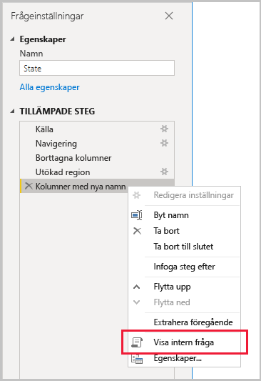
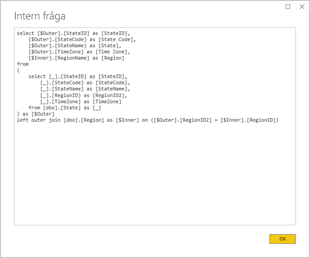
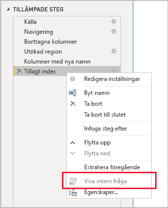

# <a name="the-importance-of-query-folding"></a>Vikten av frågedelegering

Den här artikeln vänder sig till datamodellerare som utvecklar modeller i Power BI Desktop. Den beskriver vad frågedelegering är och varför det är viktigt. Den beskriver också de datakällor och transformeringar som kan åstadkomma frågedelegering och hur du anger om dina Power Query-frågor kan delegeras, antingen helt eller delvis. Slutligen innehåller den rekommendationer om när och hur du kan få till frågedelegering.

Frågedelegering är möjligheten för en Power Query-fråga att generera ett enda frågeuttryck för att hämta och transformera källdata. Power Query-kombinationsmotorn strävar efter att uppnå frågedelegering när det är möjligt, eftersom det är det mest effektiva sättet att ansluta en Power BI-modelltabell till den underliggande datakällan.

Frågedelegering är ett viktigt begrepp inom datamodellering av flera anledningar:

- **Importmodelltabeller:** Datauppdateringar sker effektivt för importmodelltabeller med avseende på resursanvändning och uppdateringens tidsåtgång
- **DirectQuery-tabeller och tabeller med dubbelt lagringsläge:** Varje DirectQuery-tabell och tabell med dubbelt lagringsläget måste baseras på en Power Query-fråga som kan delegeras
- **Inkrementell uppdatering:** Inkrementella uppdateringar sker effektivt med avseende på resursanvändning och uppdateringens tidsåtgång. Faktum är att du får en varning i konfigurationsfönstret för den inkrementella uppdateringen om det inte går att uppnå frågedelegering för tabellen. Om det inte går så upphävs syftet med den inkrementella uppdateringen. Kombinationsmotorn skulle då behöva hämta alla källrader och sedan använda filter för att fastställa de inkrementella ändringarna.

Frågedelegering kan ske för en hel Power Query-fråga eller för en delmängd av stegen. När det inte går att uppnå vare sig delvis eller hel frågedelegering så måste Power Query-kombinationsmotorn i Power BI kompensera genom att själv bearbeta datatransformationerna. Det här kan innebära att hämta frågeresultat från källan, och om datamängden är stor kan det här ta mycket lång tid och förbruka stora mängder resurser.

Vi rekommenderar att datamodellerare strävar efter att designa sina importmodeller så effektivt som möjligt genom att säkerställa frågedelegering när det är möjligt.

## <a name="sources-that-support-query-folding"></a>Källor med stöd för frågedelegering

De flesta data källor som du kan använda frågespråk för har stöd för frågedelegering. De här datakällorna kan vara relationsdatabaser, OData-flöden (som SharePoint-listor), Exchange och Active Directory. Datakällor som flata filer, blobar och webbinnehåll har normalt inte det här stödet.

## <a name="transformations-that-can-achieve-query-folding"></a>Transformationer som kan uppnå frågedelegering

De transformationer i relationsdatakällan som kan delegeras kan skrivas som en enda SELECT-instruktion. SELECT-instruktioner kan utformas med lämpliga WHERE-, GROUP BY- och JOIN-satser. De kan också innehålla kolumnuttryck (beräkningar) med vanliga inbyggda funktioner som stöds i SQL-databaser.

I den här punktlistan ser du de transformationer som i allmänhet kan frågedelegeras.

- Ta bort kolumner
- Byta namn på kolumner (SELECT kolumnalias)
- Filtrera rader, antingen med statiska värden eller Power Query-parametrar (WHERE satspredikat)
- Gruppera och sammanfatta (GROUP BY sats)
- Expandera postkolumner (källans sekundärnyckelkolumner) för att koppla två källtabeller (JOIN sats)
- Explicit sammanfoga delegerbara frågor baserade på samma källa (JOIN sats)
- Lägga till delegerbara frågor baserade på samma källa (UNION ALL operator)
- Lägga till anpassade kolumner med _enkel logik_ (SELECT kolumnuttryck). Enkel logik innebär okomplicerade åtgärder, som användning av M-funktioner som har motsvarande funktioner i SQL-datakällan, exempelvis matematik eller textmanipulering. Följande uttryck returnerar till exempel årskomponenten i kolumnen **OrderDate** (ett numeriskt värde).

    ```powerquery-m
    Date.Year([OrderDate])
    ```

- Pivotering och normalisering (operatorerna PIVOT och UNPIVOT)

## <a name="transformations-that-prevent-query-folding"></a>Transformationer som förhindrar frågedelegering

I den här punktlistan ser du de transformationer som i allmänhet förhindrar frågedelegering. Listan är inte avsedd som en fullständig förteckning.

- Sammanfoga frågor baserade på olika källor
- Lägga till (UNION) frågor baserade på olika källor
- Lägga till anpassade kolumner med _komplicerad logik_. Komplicerad logik avser användning av M-funktioner som inte har några motsvarande funktioner i datakällan. Följande uttryck formaterar till exempel värdet i kolumnen **OrderDate** (för att returnera ett textvärde).

    ```powerquery-m
    Date.ToText([OrderDate], "yyyy")
    ```

- Lägga till indexkolumner
- Ändra datatypen för en kolumn

När en Power Query-fråga omfattar flera datakällor och datakällornas sekretessnivåer är inkompatibla så kan detta förhindra frågedelegering. Mer information finns i artikeln [Sekretessnivåer i Power BI Desktop](../desktop-privacy-levels.md).

## <a name="determine-when-a-query-can-be-folded"></a>Avgöra när en fråga kan delegeras

Du kan avgöra när en Power Query-fråga kan delegeras i redigeringsfönstret i Power Query. Om du högerklickar på det senast tillämpade steget i fönstret **Frågeinställningar** och alternativet **Visa intern fråga** är aktiverat (inte nedtonat) så kan frågan delegeras.



Om du vill visa den delegerade frågan kan du välja alternativet **Visa intern fråga**. Då ser du den interna fråga som Power Query använder för att hämta källdata.



Om alternativet **Visa intern fråga** inte är aktivt (nedtonad) så kan inte alla frågesteg delegeras. Det kan dock vara så att en delmängd av stegen fortfarande kan delegeras. Om du går baklänges från det sista steget kan du för varje steg kontrollera om alternativet **Visa intern fråga** är aktivt eller inte. När det sker har du hittat stället i stegsekvensen där det inte längre gick att uppnå frågedelegering.



## <a name="best-practice-guidance"></a>Vägledning och metodtips

Kort sagt så måste Power Query-frågan uppnå frågedelegering för DirectQuery eller tabeller med dubbelt lagringsläge. För en importtabell som baseras på en relationskälla, och när en enda SELECT-instruktion kan konstrueras, så får du _bästa möjliga prestanda för datauppdateringen_ genom att säkerställa att frågedelegering verkligen sker. Om kombinationsmotorn fortfarande måste bearbeta transformationer bör du minimera mängden arbete den måste utföra, särskilt för stora datamängder.

I den här punktlistan ges några viktiga metodtips.

- **Delegera så mycket bearbetning till datakällan som möjligt:** Om alla steg i en Power Query-fråga inte kan delegeras så ska du identifiera vilket steg det är som förhindrar delegeringen. Om det går kan du flytta senare steg till en tidigare position i sekvensen så att de omfattas av delegeringen. Power Query-kombinationsmotorn kan vara tillräckligt smart för att ordna om frågestegen när källfrågan genereras.

Om det gäller en relationsdatakälla, och om steget som förhindrar frågedelegeringen kan utföras i en enda SELECT-instruktion, eller i procedurlogiken för en lagrad procedur, bör du överväga att använda en intern frågeinstruktion som beskrivs nedan.

- **Använd en intern SQL-fråga:** När en Power Query-fråga hämtar data från en relationskälla kan du använda en intern SQL-fråga. Frågan kan faktiskt vara valfri giltig instruktion, även att köra en lagrad procedur. Om instruktionen genererar flera resultatuppsättningar returneras bara den första. Du kan deklarera parametrar i instruktionen, och vi rekommenderar att du använder M-funktionen [Value.NativeQuery](/powerquery-m/value-nativequery) till att skicka parametervärden säkert och smidigt. Det är viktigt att du förstår att Power Query-kombinationsmotorn inte kan delegera efterföljande frågesteg, och därför är det mycket viktigt att du får med all (eller så mycket som möjligt) transformeringslogik i den interna frågeinstruktionen.

    Det finns två viktiga saker att tänka på när du använder interna SQL-frågor:

    - För en DirectQuery-modelltabell måste frågan vara en SELECT-instruktion, och du kan inte använda vanliga tabelluttryck (CTE) eller en lagrad procedur i den
    - En intern SQL-fråga kan inte användas vid inkrementell uppdatering, så då skulle Power Query-kombinationsmotorn behöva hämta alla källrader och sedan tillämpa filter för att fastställa de inkrementella ändringarna

    > [!IMPORTANT]
    > En intern fråga kan göra mer än att bara hämta data. Du kan köra valfri giltig instruktion (eventuellt flera gånger), även sådana som ändrar eller tar bort data. Det är viktigt att du använder principen om minsta behörighet så att kontot som används för åtkomst till databasen bara har läsbehörighet till nödvändiga data.

- **Förbered och transformera data i källan:** Om du upptäcker att vissa Power Query-frågesteg inte kan delegeras kanske du kan utföra transformationerna i datakällan. Det kan du göra genom att skriva en databasvy som logiskt transformerar källdata, eller genom att fysiskt förbereda och materialisera data innan Power BI kör frågor om dem. Ett relationsbaserat informationslager är ett utmärkt exempel på förberedda data, eftersom det vanligtvis består av förintegrerade källor till organisationsdata.

## <a name="next-steps"></a>Nästa steg

Du kan läsa mer om frågedelegering och relaterade artiklar i de här resurserna:

- [Använda sammansatta modeller i Power BI Desktop](../desktop-composite-models.md)
- [Inkrementell uppdatering i Power BI Premium](../service-premium-incremental-refresh.md)
- [Implementera frågedelegering med Table.View](/power-query/handlingqueryfolding)
- Har du några frågor? [Fråga Power BI Community](https://community.powerbi.com/)
