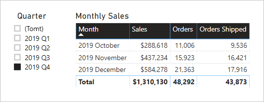

# <a name="active-vs-inactive-relationship-guidance"></a>Vägledning för aktiva kontra inaktiva relationer

Den här artikeln är avsedd för dig som är datamodellerare som arbetar med Power BI Desktop. Den ger vägledning om när du ska skapa aktiva eller inaktiva modellrelationer. Som standard sprider aktiva relationer filter till andra tabeller. Inaktiv relation kan dock endast sprida filter när ett DAX-uttryck aktiverar (använder) relationen.

[!INCLUDE [relationships-prerequisite-reading](includes/relationships-prerequisite-reading.md)]

## <a name="active-relationships"></a>Aktiva relationer

I allmänhet rekommenderar vi att du definierar aktiva relationer när det är möjligt. De utvidgar omfånget och potentialen för hur din modell kan användas av rapportförfattare och användare som arbetar med frågor och svar.

Överväg ett exempel av en importmodell som är utformad för att analysera prestanda för flyg i tid (OTP). Modellen har en **Flight**-tabell som är en tabell av faktatyp som lagrar en rad per flyg. Varje rad registrerar flygdatum, flygnummer, avgång och ankomst och eventuella fördröjningstider (i minuter). Det finns också en **Airport**-tabell, som är en tabell av dimensionstyp som lagrar en rad per flygplats. Varje rad beskriver flygplatskoden, flygplatsens namn och landet.

Här är en del av ett modelldiagram över de två tabellerna.


Det finns två modellrelationer mellan tabellerna **Flight** och **Airport**. I **Flight**-tabellen är **DepartureAirport**- och **ArrivalAirport**-kolumnerna kopplade till **Airport**-kolumnen i **Airport**-tabellen. I star-schemadesignen beskrivs **Airport**-tabellen som en [rollspelsdimension](star-schema.md#role-playing-dimensions). I den här modellen är de två rollerna _avgångsflygplats_ och _ankomstflygplats_.

Även om den här designen fungerar bra för relationella star-schemadesigner, är den inte för Power BI-modeller. Det beror på att modellrelationer är sökvägar för filterspridning och dessa sökvägar måste vara deterministiska. Därför kan en modell inte ha flera aktiva relationer mellan två tabeller. Därför, såsom beskrivs i det här exemplet, är en relation aktiv medan den andra är inaktiv (representeras av den streckade linjen). Mer specifikt är det förhållandet till **ArrivalAirport**-kolumnen som är aktiv. Det innebär att filter som tillämpas på **Airport**-tabellen automatiskt sprids till **ArrivalAirport**-kolumnen i **Flight**-tabellen.

Den här modelldesignen medför allvarliga begränsningar för hur data kan rapporteras. Mer specifikt är det inte möjligt att filtrera **Airport**-tabellen för att automatiskt isolera flyguppgifter för en avgångsflygplats. Eftersom rapporteringskrav omfattar filtrering (eller gruppering) av avgångs- och ankomstflygplatser _samtidigt_, krävs två aktiva relationer. Om du översätter detta krav till en Power BI-modelldesign måste modellen ha två flygplatstabeller.

Här är den förbättrade modelldesignen.


Modellen har nu två flygplatstabeller: **Departure Airport** och **Arrival Airport**. Modellrelationerna mellan dessa tabeller och tabellen för **Flight** är aktiva. Observera också att kolumnnamnen i **Departure Airport**- och **Arrival Airport**-tabellerna föregås av ordet _Departure_ eller _Arrival_.

Den förbättrade modelldesignen stöder framställning av följande rapportdesign.


Rapportsidan filtreras efter Melbourne som avgångsflygplats och tabellen visuella grupper per ankomstflygplatser.

> [!NOTE]
> För importmodeller har den extra tabellen resulterat i en ökad modellstorlek och längre uppdateringstider. Detta strider mot rekommendationerna som beskrivs i artikeln [Tekniker för dataminskning för importmodellering](import-modeling-data-reduction.md). I exemplet kommer dock kravet att endast ha aktiva relationer att åsidosätta dessa rekommendationer.
>
> Dessutom är det vanligt att tabeller med dimensionstyp innehåller låga radantal i förhållande till radantalet för tabellen av faktatyp. Därför är den ökade modellstorleken och uppdateringstiderna troligtvis inte alltför stora.

### <a name="refactoring-methodology"></a>Refaktorisering av metodik

Här är en metod för att omstrukturera en modell från en enda tabell med dimensionstyp, till en design med _en tabell per roll_.

1. Ta bort alla inaktiva relationer.
2. Överväg att byta namn på den rollbaserade tabellen av dimensionstyp för att bättre beskriva dess roll. I exemplet är **Airport**-tabellen relaterad till **ArrivalAirport**-kolumnen i **Flight**-tabellen, så den byter namn till **Arrival Airport**.
3. Skapa en kopia av rollspelstabellen och ge den ett namn som motsvarar dess roll. Om det är en importtabell rekommenderar vi att du definierar en beräknad tabell. Om det är en DirectQuery-tabell kan du duplicera Power Query-frågan.

    I exemplet skapades **Departure Airport**-tabell med hjälp av följande beräknade tabelldefinition.

    ```dax
    Departure Airport = 'Arrival Airport'
    ```

4. Skapa en aktiv relation för att relatera den nya tabellen.
5. Överväg att byta namn på kolumnerna i tabellerna så att de återspeglar sin roll korrekt. I exemplet föregås alla kolumner av ordet _Departure_ eller _Arrival_. Dessa namn garanterar att rapportvisualiseringar som standard har självbeskrivande och icke-tvetydiga etiketter. Det förbättrar också Frågor och svar-upplevelsen, så att användarna enkelt kan skriva sina frågor.
6. Överväg att lägga till beskrivningar till rollspelstabeller. (I rutan **Fält** kan en beskrivning visas i en knappbeskrivning när en rapportförfattare hovrar markören över tabellen.) På så sätt kan du förmedla eventuell ytterligare filterspridningsinformation till dina rapportförfattare.

## <a name="inactive-relationships"></a>Inaktiva relationer

I vissa fall kan inaktiva relationer hantera särskilda rapporteringsbehov.

Nu ska vi överväga olika modell- och rapporteringskrav:

- En försäljningsmodell innehåller en **Sales**-tabell som har två datumkolumner: **OrderDate** och **ShipDate**
- Varje rad i **Sales**-tabellen registrerar en enskild beställning
- Datumfilter används nästan alltid i kolumnen **OrderDate**, som alltid lagrar ett giltigt datum
- Endast ett mått kräver spridning av datumfilter till kolumnen **ShipDate**, som kan innehålla tomma värden (tills beställningen har levererats)
- Det finns inget krav på att samtidigt filtrera (eller gruppera efter) beställnings- _och_ leveransdatumperioder

Här är en del av ett modelldiagram över de två tabellerna.


Det finns två modellrelationer mellan tabellerna **Sales** och **Date**. I **Sales**-tabellen relaterar **OrderDate**- och **ShipDate**-kolumnerna för **Date**-kolumnen för **Date**-tabellen. I den här modellen är de två rollerna för **Date**-tabellen _order date_ och _ship date_. Det är relationen till kolumnen **OrderDate** som är aktiv.

Alla sex mått, förutom ett, måste filtreras efter kolumnen **OrderDate**. Måttet **Beställningar levererade** måste dock filtreras efter **ShipDate**-kolumnen.

Här är definitionen på måttet **Beställningar**. Det räknar bara raderna i **Sales**-tabellen i filterkontexten. Alla filter som tillämpas på **Date**-tabellen kommer att spridas till **OrderDate**-kolumnen.

```dax
Orders = COUNTROWS(Sales)
```

Här är definitionen på måttet **Beställningar levererade**. Den använder DAX-funktionen [USERELATIONSHIP](/dax/userelationship-function-dax) som aktiverar filterspridningen för en speciell relation endast under utvärderingen av uttrycket. I det här exemplet används relationen till kolumnen **ShipDate**.

```dax
Orders Shipped =
CALCULATE(
    COUNTROWS(Sales)
    ,USERELATIONSHIP('Date'[Date], Sales[ShipDate])
)
```

Denna modelldesign stöder framställning av följande rapportdesign.



Rapportsidan filtreras efter kvartal 2019 Q4. Tabellen visar grupper per månad och visar olika försäljningsstatistik. Måtten **Beställningar** och **Beställningar levererade** ger olika resultat. De använder samma sammanfattningslogik (antal rader i **Sales**-tabellen), men olika filterspridning för **Date**-tabell.

Observera att kvartalutsnittet innehåller ett tomt objekt. Det här utsnittsobjektet visas som ett resultat av [tabellexpansion](../transform-model/desktop-relationships-understand.md#strong-relationships). Även om varje **Sales**-tabellrad har ett beställningsdatum, har vissa rader ett tomt leveransdatum – dessa beställningar är ännu inte levererade. Tabellexpansion beaktar även inaktiva relationer, så tomma objekt kan visas på grund av tomma objekt på många sidor av relationen eller på grund av problem med dataintegriteten.

## <a name="recommendations"></a>Rekommendationer

Sammanfattningsvis rekommenderar vi att du definierar aktiva relationer när det är möjligt. De utvidgar omfånget och potentialen för hur din modell kan användas av rapportförfattare och användare som arbetar med frågor och svar. Det innebär att tabeller av typen rollspelsdimensioner ska dupliceras i din modell.

I vissa fall kan du dock definiera en eller flera inaktiva relationer för en tabell av typen rollspelsdimension. Du kan tänka på den här designen när:

- Det inte finns något krav på att rapportvisualiseringar ska filtreras samtidigt efter olika roller
- Du kan använda USERELATIONSHIP DAX-funktionen för att aktivera en speciell relation för relevanta modellberäkningar

## <a name="next-steps"></a>Nästa steg

Mer information om ämnet i den här artikeln finns i följande resurser:

- [Modellrelationer i Power BI Desktop](../transform-model/desktop-relationships-understand.md)
- [Förstå star-schemat och dess betydelse för Power BI](star-schema.md)
- [Vägledning vid felsökning av relationer](relationships-troubleshoot.md)
- Har du några frågor? [Fråga Power BI Community](https://community.powerbi.com/)
- Har du förslag? [Bidra till att förbättra Power BI](https://ideas.powerbi.com/)
