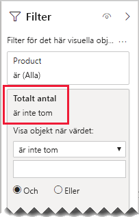

# <a name="bi-directional-relationship-guidance"></a>Vägledning för dubbelriktad relation

Den här artikeln är avsedd för dig som är datamodellerare som arbetar med Power BI Desktop. Den ger dig vägledning om när du bör skapa dubbelriktade modellrelationer. En dubbelriktad relation är en relation som filtrerar i _båda riktningarna_.

[!INCLUDE [relationships-prerequisite-reading](includes/relationships-prerequisite-reading.md)]

I allmänhet rekommenderar vi att du minimerar användningen av dubbelriktade relationer. De kan påverka prestanda negativt för modellfrågor och kan åstadkomma förvirrande upplevelser för dina rapportanvändare.

Det finns tre scenarier när dubbelriktad filtrering kan lösa särskilda krav:

- [Speciella modellrelationer](#special-model-relationships)
- [Utsnittsobjekt med data](#slicer-items-with-data)
- [Dimension-till-dimension-analys](#dimension-to-dimension-analysis)

## <a name="special-model-relationships"></a>Speciella modellrelationer

Dubbelriktade relationer spelar en viktig roll när du ska skapa följande två speciella modellrelationstyper:

- **En-till-en**: Alla en-till-en-relationer måste vara dubbelriktade – det går inte att konfigurera på något annat sätt. I allmänhet rekommenderar vi inte att du skapar de här typerna av relationer. En fullständig diskussion och alternativa modeller finns i [Vägledning till en-till-en-relationer](relationships-one-to-one.md).
- **Många-till-många**: När du relaterar två tabeller av dimenstionstyp till varandra, så krävs det en bryggningstabell. Ett dubbelriktat filter krävs för att säkerställa att filter sprids över bryggningstabellen. Mer information finns i [Vägledning till många-till-många-relationer (relatera många-till-många-dimensioner)](relationships-many-to-many.md#relate-many-to-many-dimensions).

## <a name="slicer-items-with-data"></a>Utsnittsobjekt med data

Flerriktade relationer kan tillhandahålla utsnitt som begränsar objekten till där data finns. (Om du är bekant med pivottabeller och utsnitt i Excel, så kan vi nämna att det är standardbeteendet vid hämtande av källdata från en Power BI-datamängd eller Analysis Services-modell.) Vad betyder detta? Låt oss först se på följande modelldiagram.


Den första tabellen heter **Kund** och innehåller tre kolumner: **Land/region**, **Kund** och **Kundkod**. Den andra tabellen heter **Produkt** och innehåller tre kolumner: **Färg**, **Produkt** och **SKU**. Den tredje tabellen heter **Försäljing** och innehåller fyra kolumner: **Kundkod**, **Orderdatum**, **Kvantitet** och **SKU**. Tabellerna **Kund** och **Produkt** är tabeller av dimensionstyp, och var och en har en en-till-många-relation till tabellen **Försäljing**. Varje enskild relation filtrerar i en riktning.

För att hjälpa till att beskriva hur dubbelriktad filtrering fungerar, så har vi ändrat modelldiagrammet så att tabellraderna visas. Alla exempel i den här artikeln baseras på dessa data.

> [!NOTE]
> Det går inte att visa tabellrader i Power BI Desktop-modelldiagrammet. Det sker i den här artikeln i syfte att stödja diskussionen med tydliga exempel.


Radinformationen för de tre tabellerna beskrivs i följande punktlista:

- Tabellen **Customer** innehåller två rader:
  - **Kundkod** CUST-01, **Kund** Kund-1, **Land/region** USA
  - **Kundkod** CUST-02, **Kund** Kund-2, **Land/region** Australien
- **Produkt**-tabellen innehåller tre rader:
  - **SKU** CL-01, **Produkt** T-shirt, **Färg** Grön
  - **SKU** CL-02, **Produkt** Jeans, **Färg** Blå
  - **SKU** AC-01, **Produkt** Hatt, **Färg** Blå
- Tabellen **Försäljning** innehåller tre rader:
  - **Orderdatum** 1 januari 2019, **Kundkod** CUST-01, **SKU** CL-01, **Kvantitet** 10
  - **Orderdatum** 2 februari 2019, **Kundkod** CUST-01, **SKU** CL-02, **Kvantitet** 20
  - **Orderdatum** 3 mars 2019, **Kundkod** CUST-02, **SKU** CL-01, **Kvantitet** 30

Låt oss titta på följande rapportsida.


Sidan består av två utsnitt och ett visuellt kortobjekt. Det första utsnittet är för **Land/region** innehåller två objekt: Australien och USA. Den följer för närvarande efter Australien. Det andra utsnittet är för **Produkt**, och det innehåller tre objekt: Hatt, Jeans and T-shirt. Inget objekt har valts (vilket innebär att _inga produkter_ filtreras). Det visuella kortobjektet visar kvantiteten 30.

När rapportanvändare gör ett utsnitt efter Australien vill du kanske begränsa **Product**-utsnittet till att visa objekt där data _relaterar_ till försäljning i Australien. Det är vad som avses med att visa utsnittsobjekt ”med data”. Du kan uppnå det här beteendet genom att konfigurera relationen mellan tabellerna **Produkt** och **Försäljning** så att de filtreras i båda riktningarna.


**Produkt**-utsnittet listar nu ett enskilt objekt: T-shirt. Det här objektet representerar den enda produkt som har sålts till australiensiska kunder.


Vi föreslår att du först noga överväger om den här designen kommer att fungera för dina rapportanvändare. Vissa rapportanvändare kan finna det förvirrande. De förstår inte varför utsnittsobjekten visas och försvinner dynamiskt när de interagerar med andra utsnitt.

Om du bestämmer dig för att visa utsnittsobjekt ”med data”, så rekommenderar vi inte att du konfigurerar dubbelriktade relationer. Dubbelriktade relationer kräver mer bearbetning, och kan därför inverka negativt på frågeprestanda – i synnerhet om antalet dubbelriktade relationer i din modell ökar.

Det finns ett bättre sätt att uppnå samma resultat på: Istället för att använda dubbelriktade filter, så kan du använda ett filter på visuell nivå på själva **Produkt**-utsnittet.

Låt oss nu se på relationen mellan tabellerna **Produkt** och **Försäljning** när den inte längre filtreras i båda riktningarna. Och följande måttdefinition har lagts till i tabellen **Försäljning**.

```dax
Total Quantity = SUM(Sales[Quantity])
```

Om du vill visa **Produkt**-utsnittsobjekt ”med data”, så behöver det helt enkelt filtreras efter måttet **Totalt antal** med villkoret ”är inte tom”.



## <a name="dimension-to-dimension-analysis"></a>Dimension-till-dimension-analys

Ett annorlunda scenario som involverar dubbelriktade relationer hanterar en tabell av faktatyp som en bryggningstabell. På det här viset stöder den analys av tabelldata av dimensionstyp i kontexen av en annan tabell av dimensionstyp.

Överväg med hjälp av exempelmodellen i den här artikeln hur följande frågor kan besvaras:

- Hur många färger såldes till australiensiska kunder?
- I hur många länder köptes jeans?

Båda frågorna kan besvaras _utan_ sammanfattningsdata i bryggningstabellen av faktatyp. De kräver dock att filter sprids från en tabell av dimensionstyp till en annan. När filter väl sprids via tabellen av faktatyp, så kan en sammanfattning av tabellkolumnerna av dimensionstyp uppnås med hjälp av funktionen [DISTINCTCOUNT](/dax/distinctcount-function-dax) DAX – och möjligtvis funktionerna [MIN](/dax/min-function-dax) och [MAX](/dax/max-function-dax) DAX.

Eftersom tabellen av faktatyp beter sig som en bryggningstabell, så kan du följa riktlinjerna för många-till-många-relationer när det gäller att relatera två tabeller av dimensionstyp till varandra. Detta kräver att du konfigurerar åtminstone en relation som filtrerar i båda riktningarna. Mer information finns i [Vägledning till många-till-många-relationer (relatera många-till-många-dimensioner)](relationships-many-to-many.md#relate-many-to-many-dimensions).

Så som redan beskrivits i den här artikeln, så kan den här designen dock resultera i en negativ inverkan på prestanda och användarens upplevelser kring [utsnittsobjekt ”med data”](#slicer-items-with-data). Så vi rekommenderar att du aktiverar dubbelriktad filtrering _i en måttdefinition_ genom att använda funktionen [CROSSFILTER](/dax/crossfilter-function) DAX istället. CROSSFILTER-funktionen kan användas för att modifiera filterriktningarna – eller till och med inaktivera relationen – under utvärderingen av ett uttryck.

Och överväg att lägga till följande måttdefinition till tabellen **Försäljning**. I det här exemplet har relationen mellan tabellerna **Kund** och **Försäljning** konfigurerats till att filtrera i _en riktning_.

```dax
Different Countries Sold =
CALCULATE(
    DISTINCTCOUNT(Customer[Country-Region]),
    CROSSFILTER(
        Customer[CustomerCode],
        Sales[CustomerCode],
        BOTH
    )
)
```

Under utvärderingen av måttuttrycket **Sålt i olika länder** filtreras relationen mellan tabellerna **Kund** och **Försäljning** i båda riktningarna.

Följande visuella tabellobjekt presenterar statistik för varje såld produkt. Kolumnen **Kvantitet** visar helt enkelt kvantitetssummevärdet. Kolumnen **Sålt i olika länder** representerar det distinkta antalet land/region-värden för alla kunder som har köpt produkten.


## <a name="next-steps"></a>Nästa steg

Mer information om ämnet i den här artikeln finns i följande resurser:

- [Modellrelationer i Power BI Desktop](../transform-model/desktop-relationships-understand.md)
- [Förstå star-schemat och dess betydelse för Power BI](star-schema.md)
- [Vägledning för en-till-en-relation](relationships-one-to-one.md)
- [Vägledning för att lägga till en många-till-många-relationer](relationships-many-to-many.md)
- [Vägledning vid felsökning av relationer](relationships-troubleshoot.md)
- Har du några frågor? [Fråga Power BI Community](https://community.powerbi.com/)
- Har du förslag? [Bidra till att förbättra Power BI](https://ideas.powerbi.com/)