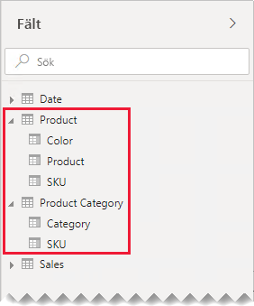
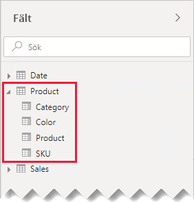
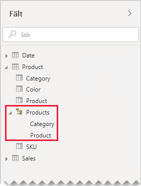
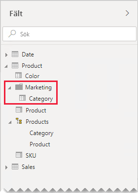

# Vägledning för en-till-en-relation

Den här artikeln är avsedd för dig som är datamodellerare som arbetar med Power BI Desktop. Den ger dig vägledning om hur du kan arbeta med en-till-en-modellrelationer. En en-till-en-relation kan skapas när var och en av tabellerna innehåller en kolumn med gemensamma och unika värden.

[!INCLUDE [relationships-prerequisite-reading](includes/relationships-prerequisite-reading.md)]

Det finns två scenarier som inbegriper en-till-en-relationer:

- [Degenererade dimensioner](#degenerate-dimensions): Du kan härleda en [degenererad dimension](star-schema.md#degenerate-dimensions) från en faktatyptabell.
- [Raddata sträcker sig över tabeller](#row-data-spans-across-tables): En enskild affärsentitet eller ett ämne läses in som två (eller flera) modelltabeller, möjligen eftersom deras data har sitt ursprung i olika datalager. Det här scenariot kan vara vanligt för tabeller av dimensionstyp. Huvudproduktinformation lagras t.ex. i ett operativt säljsystem och ytterligare produktinformation lagras i en annan källa.

    Det är dock ovanligt att man relaterar två tabeller av faktatyp med en ett-till-en-relation. Orsaken är att båda tabellerna av faktatyp måste ha samma dimensionalitet och kornighet. Varje tabell av faktatyp måste dessutom ha unika kolumner som tillåter att modellrelationen skapas.

## Degenererade dimensioner

När kolumner från en tabell av faktatyp används för filtrering eller gruppering, så kan du överväga att göra dem tillgängliga i en separat tabell. På så sätt kan du separera kolumner som används för filter eller gruppering från de kolumner som används för att sammanfatta faktarader. Denna separation kan:

- Reducera lagringsutrymme
- Förenkla modellberäkningar
- Bidra till bättre frågeprestanda
- Förse rapportförfattare med ett mer intuitivt **Fält**-fönster

Tänk dig en källförsäljningstabell som lagrar säljorderinformation i två kolumner.

I kolumnen **OrderNumber** lagras ordernumret och i kolumnen **OrderLineNumber** lagras en radsekvens i ordern.

Observera att kolumnerna för ordernummer och orderradsnummer i följande modelldiagram inte har lästs in i tabellen **Försäljning**. Istället användes värdena för att skapa en [surrogatnyckel](star-schema.md#surrogate-keys)kolumn med namnet **SalesOrderLineID**. (Nyckelvärdet beräknas genom att ordernumret multipliceras med 1000, varefter orderradsnumret läggs till.)

Tabellen **Försäljningsorder** erbjuder rapportförfattare tre kolumner: **Försäljningsorder**, **Försäljningsorderrad** och **Radnummer**. Den rymmer även en hierarki. De här tabellresurserna stöder rapportutformningar som måste filtrera, gruppera efter eller öka detaljnivån i order och orderrader.

Eftersom tabellen **Försälningsorder** härleds från försäljningsdata, så ska det finnas exakt samma antal rader i varje tabell. Dessutom ska det finnas matchande värden i varje **SalesOrderLineID**-kolumn.

## Raddata sträcker sig över tabeller

Tänk dig ett exempel som involverar två en-till-en-relaterade tabeller av dimensionstyp: **Produkt** och **Produktkategori**. Varje tabell representerar importerade data och har en **SKU**-kolumn (lagerhållningsenhet) som innehåller unika värden.

Här är en del av ett modelldiagram över de två tabellerna.

Den första tabellen heter **Produkt** och innehåller tre kolumner: **Färg**, **Produkt** och **SKU**. Den andra tabellen heter **Produktkategori** och innehåller två kolumner: **Kategori** och **SKU**. En en-till-en-relation relaterar de två **SKU**-kolumnerna till varandra. Relationen filtrerar i båda riktningarna, vilket alltid är fallet med en-till-en-relationer.

För att hjälpa till att beskriva hur spridningen av relationsfiltret fungerar har modelldiagrammet ändrats så att tabellraderna visas. Alla exempel i den här artikeln baseras på dessa data.

> [!NOTE]
> Det går inte att visa tabellrader i Power BI Desktop-modelldiagrammet. Det sker i den här artikeln i syfte att stödja diskussionen med tydliga exempel.

Radinformationen för de två tabellerna beskrivs i följande punktlista:

- **Produkt**-tabellen innehåller tre rader:
  - **SKU** CL-01, **Produkt** T-shirt, **Färg** Grön
  - **SKU** CL-02, **Produkt** Jeans, **Färg** Blå
  - **SKU** AC-01, **Produkt** Hatt, **Färg** Blå
- Tabellen **Produktkategori** innehåller två rader:
  - **SKU** CL-01, **Kategori** Kläder
  - **SKU** AC-01, **Kategori** Accessoarer

Observera att tabellen **Produktkategori** inte inkluderar någon rad för produkten SKU CL-02. Vi ska diskutera konsekvenserna av denna saknade rad längre fram i den här artikeln.

I **Fält**-fönstret hittar rapportförfattare produktrelaterade fält i två tabeller: **Produkt** och **Produktkategori**.

Låt oss se vad som händer när fält från båda tabellerna läggs till i ett visuellt tabellobjekt. I det här exemplet hämtas **SKU**-kolumnens innehåll från **Produkt**-tabellen.

Observera att värdet för **Kategori** för produkten SKU CL-02 är TOM. Orsaken till detta är att det inte finns någon rad för den här produkten i tabellen **Produktkategori**.

### Rekommendationer

Närhelst det är möjligt rekommenderar vi att du undviker att skapa en-till-en-modellrelationer när raddata sträcker sig över modelltabeller. Förklaringen ligger i att den här designen kan:

- Bidra till att **Fält**-fönstret skräpas ned genom att fler tabeller än nödvändigt listas
- Göra det svårt för rapportförfattare att hitta relaterade fält, efterso de distribueras till flera tabeller
- Begränsa möjligheten att skapa hierarkier, eftersom deras nivåer måste baseras på kolumner från _samma tabell_
- Producera oväntade resultat när det inte finns någon komplett matchning av rader mellan tabellerna

Specifika rekommendationer kan variera beroende på om en-till-en-relationen är _intra-insulär_ eller _inter-insulär_. Mer information om utvärdering av relationer finns i [Modellrelationer i Power BI Desktop (relationsutvärdering)](../desktop-relationships-understand.md#relationship-evaluation).

### Intra-insulär en-till-en-relation

När en _intra-insulär_ en-till-en-relation finns mellan tabeller, så rekommenderar vi att du konsoliderar data i en enskild modelltabell. Det gör du genom att sammanfoga Power Query-frågorna.

I det följande presenteras en metod för att konsolidera och utforma en-till-en-relaterade data:

1. **Sammanfoga frågor**: När du [kombinerar de två frågorna](../desktop-shape-and-combine-data.md#combine-queries), så ta hänsyn till datafullständigheten i respektive fråga. Om en fråga innehåller en komplett uppsättning rader (som en huvudlista), så sammanfoga den andra frågan med den. Konfigurera sammanslagningstransformationen med en _vänster yttre koppling_, vilket är standardkopplingstypen. Den här kopplingstypen ser till att du behåller alla rader i den första frågan, och kompletterar dem med alla eventuella matchande rader i den andra frågan. Utöka alla nödvändiga kolumner från en andra frågan i den första frågan.
2. **Inaktivera frågeinläsning**: Se till att [inaktivera inläsningen](import-modeling-data-reduction.md#disable-power-query-query-load) av den andra frågan. På så vis läses dess resultat inte in som en modelltabell. Den här konfigurationen reducerar datamodellens lagringsstorlek och bidrar till att hålla **Fält**-fönstret rent från skräp.

    I vårt exempel kan rapportförfattare nu hitta en enskild tabell med namnet **Produkt** i **Fält**-fönstret. Det innehåller alla produktrelaterade fält.

    
3. **Ersätt värden som saknas**: Om den andra frågan har omatchade rader, så visas NULL i de kolumner som introducerats av den. Överväg, när så är lämpligt, att ersätta NULL-värdena med ett tokenvärde. Att ersätta värden som saknas är särskilt viktigt när rapportförfattarna filtrerar eller grupperar efter kolumnvärdena, eftersom tomma värden inte kan visas i visuella rapportobjekt.

    Lägg i följande visuella tabellobjekt märke till att kategorin för produkten SKU CL-02 nu anges som _[Odefinierad]_ . I frågan ersattes null-kategorierna med detta tokentextvärde.

    

4. **Skapa hierarkier**: Om det finns relationer _mellan kolumnerna_ i den nu konsoliderade tabellen, så kan det vara bra att skapa hierarkier. På så vis kan rapportförfattare snabbt identifiera möjligheter för att öka detaljnivån för visuella rapportobjekt.

    I vårt exempel kan nu rapportförfattarna använda en hierarki med två nivåer: **Kategori** och **Produkt**.

    

Om du uppskattar hur separata tabeller bidrar till att ordna dina fält, så rekommenderar vi ändå att du konsoliderar till en enskild tabell. Du kan fortfarande ordna dina fält, men genom att använda _visningsmappar_ istället.

I vårt exempel kan rapportförfattare hitta fältet **Kategori** i visningsmappen **Marknadsföring**.

Om du ändå väljer att definiera en intra-insulär en-till-en relation i din modell, så se till, närhelst möjligt, att det finns matchande rader i de relaterade tabellerna. Eftersom en intra-insulär en-till-en-relation utvärderas som en [stark relation](../desktop-relationships-understand.md#strong-relationships), så kan dataintegritetsärenden dyka upp i dina visuella rapportobjekt som TOM. (Du kan se ett exempel på en TOM gruppering i det första visuella tabellobjektet som presenterades i den här artikeln.)

### Inter-insulär en-till-en-relation

När det finns en _inter-insulär_ en-till-en-relation mellan tabeller, så finns det inte någon alternativ modelldesign, såvida du inte konsoliderat data i dina datakällor i förväg. Power BI utvärderar en-till-en-modell relationen som en [svag relation](../desktop-relationships-understand.md#weak-relationships). Därför bör du se till att det finns matchande rader i de relaterade tabellerna, eftersom omatchade rader elimineras från frågeresultaten.

Låt oss se vad som händer när fält från båda tabellerna läggs till i ett visuellt tabellobjekt, och det finns en svag relation mellan tabellerna.

Tabellen visar endast två rader. Produkt-SKU:n r-02 saknas eftersom det inte finns någon matchande rad i tabellen **Produktkategori**.

## Nästa steg

Mer information om ämnet i den här artikeln finns i följande resurser:

- [Modellrelationer i Power BI Desktop](../desktop-relationships-understand.md)
- [Förstå star-schemat och dess betydelse för Power BI](star-schema.md)
- [Vägledning vid felsökning av relationer](relationships-troubleshoot.md)
- Har du några frågor? [Fråga Power BI Community](https://community.powerbi.com/)
- Har du förslag? [Bidra till att förbättra Power BI](https://ideas.powerbi.com/)
