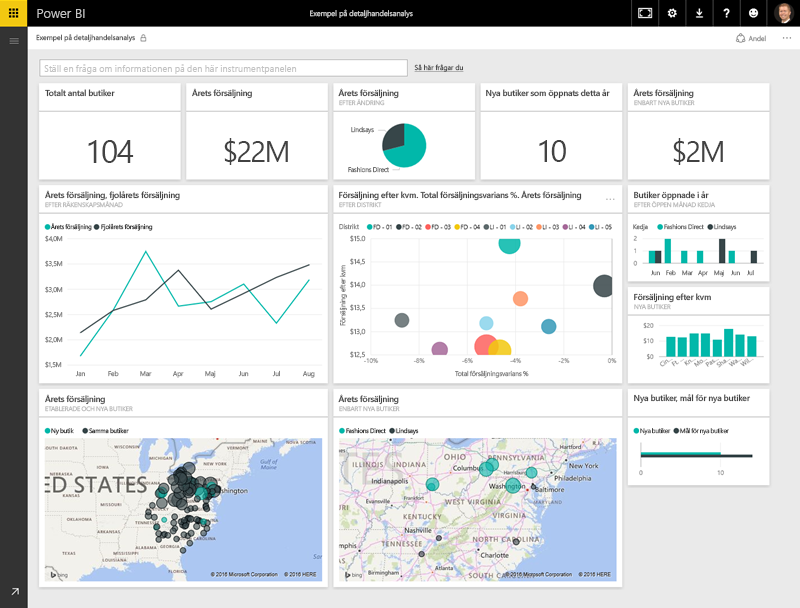
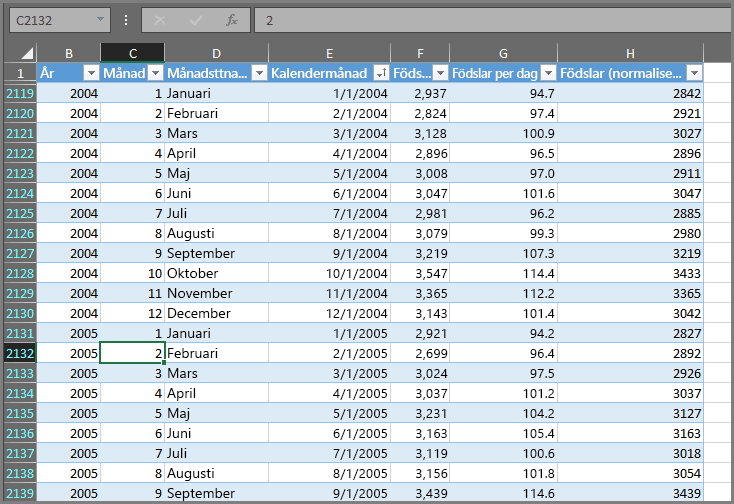
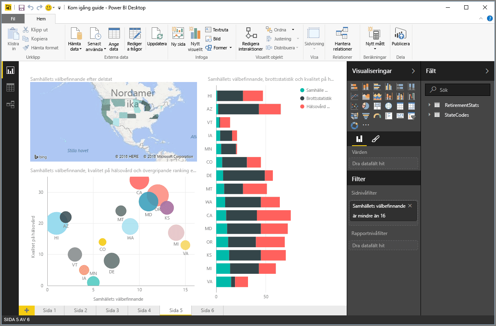
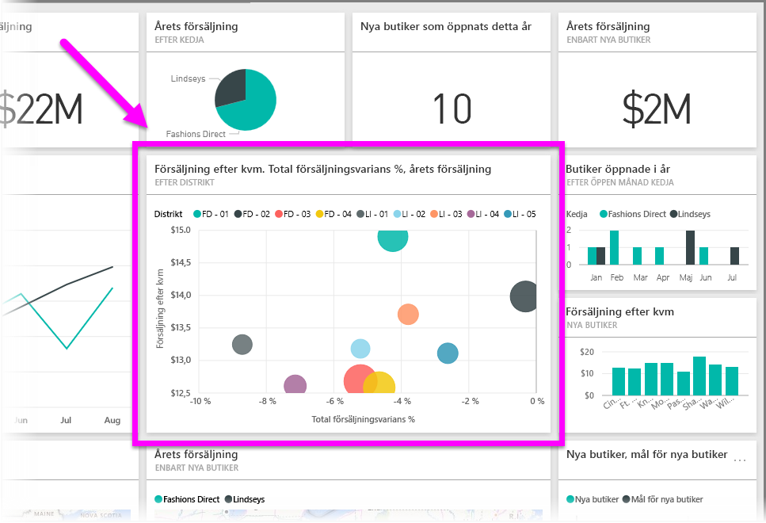

Allt du gör i Power BI kan delas upp i några grundläggande **byggstenar**. När du förstår dessa byggstenar kan du expandera dina kunskaper om var och en av dem och börja skapa avancerade och komplexa rapporter. När allt kommer omkring är även det till synes mest komplexa uppbyggt av grundläggande byggstenar – byggnader skapas till exempel med trä, stål, betong och glas. Bilar tillverkas av metall, tyg och gummi. Naturligtvis kan även byggnader och bilar vara enkla eller avancerade – beroende på hur de grundläggande byggstenarna placeras.

Låt oss ta en titt på dessa grundläggande byggstenar, diskutera några enkla saker som kan byggas med dem och sedan få en uppfattning om hur även komplexa saker kan skapas.

De grundläggande byggstenarna i Power BI är följande:

* Visualiseringar
* Datauppsättningar
* Rapporter
* Instrumentpaneler
* Paneler

## Visualiseringar
En **visualisering** (kallas ibland också ett **visuellt objekt**) är en visuell representation av data, till exempel ett diagram, en graf, en färgkodad översikt eller andra intressanta saker som du kan skapa för att framställa dina data visuellt. Power BI innehåller många olika visualiseringstyper och det kommer fler hela tiden. Följande bild visar en samling av olika visualiseringar som har skapats i Power BI-tjänsten.

Visualiseringar kan vara enkla – som ett enda tal som representerar något viktig – eller visuellt komplexa – som en gradientfärgad översikt som visar väljares åsikter rörande en viss social fråga eller ett socialt problem. Målet med ett visuellt objekt är att presentera data på ett sätt som ger kontext och insikter, två faktorer som sannolikt skulle vara svåra att avläsa från en rå tabell med siffror eller text.

## Datauppsättningar
En **datauppsättning** är en samling data som Power BI använder för att skapa sina visualiseringar.

Du kan ha en enkel datauppsättning baserad på en enskild tabell från en Excel-arbetsbok, liknande vad som visas i följande bild.

**Datauppsättningar** kan också vara en kombination av många olika källor som du kan filtrera och kombinera för att få en unik samling data (en datauppsättning) för användning i Power BI.

Du kan till exempel skapa en datauppsättning från tre olika databasfält, en webbplatstabell, en Excel-tabell och onlineresultat från en marknadsföringskampanj via e-post. Denna unika kombination betraktas fortfarande som en enskild **datauppsättning**, även om dess delar hämtades från flera olika källor.

Genom att filtrera data innan du för in dem i Power BI kan du fokusera på de data som är viktiga för dig. Du kan till exempel filtrera din kontaktdatabas så att endast kunder som fick e-post från marknadsföringskampanjen ingår i datauppsättningen. Sedan kan du skapa visualiseringar baserade på den delmängden (den filtrerade samlingen) kunder som inkluderades i kampanjen. Filtrering hjälper dig att fokusera dina data och ditt arbete.

En viktig och mycket fördelaktig egenskap hos Power BI är den stora mängden **datakopplingar** som ingår. Oavsett om de data som du vill använda befinner sig i Excel eller i en SQL-databas, i Azure eller i Oracle eller i en tjänst som Facebook, Salesforce eller MailChimp har Power BI inbyggda datakopplingar som gör att du enkelt kan ansluta till dessa data, filtrera dem vid behov och föra in dem i din datauppsättning.

När du har en datauppsättning kan du börja skapa visualiseringar som visar olika delar av datauppsättningen på olika sätt och få insikter från det som visas. Det är där som rapporter kommer in i bilden.

## Rapporter
I Power BI är en **rapport** en samling visualiseringar som visas tillsammans på en eller flera sidor. Precis som andra rapporter som du kan skapa för en försäljningspresentation eller en rapport som du skulle skriva för en skoluppgift, är en **rapport** i Power BI en samling objekt som är relaterade till varandra. Följande bild visar en **rapport** i Power BI Desktop – i det här fallet är det femte sidan i en sex sidor lång rapport. Du kan också skapa rapporter i Power BI-tjänsten.

Med rapporter kan du skapa många visualiseringar, flera sidor långa om så behövs, och du kan ordna dem på det sätt som bäst förmedlar det du vill få fram.

Du kan skapa en rapport om kvartalsvis försäljning, en om produkttillväxt i ett visst segment eller kanske en om isbjörnars migrationsmönster. Oavsett ämne kan du med de här rapporterna samla in och organisera dina visualiseringar på en eller flera sidor.

## Instrumentpaneler
När du är redo att dela en sida från en rapport, eller dela en samling visualiseringar, skapar du en **instrumentpanel**. Ungefär som instrumentpanelen i en bil, består **instrumentpanelen** i Power BI av en samling visuella objekt från en enskild sida som du kan dela med andra. Ofta är det en vald grupp med visuella objekt som ger snabb inblick i de data eller det förhållande som du vill presentera.

En instrumentpanel måste få plats på en enda sida, som ofta kallas en arbetsyta (arbetsytan är den tomma bakgrunden i Power BI Desktop eller tjänsten där du placerar dina visualiseringar). Se det som den arbetsyta en artist eller målare använder – en duk där du skapar, kombinerar och omarbetar intressanta och övertygande visuella objekt.
Du kan dela instrumentpaneler med andra användare eller grupper som sedan kan interagera med dig via instrumentpanelen när de befinner sig i Power BI-tjänsten eller på sin mobila enhet.

## Paneler
I Power BI är en **panel** en enstaka visualisering som finns i en rapport eller på en instrumentpanel. Det är den rektangulära rutan som innehåller varje enskilt visuellt objekt. På följande bild visas en panel (markerad med en färgstark ruta) som också omges av andra paneler.

När du *skapar* en rapport eller en instrumentpanel i Power BI, kan du flytta eller ordna paneler efter hur du vill presentera din information. Du kan göra dem större, ändra höjd eller bredd och lägga dem tätt intill andra paneler, hur du än vill ha det.

När du *visar* eller *använder* en instrumentpanel eller en rapport – vilket innebär att du inte har skapat den eller är ägaren, utan den har delats med dig – kan du interagera med den men inte ändra storlek på panelerna eller ändra hur de är placerade.

## Nu har du fått en översikt över alla delar
Detta var grunderna för Power BI och dess byggstenar. Vi tar en stund och repeterar det igen.

Power BI är en samling tjänster, appar, och kopplingar som gör att du kan ansluta till dina data, var de än finns, filtrera dem vid behov och sedan föra in dem i Power BI där du kan skapa övertygande visualiseringar som du kan dela med andra.  

Nu när du förstår den handfull grundläggande byggstenar som Power BI består av, blir det tydligare att du kan skapa datauppsättningar som passar just *dig* och skapa visuella och övertygande rapporter som berättar det som du vill förmedla. Budskap som förmedlas med Power BI behöver inte vara komplexa eller komplicerade för att vara övertygande.

För en del kan det vara mycket användbart att använda en enda Excel-tabell i en datauppsättning och sedan dela en instrumentpanel i Power BI med sitt team.

För andra kan det vara värdefullt att använda Azure SQL Data Warehouse-tabeller i realtid som kombineras med andra databaser och en realtidskälla som sedan filtreras i realtid för att skapa en datauppsättning som övervakar varje ögonblick av en tillverkningsprocess.

Processen är densamma för båda: skapa datauppsättningar, bygga övertygande visuella objekt och dela dem med andra. Och på samma sätt är resultatet av båda (för varje) detsamma: du kan utnyttja din ständigt expanderande samling data och omvandla dem till insiktsfulla beslutsunderlag.

Oavsett om dina datainsikter kräver enkla eller komplexa datauppsättningar, hjälper Power BI dig att komma igång snabbt och kan expandera med dina behov för att bli så komplext som dina data kräver. Och eftersom Power BI är en Microsoft-produkt, kan du räkna med att den är robust, utökningsbar, Office-vänlig och företagsredo.

Nu ska vi se hur det fungerar. Vi börjar med att ta en snabb titt på Power BI-tjänsten.

