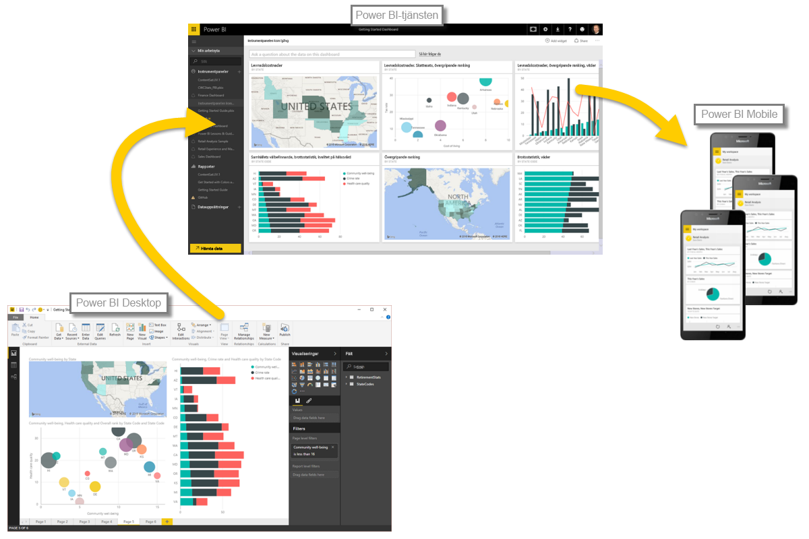

Nu när du känner till grunderna för Power BI ska vi gå vidare till några praktiska tips och en guidad visning. Guide för videogenomgången är **Will Thompson**, programchef för Power BI-teamet på Microsoft. Det kommer också att dyka upp några gästguider lite senare i kursen.

Will kommer beskriva de många saker du kan göra med Power BI. Tänk på att alla dessa aktiviteter och den analys som du kan göra med Power BI vanligtvis följer ett normalt flöde. Det **vanliga aktivitetsflödet** i Power BI är följande:

* Hämta data till Power BI Desktop och skapa en rapport.
* Publicera till Power BI-tjänsten där du skapar nya visualiseringar eller instrumentpaneler
* Dela dina instrumentpaneler med andra, särskilt med personer som är i farten
* Visa och interagera med delade instrumentpaneler och rapporter i Power BI Mobile-appar

Som tidigare nämnts kan du ägna all tid åt **Power BI-tjänsten**, exempelvis för hämtning av data och att skapa instrumentpaneler. Någon annan i ditt team använder kanske enbart **Power BI Desktop**, vilket också går bra. För att hjälpa dig att förstå hela omfattningen av Power BI och vad du kan göra, visar vi dig alltihop. Därefter kan du bestämma hur du ska använda det på bästa sätt.

Vi sätter igång och låter Will ta oss genom processen. Den första uppgiften är att du ska förstå de grundläggande byggstenarna för Power BI, vilket ger en god grund för att lära dig hur Power BI förvandlar data till rapporter och visuella objekt.

