I det här avsnittet tar vi en närmare titt på hur de första två delarna av Power BI fungerar ihop:

* Skapa en rapport i **Power BI Desktop**
* Publicera rapporten i **Power BI-tjänsten**

Vi börjar i Power BI Desktop och väljer **Hämta data**. Samling med datakällor visas, så att du kan välja en datakälla. I följande bild visas hur någon väljer en webbsida som källa. I videon ovan väljer Will en **Excel**-arbetsbok.

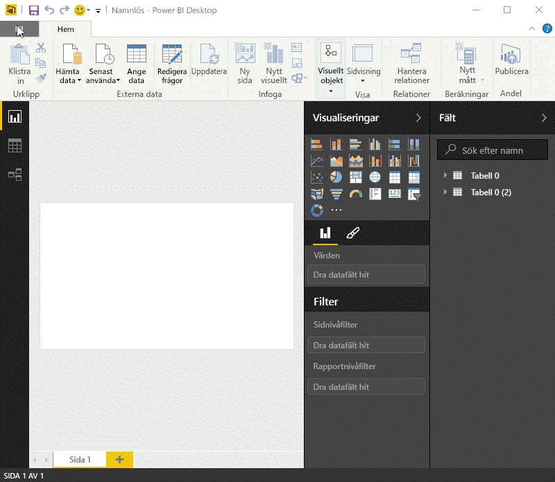

Oavsett vilken datakälla du väljer, så ansluter Power BI till datakällan, och visar dig tillgängliga data från källan. Följande bild är ett annat exempel. Den är hämtad från en webbsida som analyserar olika tillstånd och viss intressant tillbakadragandestatistik.

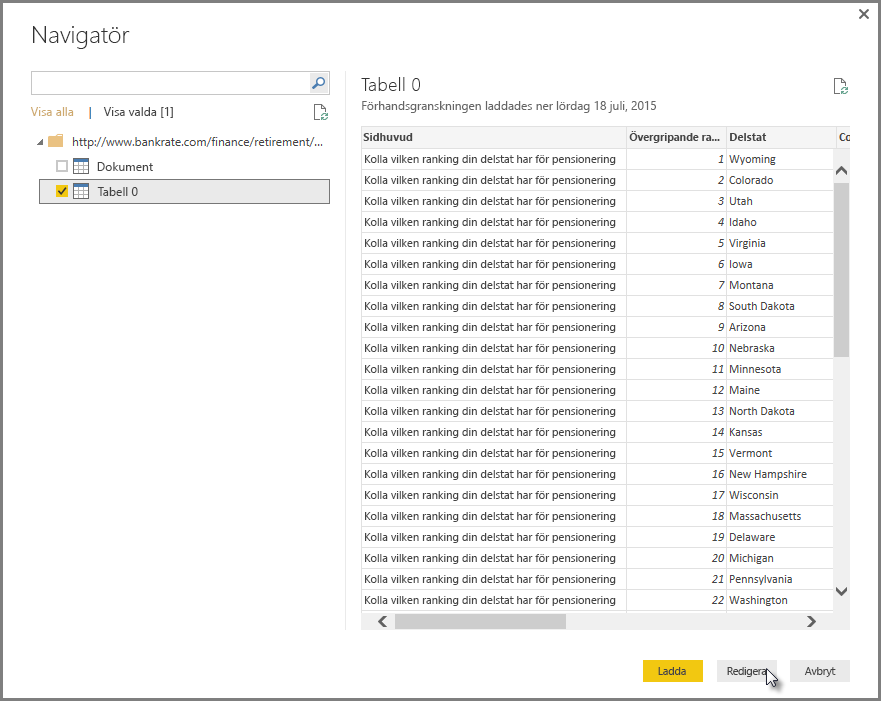

Du kan börja bygga rapporter i **rapportvyn** i Power BI Desktop.

**Rapportvyn** innehåller fem huvudområden:

1. Menyfliksområdet, där vanliga uppgifter som är associerade med rapporter och visualiseringar visas
2. **Rapportvyn**, eller arbetsytan, där visualiseringarna skapas och arrangeras
3. Flikområdet **Sidor** längst ned, där du kan välja eller lägga till en rapportsida
4. Rutan **Visualiseringar**, där du ändrar visualiseringar, anpassar färger, tillämpar filter, drar fält och mycket annat
5. Rutan **Fält**, där du kan dra frågeelement och filter till **rapportvyn** eller till området **Filter** i fönstret **Visualiseringar**

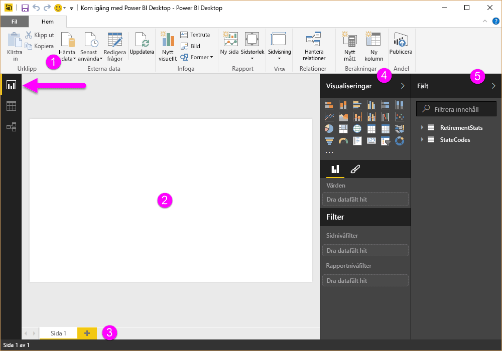

Du kan dölja fönstren **Visualiseringar** och **Fält** genom att välja den lilla pilen längs kanten, vilket ger mer utrymme i **rapportvyn** för att skapa snygga visualiseringar. När du modifierar visualiseringar visas även pilar som pekar uppåt eller nedåt, vilket innebär att du kan visa respektive dölja motsvarande avsnitt.

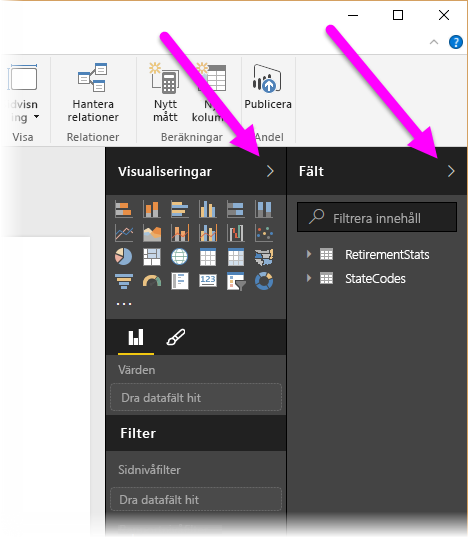

Om du vill skapa en visualisering är det bara att dra ett fält från listan **Fält** till **rapportvyn**. I det här fallet drar vi fältet Tillstånd från *RetirementStats* och ser vad som händer.

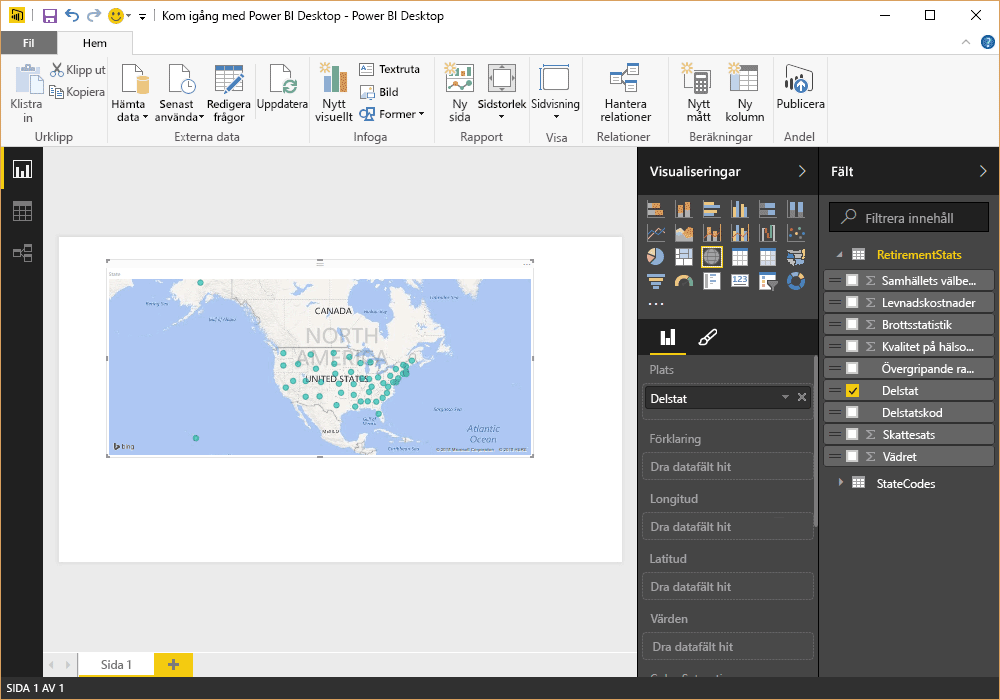

Ser man på... Power BI Desktop har automatiskt skapat en kartabaserad visualisering eftersom programmet registrerade att fältet Tillstånd innehöll geoplatsdata.

Låt oss snabbspola framåt en bit nu. Efter att ha skapat en rapport med några visualiseringar kan vi nu publicera detta i Power BI-tjänsten. Välj **Publicera** i menyfliksområdet **Start** i Power BI Desktop.

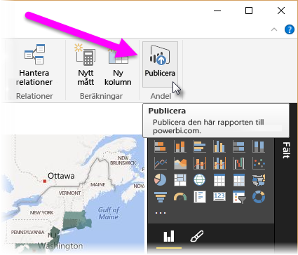

Du uppmanas att logga in på Power BI.

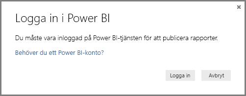

När du har loggat in och publiceringsprocessen är klar visas följande dialogruta. Du kan välja länken (nedan **klart!** ), så kommer du till Power BI-tjänsten, där du kan se den rapport du precis har publicerat.

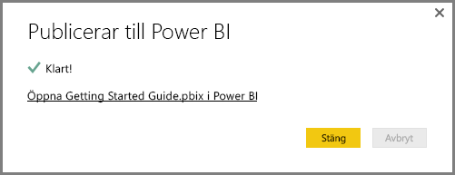

När du loggar in på Power BI visas den Power BI Desktop-fil som du precis har publicerat i tjänsten. I bilden nedan visas den rapport som du skapade i Power BI Desktop i avsnittet **Rapporter**.

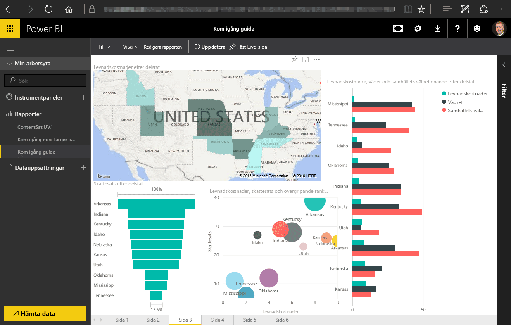

I rapporten kan du välja **fästikonen** och fästa det visuella objektet på en instrumentpanel. Följande bild visar fästikonen markerad med en ljus ruta och pil.

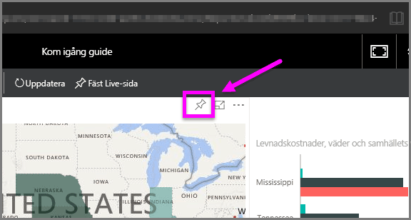

När du väljer ikonen visas följande dialogruta, med vilken du kan fästa det visuella objektet på en befintlig instrumentpanel eller skapa en ny instrumentpanel.

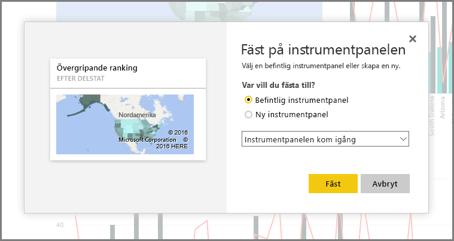

När vi har fäst ett par visuella objekt från rapporten visas de på instrumentpanelen.

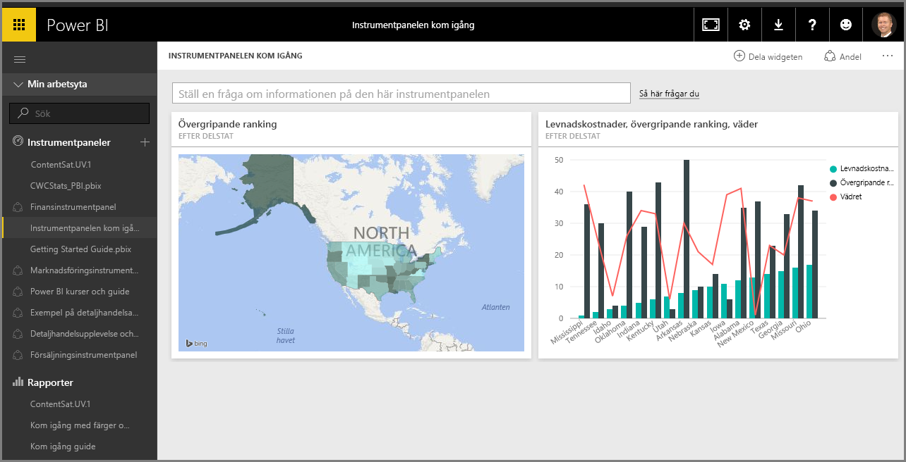

Det finns såklart mycket mer du kan göra med Power BI, som att dela de instrumentpaneler du skapar. Vi kommer att diskutera detta längre fram i den här kursen.

Nu ska titta vi på en funktion som kan skapa instrumentpaneler automatiskt. Allt du behöver göra är att ansluta till en molntjänst som Facebook, Salesforce eller någon annan.

