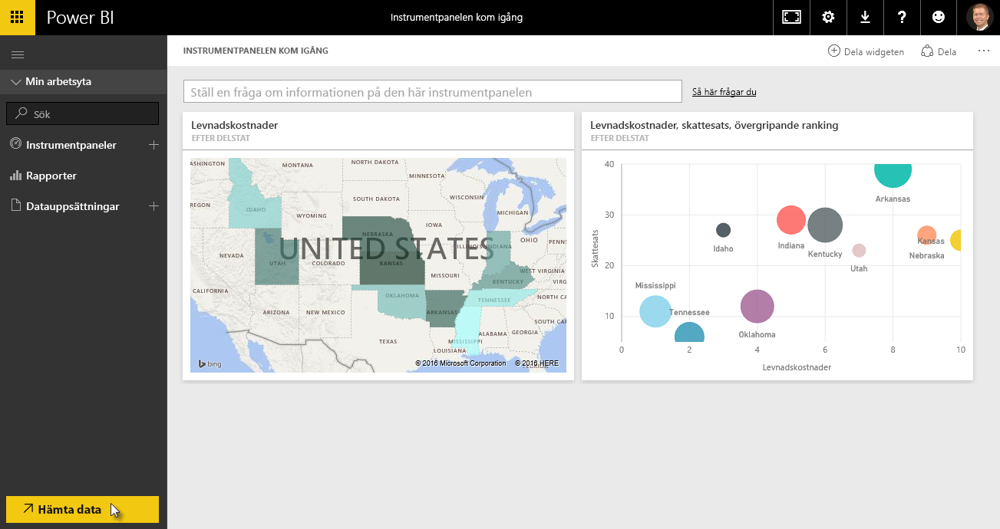
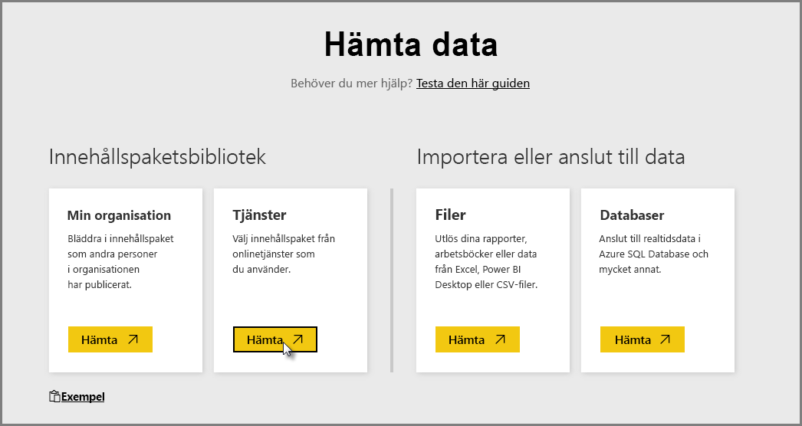
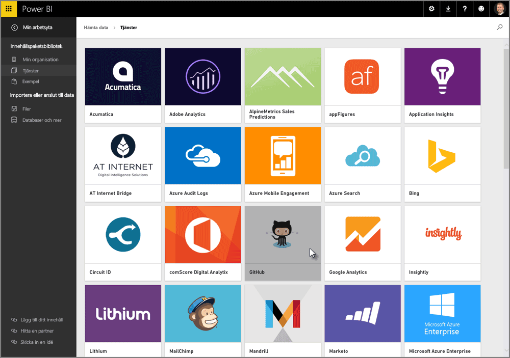
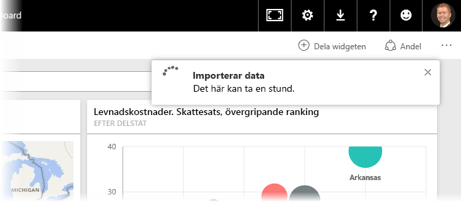
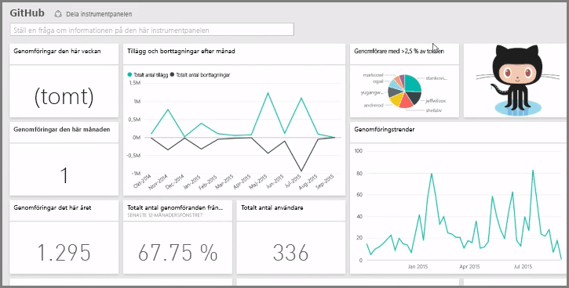
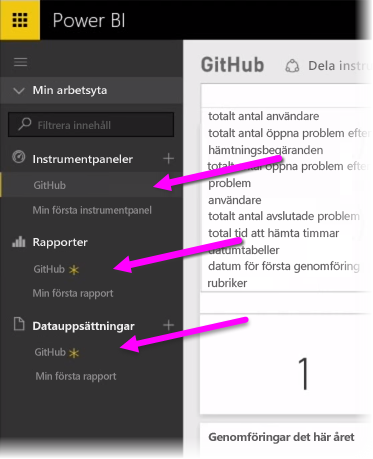
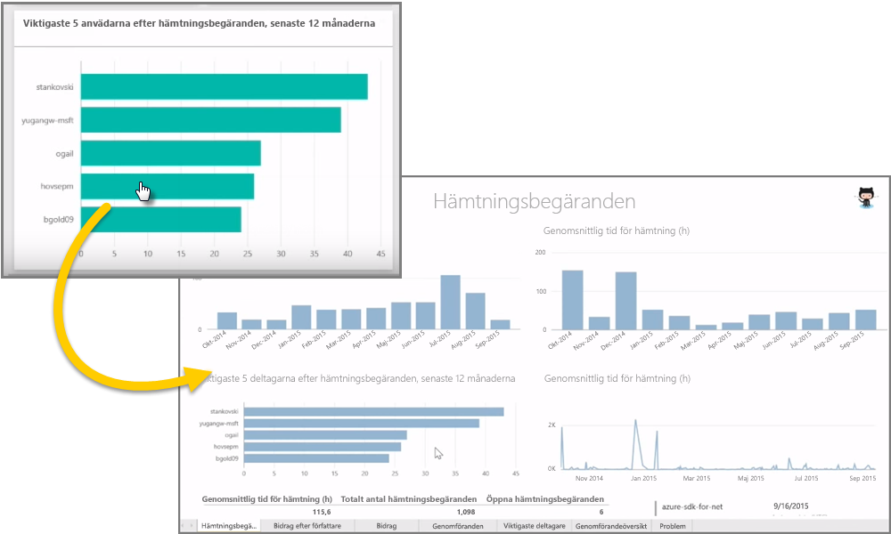
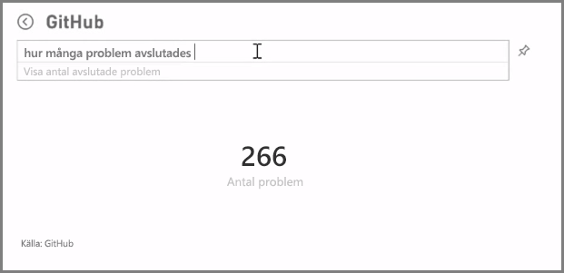
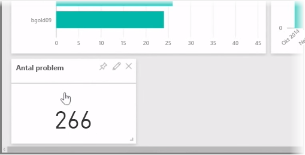
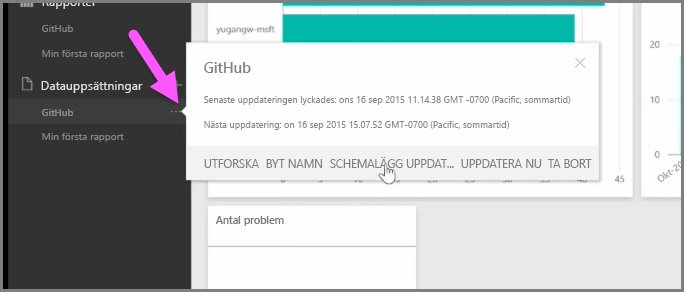

Som vi fick lära oss tidigare är det vanliga arbetsflödet i Power BI att skapa en rapport i Power BI Desktop, publicera den i Power BI-tjänsten och sedan dela den med andra så att de kan visa den i tjänsten eller i en mobilapp.

Vissa börjar dock i Power BI-tjänsten, så vi tar en snabbtitt på tjänsten och lär oss mer om ett enkelt och populärt sätt att snabbt skapa visuella objekt i Power BI: *innehållspaket*.

Ett **innehållspaket** är en samling förkonfigurerade, färdiga visuella objekt och rapporter som baseras på specifika datakällor, till exempel Salesforce. Att använda ett innehållspaket är som att köra en enportionsrätt i mikron eller beställa en stor snabbmatsmeny: efter bara några klickningar och kommentarer serveras du snabbt flera olika rätter som har utformats för att passa bra ihop och allt presenteras i ett välordnat paket, redo för konsumtion.

Så låt oss ta en snabbtitt på innehållspaket, tjänsten och hur det fungerar. Vi går in mer i detalj på innehållspaket (och tjänsten) i kommande avsnitt; tänk på det här som en aptitretare för att göra dig lite hungrig.

## Skapa färdiga instrumentpaneler med molntjänster
Med Power BI är det enkelt att ansluta till data. Från Power BI-tjänsten kan du enkelt välja knappen **Hämta data** i det nedre vänstra hörnet på startsidan.

På *arbetsytan* (området i mitten av Power BI-tjänsten) visas tillgängliga datakällor i Power BI-tjänsten. Utöver vanliga datakällor som Excel-filer, databaser eller Azure-data kan Power BI även ansluta till **programvarutjänster** (kallas även för SaaS-leverantörer eller molntjänster) som Salesforce, Facebook, Google Analytics och ett helt utbud av andra SaaS-tjänster lika enkelt.

För de här programvarutjänsterna tillhandahåller **Power BI-tjänsten** en samling färdiga visuella objekt som på förhand ordnats på instrumentpaneler och i rapporter som kallas **innehållspaket**. Med innehållspaket kommer du snabbt igång med Power BI med data från den tjänst som du väljer. När du till exempel använder Salesforce-innehållspaketet, ansluter Power BI till ditt Salesforce-konto (när du har angett dina autentiseringsuppgifter) och fyller därefter i en fördefinierad samling visuella objekt och instrumentpaneler i Power BI.

Power BI tillhandahåller innehållspaket för alla typer av tjänster. Följande bild visar den första bilden med tjänster, i alfabetisk ordning, som visas när du väljer **Hämta** från rutan **Tjänster** (visas i föregående bild). Som du kan ser på bilden nedan finns det många att välja mellan.

För våra syften väljer vi **GitHub**. GitHub är ett program för källkontroll online. När jag angett informationen och autentiseringsuppgifterna för GitHub-innehållspaketet börjar den importera mina data.

När dessa data har lästs in, visas det fördefinierade GitHub-innehållspaketets instrumentpanel.

Förutom **instrumentpanelen** finns även **rapporten** som genererades (som en del av GitHub-innehållspaketet) för att skapa instrumentpanelen tillgänglig, liksom **datauppsättningen** (den samling data som hämtats från GitHub) som skapades under dataimporten och användes för att skapa GitHub-rapporten.

Du kan klicka på något av de visuella objekten på instrumentpanelen så skickas du automatiskt vidare till den **rapportsida** där det visuella objektet skapades. Så när du klickar på **Topp 5-användare efter pull-begäranden** öppnar Power BI sidan **Pull-begäranden** i rapporten (den rapportsida det visuella objektet skapades från).

## Ställa frågor om dina data
Du kan även ställa frågor om dina data så skapar Power BI-tjänsten visuella objekt baserat på din fråga i realtid. I följande bild ser du hur Power BI skapar ett visuellt sifferobjekt för att visa antalet problem som har stängts, baserat på vad som skrivs i fältet för **frågor med naturligt språk**.

När du har ett visuellt objekt som du gillar kan du välja **fästikonen** till höger om fältet för frågor med naturligt språk för att fästa det visuella objektet på instrumentpanelen. I det här fallet fästs det visuella objekt på GitHub-instrumentpanelen eftersom det är den instrumentpanel som är vald för tillfället.

## Uppdatera data i Power BI-tjänsten
Du kan också välja att **uppdatera** datauppsättningen för ett innehållspaket eller andra data som du använder i Power BI. För att ställa in uppdateringsinställningar börjar du med att välja ellipserna (de tre punkterna) bredvid en datauppsättning så visas en meny.

Välj alternativet **Uppdatera schema** längst ned i menyn. Dialogrutan Inställningar visas på arbetsytan, där du kan ange uppdateringsinställningar som passar dina behov.

Nu är vår snabbtitt på Power BI-tjänsten över. Det finns många fler saker som du kan göra med tjänsten, vilket vi tar upp senare i den här kursen. Kom också ihåg att det finns många olika typer av data som du kan ansluta till och många olika typer av innehållspaket och det kommer allt fler hela tiden.

Bra, då går vi vidare till nästa ämne där vi sammanfattar det här **Komma igång**-avsnittet och förbereder dig inför nästa steg.

