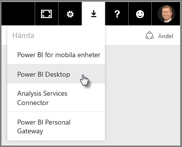
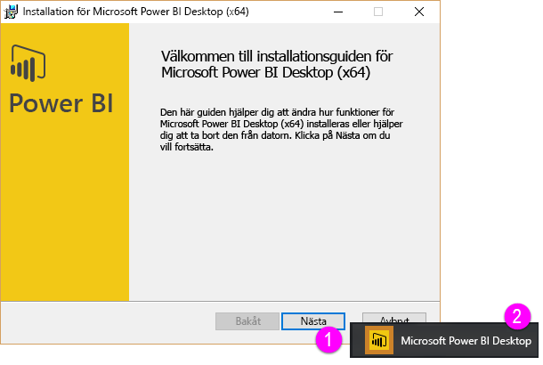

Välkommen till den andra delen i den **interaktiva utbildningen** för Power BI: **Hämta data**. I det här avsnittet tittar vi på flera datacentrerade funktioner och verktyg för Power BI, med fokus på Power BI Desktop. Många av dessa verktyg finns även i Power BI-tjänsten, så du får dubbel användning av det här avsnittet.

När du hämtar data är den ibland inte så bra formaterad eller *ren*, vilket du kanske vill att den ska vara. Så i det här avsnittet beskrivs hur du hämtar data, hur du rensar den (kallas ibland att *rensa* eller *transformera* data) och du får även vissa avancerade tips som gör din datahämtning enklare.

Som alltid i den här kursen har utbildningen samma struktur som arbetsflödet i Power BI. Därför startar vi med en titt på **Power BI Desktop**, där arbetet ofta börjar.

## En översikt över Power BI Desktop
Power BI Desktop är ett verktyg för att ansluta till, rensa och visualisera dina data. Med Power BI Desktop kan du ansluta till data och sedan modellera och visualisera den på olika sätt. De flesta användare som arbetar med Business Intelligence-projekt kommer att tillbringa merparten av sin tid med Power BI Desktop.

Du kan hämta Power BI Desktop [från webben](http://go.microsoft.com/fwlink/?LinkID=521662), du kan också installera **Power BI Desktop** som en app från [**Windows Store**](http://aka.ms/pbidesktopstore), eller så kan du hämta den från Power BI-tjänsten. För att hämta **Power BI Desktop** i tjänsten så väljer du bara nedpilen på den övre högra sidan av Power BI och välj sedan Power BI Desktop.

Power BI Desktop installeras som ett program på Windows-datorn.

När du har hämtat det installerar du Power BI Desktop och kör det likadant som andra program i Windows. Följande bild visar startskärmen för Power BI Desktop, som syns när du startar programmet.

Power BI Desktop ansluter till en mängd olika datakällor, från lokala databaser och Excel-kalkylblad till molntjänster. Det hjälper dig att rensa och formatera dina data så att de blir mer användbara, inklusive att dela upp och byta namn på kolumner, ändra datatyper och arbeta med datum. Du kan också skapa relationer mellan kolumner så att det blir lättare att modellera och analysera dina data.

