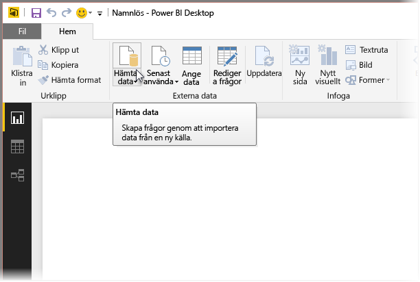
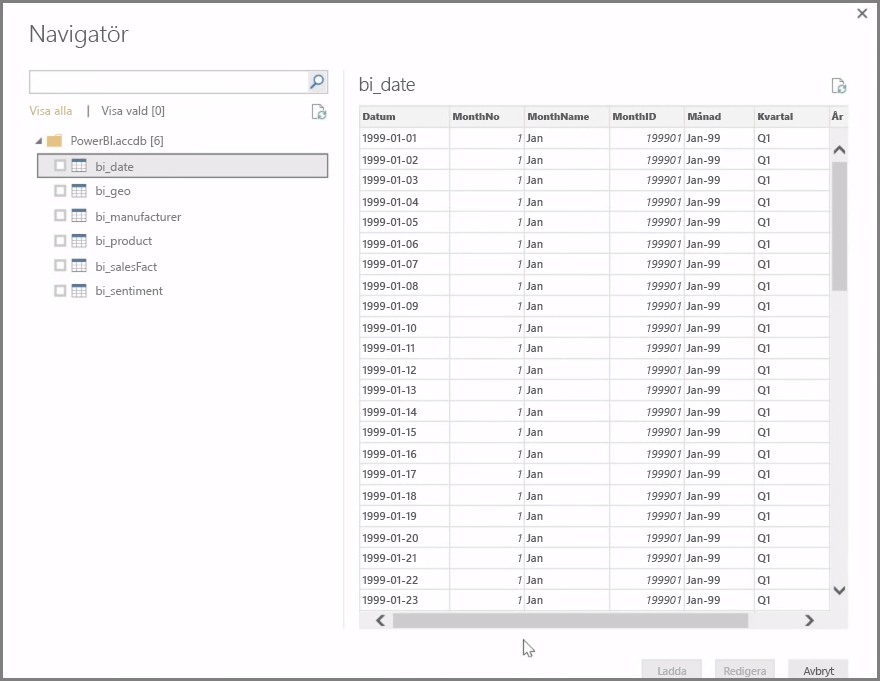
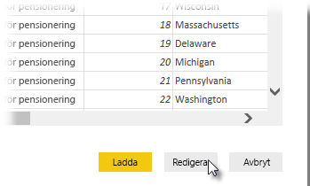

**Power BI Desktop** kan ansluta till en rad olika datakällor, däribland lokala databaser, Excel-arbetsböcker och molntjänster. För närvarande har över 59 olika molntjänster, t.ex. GitHub och Marketo, specifika anslutningsappar, och du kan ansluta till generiska datakällor via XML, CSV, text och ODBC. Power BI kan till och med även skrapa tabelldata direkt från en webbplats-URL! Men låt oss börja från början med att öppna Power BI Desktop och ansluta till data.

När du startar **Power BI Desktop** och går förbi startskärmen kan du hämta data från menyfliksområdet på fliken **Start**.

Det görs månatliga uppdateringar av Power BI Desktop, och med varje uppdatering uppdateras sidan **Power BI Desktop-nyheter** med information om uppdateringarna, länkar till bloggen och en länk för hämtning.

I Power BI Desktop finns det många olika typer av datakällor. Upprätta en anslutning genom att välja en källa. Beroende på ditt val blir du ombedd att hitta datakällan på datorn eller i nätverket, eller så uppmanas du att logga in på en tjänst och autentisera din begäran.

När du har anslutit är det första fönstret du ser **Navigatör**. Navigatören visar datakällans tabeller eller entiteter, och om du klickar på en av dem, så får du en förhandsgranskning av innehållet. Du kan sedan importera dina valda tabeller eller entiteter direkt, eller välja **Redigera** om du vill transformera och rensa data innan du importerar.

När du har valt de tabeller som du vill hämta in till Power BI Desktop kan du läsa in dem i Power BI Desktop genom att välja knappen **Läs in** längst ned till höger i **Navigatör**. Ibland kan det kanske hända att du vill göra ändringar i dessa tabeller innan du läser in dem i Power BI Desktop. Du vill kanske bara ha en delmängd av kunderna eller filtrera fram försäljnings enbart för ett visst land. I sådana fall kan du välja knappen Redigera och filtrera eller transformera data innan du hämtar in dem till Power BI Desktop.

Vi fortsätter där och redigerar våra data i nästa avsnitt.

