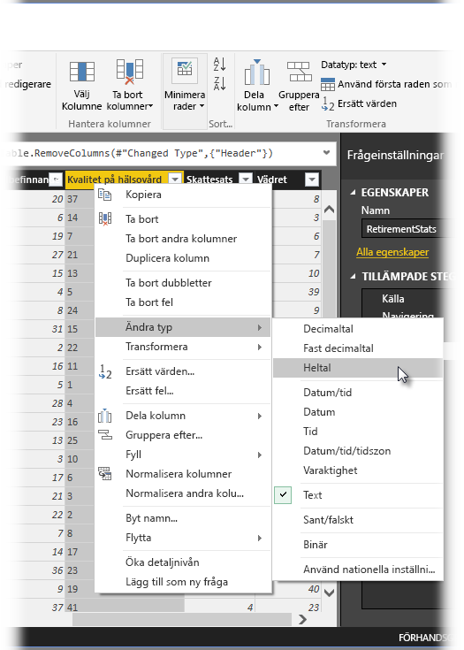
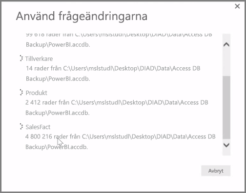

**Power BI Desktop** innehåller **Frågeredigeraren**, ett kraftfullt verktyg för att utforma och transformera data så att de är klara för dina modeller och visualiseringar. När du väljer Redigera i Navigatör starts Frågeredigeraren som fylls med tabeller eller andra entiteter som du väljer från datakällan.

Du kan också starta **Frågeredigeraren** direkt från **Power BI Desktop** med knappen **Redigera frågor** i menyfliksområdet **Start**.

När Frågeredigeraren har lästs in med data som är klara att utformas visas ett antal olika avsnitt:

1. Många knappar i menyfliksområdet är nu aktiverade, så att du kan interagera med frågans data
2. I det vänstra fönstret listas frågor (en för varje tabell eller entitet) som du kan välja, visa och utforma
3. I mittfönstret visas data från den valda frågan visas och kan bearbetas
4. Fönstret Frågeinställningar visas med en lista över frågans egenskaper och tillämpade steg

När du högerklickar på en kolumn i mittfönstret visas ett antal olika tillgängliga transformationer, t.ex. borttagning av kolumnen från tabellen, duplicering av kolumnen under ett nytt namn och ersättning av värden. Från den här menyn kan du också dela textkolumner i flera med hjälp av avgränsare.

Menyflliksområdet **Frågeredigeraren** innehåller fler verktyg, med vilka du t.ex. kan ändra kolumners datatyp, lägga till matematisk notation eller extrahera element från datum, t.ex. veckodag.

När du tillämpar transformationer visas varje steg i listan **Tillämpade steg** i fönstret **Frågeinställningar** till höger i **Frågeredigeraren**. Du kan använda listan om du vill ångra eller granska ändringar, eller t.o.m. ändra namnet på ett steg. Om du vill spara dina transformationer väljer du **Stäng och använd** på fliken **Start**.

När du har valt **Stäng och använd** tillämpar Frågeredigeraren de ändringar du har gjort i frågan, och tillämpar dem i Power BI Desktop.

Du kan åstadkomma allt möjligt när du transformerar data i **Frågeredigeraren**, vilket även inkluderar avancerade transformationer. I nästa avsnitt tar vi en titt på några av dessa avancerade transformationer, så att du får en uppfattning om de nästan obegränsade möjligheter du har när du transformerar data med **Frågeredigeraren**.

