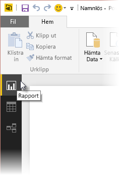
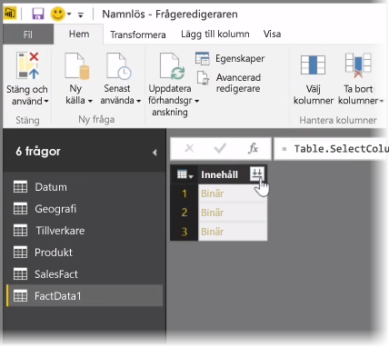
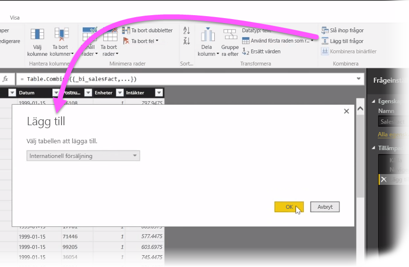
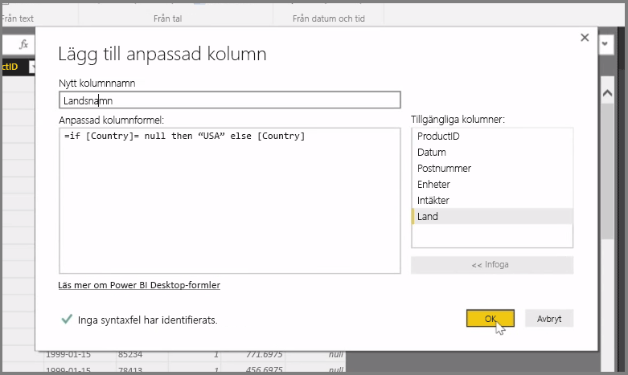

I den här artikeln undersöker vi några avancerade tekniker för dataimport och -rensning för **Power BI Desktop**. När du har format dina data i **Frågeredigeraren** och fört dem till **Power BI Desktop**, kan du titta på dem på ett antal olika sätt. Det finns tre vyer i Power BI Desktop: Vyn **Rapport**, vyn **Data** och vyn **Relationer**. Du kan visa varje vy genom att välja respektive ikon överst till vänster på arbetsytan. I följande bild har **rapportvyn** valts. Det gula fältet bredvid ikonen indikerar vilken vy som är aktiv.

Om du vill ändra vyn väljer du bara någon av de andra två ikonerna. Det gula fältet bredvid ikonen indikerar vilken vy som är aktiv.

Power BI Desktop kan kombinera data från flera källor i en enda rapport, när som helst under modelleringsprocessen. Om du vill lägga till ytterligare källor till en befintlig rapport, väljer du **Redigera frågor** på **Start**-menyfliken och sedan **Ny källa** i **Frågeredigeraren**.

Det finns många olika möjliga datakällor som du kan använda i **Power BI Desktop**, inklusive mappar. Genom att ansluta till en mapp kan du importera data från flera filer samtidigt, till exempel en serie med Excel-filer eller CSV-filer. Filerna som finns i den valda mappen visas i **Frågeredigeraren** som binärinnehåll och deras värden läses in om du klickar på dubbelpilsikonen överst i kolumnen **Innehåll**.

Ett av de mest användbara verktygen i Power BI är *filtren*. Om du till exempel väljer den nedrullningsbara pilen bredvid en kolumn öppnas en lista med textfilter som du kan använda för att ta bort värden från din modell.

Du kan också slå ihop och lägga till frågor och sammanfoga flera tabeller (eller data från olika filer i mappar) till en enda tabell som innehåller precis de data som du vill. Du kan använda verktyget **Lägg till frågor** för att lägga till data från en ny tabell till en befintlig fråga. Power BI Desktop försöker matcha kolumnerna i dina frågor som du sedan kan justera efter behov i **Frågeredigeraren**.

Slutligen ger verktyget **Lägg till anpassad kolumn** avancerade användare möjlighet att skriva frågeuttryck från grunden med hjälp av det kraftfulla M-språket. Du kan lägga till en anpassad kolumn baserad på uttryck på M-frågespråket och hämta dina data precis som du vill.

