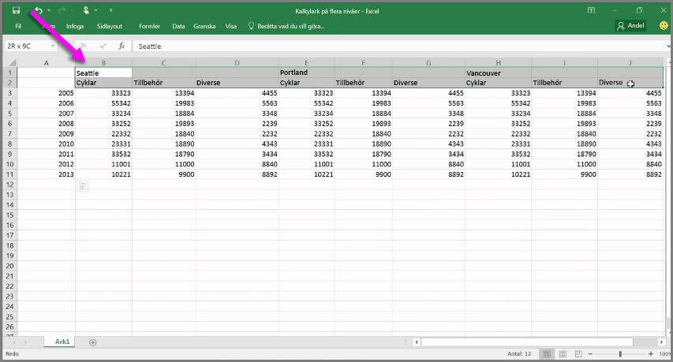
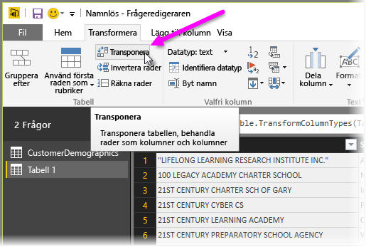
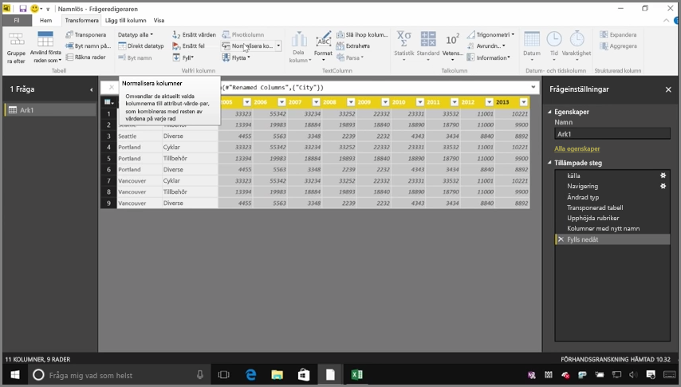
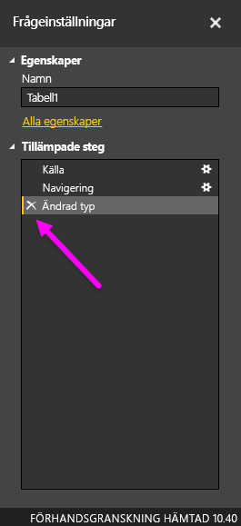
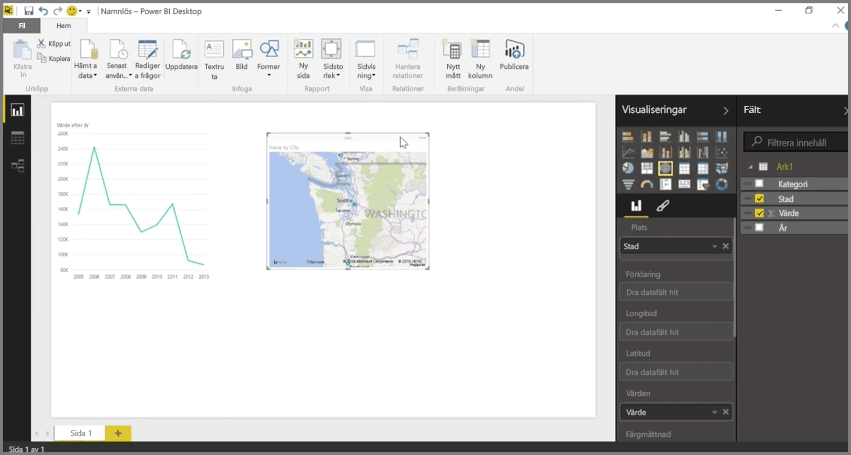

Power BI kan importera data från nästan alla källor men visualiserings- och modelleringsverktygen fungerar bäst med data i tabellform. Ibland är dina data inte formaterade i enkla kolumner, vilket ofta är fallet med Excel-kalkylblad, där en tabellayout som ser bra ut för det mänskliga ögat inte nödvändigtvis är optimal för automatiska frågor. Följande kalkylblad har till exempel rubriker som sträcker sig över flera kolumner.

Lyckligtvis har Power BI verktyg för att snabbt omvandla tabeller med flera kolumner till datauppsättningar som du kan använda.

## Transponera data
Med till exempel **Transponera** i **Frågeredigeraren**, kan du växla data (omvandla kolumner till rader och rader till kolumner) så att du kan bryta ned data till format som du kan manipulera.

När du har gjort det ett par gånger, enligt beskrivningen i videon, börjar din tabell likna något som Power BI lättare kan arbeta med.

## Formatera data
Du kan också behöva formatera data, så att Power BI kan kategorisera och identifiera dessa data korrekt när de har importerats.

Med en handfull omvandlingar, som *befordran av rader till rubriker* för att bryta ned rubriker, använda **Fyll** för att omvandla *null*-värden till de värden som finns upptill eller nedtill i en kolumn och **Normalisera kolumner**, kan du rensa data till en datauppsättning som du kan använda i Power BI.

Med Power BI kan du experimentera med dessa omvandlingar av dina data och avgöra vilka typer som får dina data i ett kolumnformat som gör att Power BI kan arbeta med dem. Och kom ihåg att alla åtgärder som du vidtar registreras i avsnittet Använda steg i Frågeredigeraren, så om en omvandling inte fungerar som du hade tänkt dig kan du bara klick på **x** bredvid steget och ångra det.

## Skapa visuella objekt
När dina data är i ett format som Power BI kan använda, genom att omvandla och rensa dessa data, kan du börja skapa visuella objekt.

## Nästa steg
**Grattis!** Du har slutfört det här avsnittet i kursen **Interaktiv utbildning** för Power BI. Nu vet hur du **hämtar data** till Power BI Desktop och hur du *formar* eller *omvandlar* dessa data så att du kan skapa övertygande visuella objekt.

Nästa steg i att lära sig hur Power BI fungerar, och hur du får det att fungera för *dig*, är att förstå vad som händer vid **modellering**. Som du fick lära dig tidigare är en  **datauppsättning** en grundläggande byggsten i Power BI, men vissa datauppsättningar kan vara komplexa och baseras på många olika datakällor. Och ibland måste du lägga till din egen särskilda prägel (eller ett eget *fält*) till den datauppsättning som du skapar.

Du får lära dig mer om **modellering** och mycket annat i nästa avsnitt. Vi syns där!

