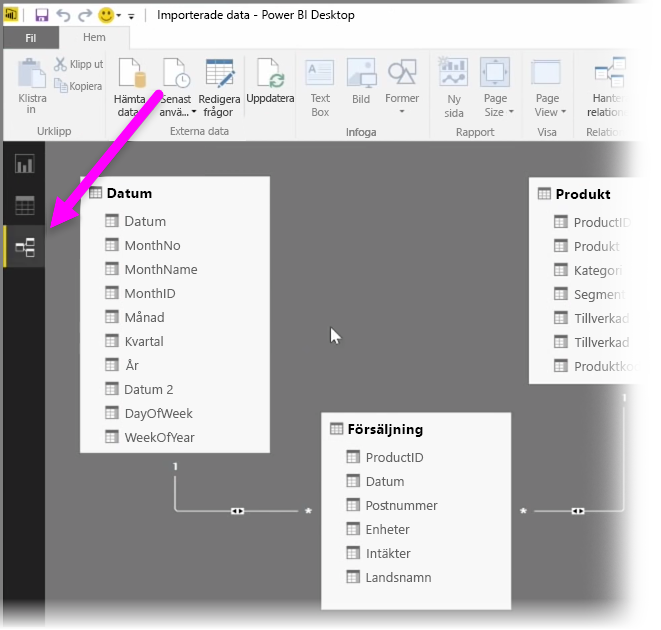
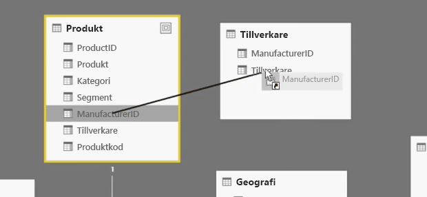
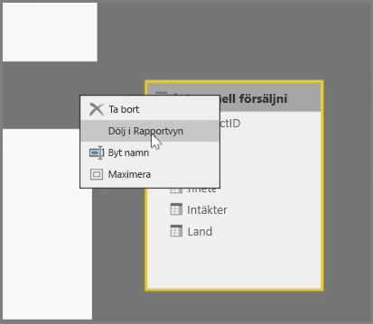
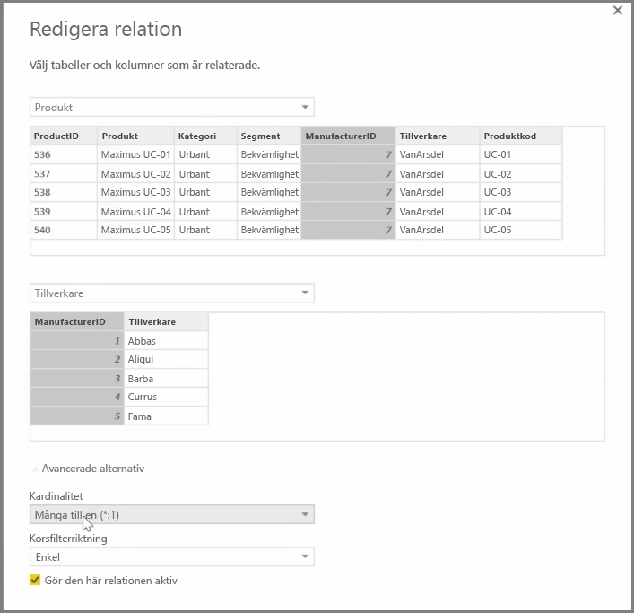

Med Power BI kan du visuellt ange relationen mellan tabeller eller element. Om du vill se en diagramvy över dina data använder du **relationsvyn**, som finns längst till vänster på skärmen bredvid rapportarbetsytan.

I vyn **Relationer** finns en fyrkant för varje tabell och dess kolumner, samt linjer mellan dem som motsvarar relationerna.

Det är enkelt att lägga till och ta bort relationer. Om du vill ta bort en relation högerklickar du på den och väljer **Ta bort**. Om du vill skapa en relation kan du dra och släppa de fält som du vill länka mellan tabellerna.

Om du vill dölja en tabell eller en enskild kolumn från rapporten högerklickar du på den i relationsvyn och väljer **Dölj i Rapportvy**.

Om du vill se en mer detaljerad vy över dina datarelationer väljer du **Hantera relationer** på fliken **Start**. Dialogrutan **Hantera relationer** öppnas och visar dina relationer som en lista i stället för ett visuellt diagram. Härifrån kan du välja **Identifiera automatiskt** för att hitta relationer i nya eller uppdaterade data. Välj **Redigera** i dialogrutan **Hantera relationer** om du vill redigera dina relationer manuellt. Här kan du också hitta avancerade alternativ för att ange *Kardinalitet* och *Korsfilterriktning* för dina relationer.

Kardinalitetsalternativen är *Många-till-en* och *En-till-en*. *Många-till-en* används i dimensionstyprelationer, till exempel en försäljningstabell med flera rader per produkt som matchas mot en tabell där varje produkt finns på en egen unik rad. *En-till-en* används ofta för att länka enskilda poster i referenstabeller.

Som standard anges att relationerna ska korsfiltrera i båda riktningarna. Om korsfiltrering bara görs i en riktning begränsas några av modelleringsfunktionerna i en relation.

Genom att ange korrekta relationer mellan dina data kan du skapa komplexa beräkningar över flera dataelement.

