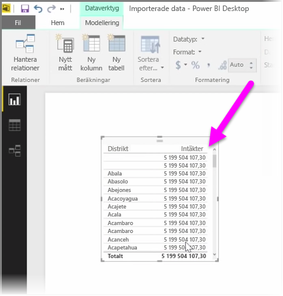
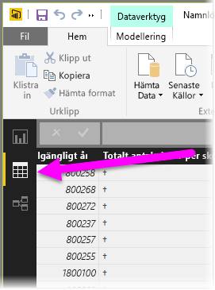
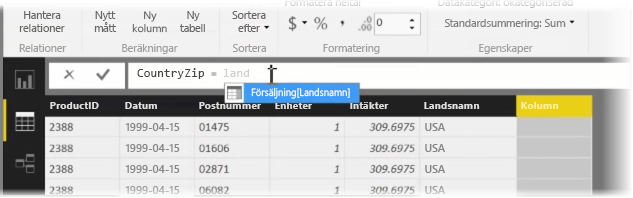
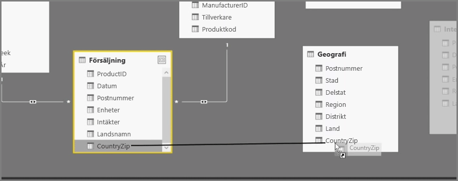
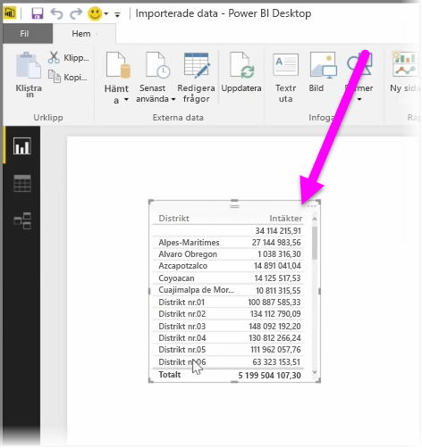

Att skapa beräknade kolumner är ett enkelt sätt att utöka och förbättra dina data. En **beräknad kolumn** är en ny kolumn som du skapar genom att definiera en beräkning som transformerar eller kombinerar två eller flera element med befintliga data. Du kan till exempel skapa en ny kolumn genom att kombinera två kolumner till en.

Ett bra skäl till att skapa en beräknad kolumn är för att upprätta en relation mellan tabeller när det saknas unika fält som kan användas till att upprätta någon relation. Att det saknas en relation blir tydligt när du skapar ett enkelt tabellobjekt i Power BI Desktop och du får samma värde för alla poster, trots att du vet att underliggande data är olika.

Om du vill skapa en relation med unika datafält kan du exempelvis skapa en ny beräknad kolumn för ”Fullständigt telefonnummer” genom att kombinera värdena från ”Riktnummer” och ”Lokalt nummer” när dessa värden finns i dina data. Beräknade kolumner är användbara när du snabbt vill skapa modeller och visualiseringar.

Om du vill skapa en beräknad kolumn väljer du **Datavy** i Power BI Desktop på vänster sida i rapportarbetsytan.

Välj **Ny kolumn** på fliken Modellering. Detta aktiverar formelfältet där du kan ange beräkningar med DAX-språk (Data Analysis Expressions). DAX är ett kraftfullt formelspråk (finns även i Excel) som du kan skapa robusta beräkningar med. Samtidigt som du skriver en formel visar Power BI Desktop matchande formler eller dataelement för att underlätta och påskynda skapandet av din formel.

Power BI-formelfältet föreslår specifika DAX-funktioner och relaterade datakolumner samtidigt som du anger uttrycket.

När de beräknade kolumnerna har skapats i varje tabell, kan de användas som en unik nyckel för att upprätta en relation mellan dem. Gå till vyn **Relation** och dra sedan fältet från en tabell till en annan för att skapa relationen.

Om du går tillbaka till vyn **Rapport** kommer du nu att se ett annat värde för varje distrikt.

Det finns även andra saker som du kan göra genom att skapa beräknade kolumner.

