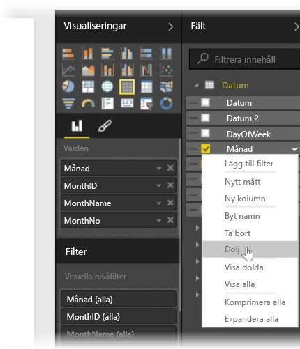
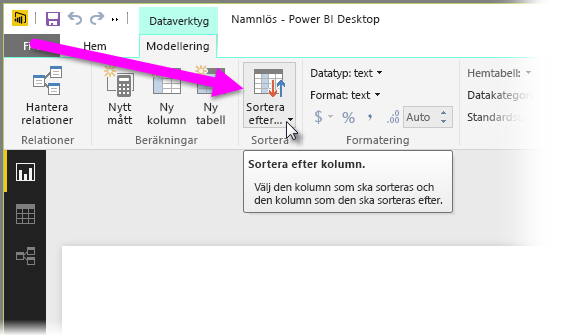
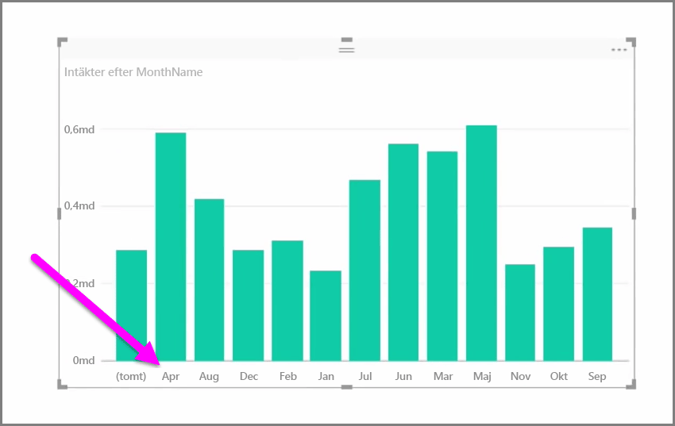
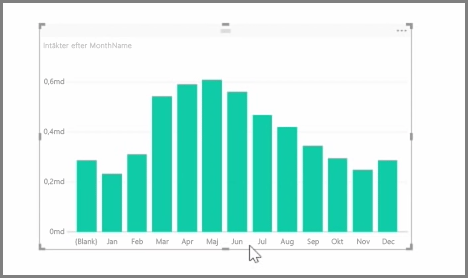

Importerade data innehåller ofta fält som du egentligen inte behöver för rapportering och visualisering eftersom det är extra information eller eftersom dessa data finns redan i en annan kolumn. Power BI Desktop har verktyg för att optimera dina data och göra dem mer användbara för dig genom att skapa rapporter och visuell information och för att visa dina delade rapporter.

## Dolda fält
Om du vill dölja en kolumn i fönstret **Fält** i Power BI Desktop högerklickar du på den och väljer **Dölj**. Observera att din dolda kolumner inte tas bort. Om du har använt fältet i befintliga visualiseringar är dess data fortfarande kvar och du kan fortfarande använda informationen i andra visualiseringar. Det dolda fältet visas bara inte i fönstret **Fält**.

Om du visar tabeller i vyn **Relationer** är dolda fält nedtonade. Deras data är fortfarande är tillgängliga och är fortfarande en del av modellen, de bara är dolda från vyn. Du kan alltid fram alla fält som har dolts genom att högerklicka på fältet och markera **Ta fram**.

## Sortera visualiseringsdata i ett annat fält
Verktyget **Sortera efter kolumn** finns på fliken**Modellering** och är mycket användbar för att säkerställa att dina data visas i den ordning som du tänkt.

Ett vanligt exempel är att data som innehåller namnet på månaden sorteras alfabetiskt som standard,  vilket innebär att ”augusti” visas före ”februari”.

I det här fallet kan du välja fältet i listan Fält och därefter välja **Sortera efter kolumn** från fliken **Modeling** och sedan välja ett fält att sortera efter för att lösa problemet. I det här fallet används kategorin ”Månadsnr” för att ordna månaderna som avsett.

Att ange datatypen för ett fält är ett annat sätt att optimera din information så att den hanteras korrekt. Om du vill ändra en datatyp från rapportarbetsytan, markerar du kolumnen i rutan **Fält** och använder sedan listrutan **Format**. Välj något av alternativen för formatering. Eventuella effekter som du har skapat som visar fältet uppdateras automatiskt.

