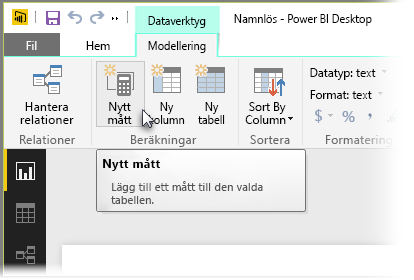
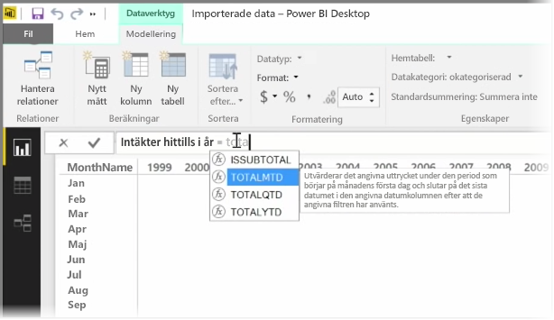
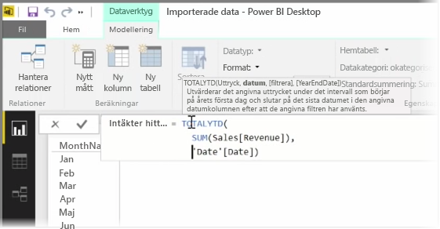
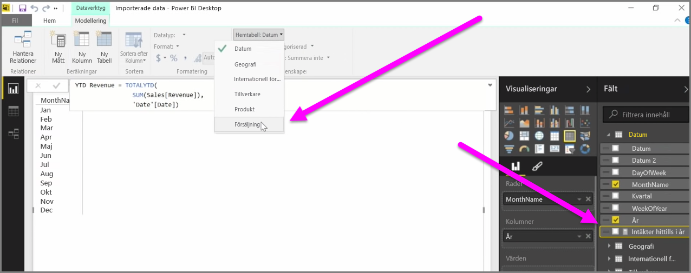

En *mått* är en beräkning som finns i din Power BI-datamodell. Välj **Nytt mått** på fliken **Modellering** i vyn **Rapport** om du vill skapa ett mått.

En av fördelarna med DAX-språket (dataanalysspråket i Power BI) är att det innehåller många användbara funktioner, särskilt när det gäller tidsbaserade beräkningar som *år till datum* eller *år på år*. Med DAX kan du definiera ett tidsmått en gång, och dela det i så många olika fält du vill från din datamodell.

I Power BI kallas en definierad beräkning ett *mått*. Om du vill skapa ett *mått* väljer du **Nytt mått** på fliken **Start**. Då öppnas formelfältet där du kan ange det DAX-uttryck som definierar ditt mått. När du skriver föreslår Power BI relevanta DAX-funktioner och datafält i takt med att du fyller i beräkningen, och du får också förklaringar av vissa syntax- och funktionsparametrar.

Om beräkningen är riktigt lång, så kan du lägga till extra radbrytningar i uttrycksredigeraren genom att trycka på **ALT-Retur**.

När du har skapat ett nytt mått visas det i någon av tabellerna i fönstret **Fält** på höger sida av skärmen. Power BI infogar det nya måttet i den tabell som du för tillfället har valt, och även om det inte spelar någon roll exakt var måttet finns i dina data, så kan du enkelt flytta det genom att markera måttet och använda listrutemenyn **Starttabell**.

Du kan använda ett mått som vilken annan tabellkolumn som helst: det är bara att dra och släppa den på rappportens arbetsyta eller i visualiseringens fält. Mått kan dessutom integreras med utsnitt, varvid dina data segmenteras direkt, vilket innebär att du kan definiera ett mått på en gång och sedan använda det i många olika visualiseringar.

DAX-funktionen **Beräkna** är en kraftfull funktion som möjliggör alla möjliga typer av användbara beräkningar, vilket är särskilt användbart för ekonomiska rapporter och visuella objekt.

