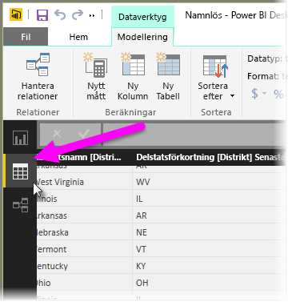
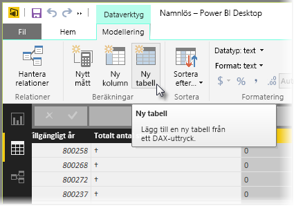
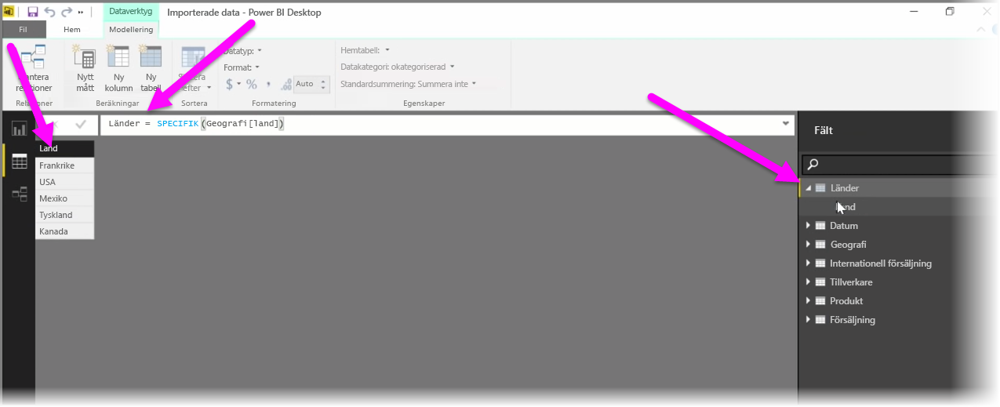

Beräknade tabeller är en funktion i DAX som gör det möjligt att uttrycka en rad nya funktioner för modellering. Om du vill skapa olika typer av kopplingar för sammanslagning eller skapa nya tabeller direkt baserat på resultatet av en funktionell formel, är beräknade tabeller rätt sätt att göra det på.

Om du vill skapa en beräknad tabell väljer du **Datavy** i Power BI Desktop på vänster sida i rapportarbetsytan.

Välj **Ny tabell** från fliken modellering för att öppna formelfältet.

Skriv namnet på din nya tabell till vänster om likhetstecknet och den beräkning som du vill använda för att skapa tabellen till höger. När du är klar med beräkningen, visas den nya tabellen i fönstret Fält i modellen.

När du är klar kan du använda den beräknade tabellen precis som andra tabeller i relationer, formler och rapporter.

