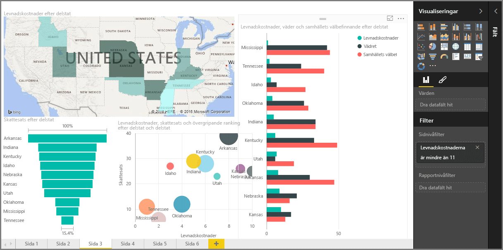

Välkommen till avsnittet **Visualiseringar** i den **interaktiva utbildningen** för Power BI. Förbered dig för en rolig, intressant och upplysande rundtur bland alla de visualiseringar som Power BI har att erbjuda. Men det är inte allt – det kommer fler visualiseringar hela tiden!

Visuella objekt är såklart resultatet av någon typ av. Vi vill hantera denna information och presentera den på ett övertygande och insiktsfullt sätt och *visa* det som står ut. Och Power BI kan erbjuda alla typer av övertygande visuella objekt – och nästan obegränsade möjligheter att anpassa dem. Så att detta är ett viktigt avsnitt!

Det kan verka som om det här avsnittet innehåller många ämnen, men oroa dig inte: varje avsnitt är kort och fyllt med (som du säkert anar) visuella objekt, och är enkla att ta till sig. Förmodligen kommer du att sicksacka dig igenom det här avsnittet och föreställa dig hur du kan använda dessa visuella objekt för att presentera dina egna data.

Vi börjar med visualiseringarnas grundstenar – de enkla visualiseringar som vi alla känner till – och försäkrar oss om att du känner till alla dess konster och knep. Sedan tar vi oss an mer avancerade, eller i varje fall mindre vanliga, metoder och fyller på din rapportskapande verktygslåda.

Ha det så kul – här finns mycket att lära!

## Introduktion till visuella objekt i Power BI
Att visualisera data är en av de centrala funktionerna i Power BI – ett grundläggande byggblock, så som vi definierade det tidigare i utbildningen. Och att skapa visuella objekt är det enklaste sättet att finna och dela insikter på.

Power BI har ett brett utbud av standardvisualiseringar tillgängliga som standard – allt från enkla stapeldiagram till cirkeldiagram och kartor och till lite mer esoteriska saker som vattenfall, trattar, mätare och annat. Power BI Desktop erbjuder även kraftfulla sidformateringsverktyg, t.ex. former och bilder, som bidrar till att ge liv åt din rapport.

