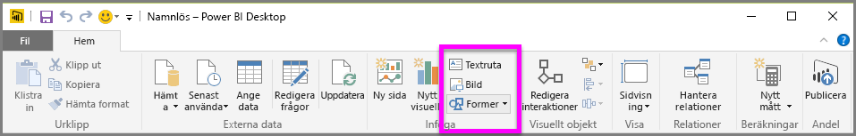
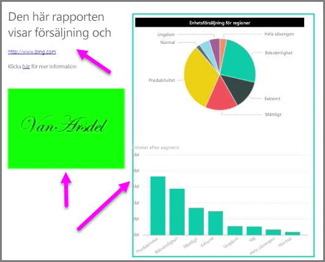

Förutom databundna visuella objekt kan du också lägga till statiska element, till exempel textrutor, bilder och figurer, för att förbättra det visuella utseendet i dina rapporter. Om du vill lägga till ett visuellt element väljer du **Textruta**, **Bild** eller **Former** på fliken **Start**.

Med **Textrutor** kan du visa stora rubriker, beskrivningar och korta stycken med information tillsammans med din visualiseringar. Textrutorna kan innehålla länkar, antingen via en skriftlig URL eller genom att markera en fästpunktsfras och välja länksymbolen i alternativfältet för textrutan. Om du inkluderar URL:er i textrutor identifierar Power BI automatiskt länkarna och aktiverar dem.

Om du väljer **Bild** öppnas en filläsare där du kan välja bild från datorn eller någon annan nätverksansluten källa. Om du ändrar storlek på en bild i rapporten bibehålls proportionerna som standard, men detta kan inaktiveras i de visuella formateringsalternativen.

I **Former** finns fem olika alternativ, bland annat rektanglar och pilar. Formerna kan vara fyllda eller genomskinliga med en kantlinje i färg. (Det senare är användbart om man vill skapa ramar runt grupper med visualiseringar.)

