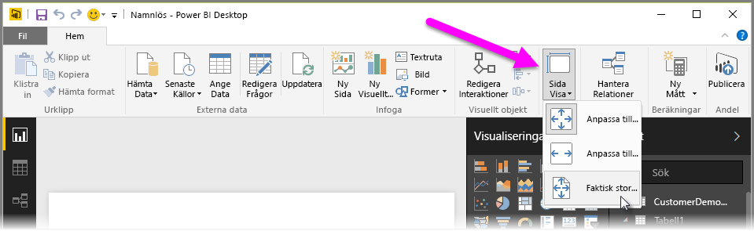
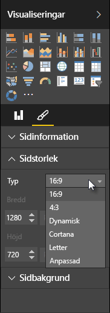

Med Power BI Desktop kan du styra layout och formatering av dina rapportsidor, till exempel storlek och orientering.

Använd menyn **Sidvisning** på fliken Start för att ändra hur rapportsidorna skalas. Bland de tillgängliga alternativen finns **Anpassa till sida** (standard), **Anpassa till bredd** och **Faktisk storlek**.

Du kan också ändra sidstorleken själv. Som standard är rapportsidorna 16:9. Om du vill ändra sidstorleken bör du se till att inga visuella objekt har markerats. Välj sedan penselikonen i fönstret Visualiseringar och därefter **Sidstorlek** för att expandera avsnittet.

Bland alternativen för sidstorleken finns 4x3 (mer kvadratisk proportion) och dynamisk (sidan dras ut för att fylla det tillgängliga utrymmet). Det finns även en standardbrevstorlek för rapporter. Tänk på att du kan behöva ändra storlek på dina visuella objekt när du har ändrat sidstorleken för att de ska finnas kvar på arbetsytan.

Du kan också ange en egen sidstorlek i tum eller bildpunkter, samt ändra bakgrundsfärg på hela rapporten.

Ett annat alternativ är att välja Cortana som anpassar storleken på rapporten så att den kan användas som ett resultat vid Cortana-sökningar.

