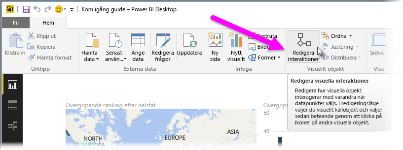
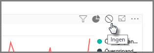
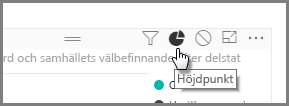
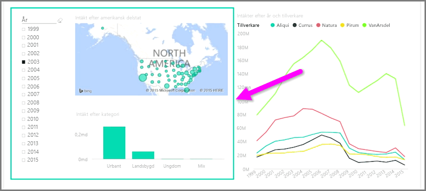

När du har flera visualiseringar på samma rapportsida, och om du väljer ett visst segment genom att klicka eller använda ett utsnitt så påverkas alla visuella objekt på sidan. Men i vissa fall vill du kanske visa utsnitt enbart för vissa visuella objekt. Detta gäller särskilt när du använder element som punktdiagram, där den centrala innebörden försvinner om du begränsar data till ett visst segment. Som tur är kan du med Power BI Desktop styra hur interaktioner flödar mellan de visuella objekten.

Om du vill ändra interaktionen mellan dina visualiseringar väljer du **Redigera** i avsnittet för visuell information i menyfliksområdet **Start**, så aktiveras **Redigeringsläge**.

>[!NOTE]
>Ikonen **Redigera interaktioner** i Power BI Desktop har ändrats sedan videon spelades in.
> 
> 

Nu när du väljer ett visuellt objekt på din rapportarbetsyta, så visas en liten täckande *filterikon* i det övre högra hörnet i varje visuellt objekt som påverkas. Om du vill exkludera ett visuellt objekt från interaktionen klickar du på symbolen *Ingen* i det övre högra hörnet, intill *filterikonen*.

I vissa fall kan du justera vilken typ av filterinteraktion som ska ske mellan de visuella objekten. När **Redigeringsläge** är aktivt väljer du det visuella objekt du använder för att filtrera. Om du kan ändra typen av interaktion för ett annat visuellt objekt, så visas en *cirkeldiagramsikon* bredvid filterikonen i det övre högra hörnet.

Markera segmenterade data genom att klicka på *cirkeldiagramsikonen*. I annat fall så filtreras informationen. Liksom tidigare kan du ta bort all interaktion genom att klicka på ikonen *Ingen*.

En bra Designtips är att rita en transparent form runt de visuella objekt som interagerar med varandra, så det blir tydligt för användaren att de har en interaktiv relation.

