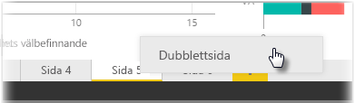

Individuella sidor i en rapport kan vara komplicerade med flera visualiseringar som interagerar på specifika sätt och har exakt formatering. Ibland när du skapar en rapport kan du vill använda samma visuella information och layouter för två olika sidoavsnitt. Till exempel, om du precis har sammanställt rapport med bruttointäkter vill du kanske även har en nästan identisk sida med nettointäkter.

Det vore besvärligt att återskapa allt arbete men med Power BI Desktop är det bara att duplicera rapportsidan.

Högerklicka på fliken som du vill kopiera och välj **Duplicera sida**.

Du kan sedan byta namn på sidofliken, uppdatera textrubriken om du har en och därefter uppdatera den visuella informationen med det nya fältet som du vill spåra.

