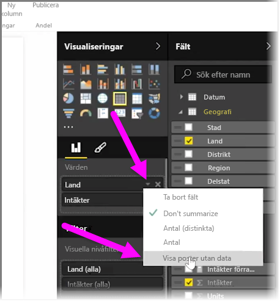
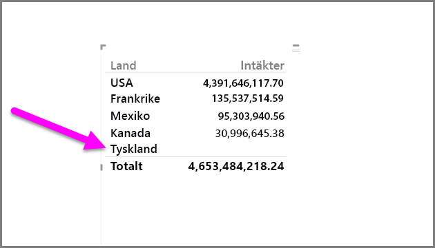
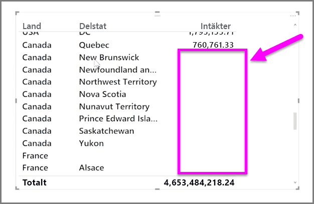

Som standard visas endast kolumnrubrikerna i dina rapporter om de innehåller data. Till exempel, om du visar intäkter efter land och det inte finns någon försäljning i Norge visas Norge inte någonstans i din visualisering.

För att visa tomma kategorier, klicka på nedåtpilen i fältet som du vill ändra i rutan **Visualiseringar** och välj **Visa objekt utan data**.

Eventuella tomma kolumner visas nu i ditt visualisering med tomma värden.

När du har valt **Visa objekt utan data** för fält i rutan **Visualiseringar** gäller det för alla fält som visas i rutan Visualiseringar. Så om du lägger till ett annat fält visas också alla objekt som saknar data utan att du behöver gå tillbaka till menyn.

