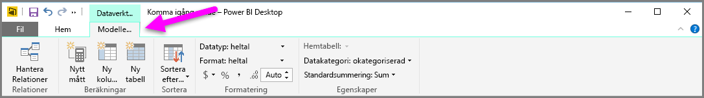
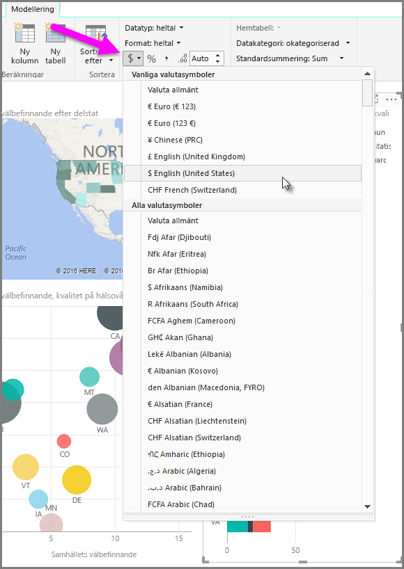
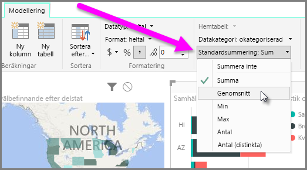
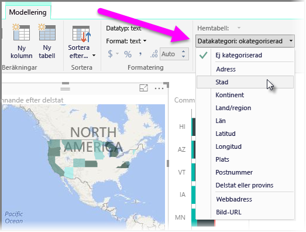

Power BI har egenskaper som du kan tilldela för fält i din modell och som kan hjälpa dig att rapportera, visualisera och presentera data tydligare. Till exempel, det kan hända att du vill beräkna medelvärdet för en lista med tal men Power BI summerar listan automatiskt. Med Power BI kan ändra du hur listorna med tal sammanfattas.

## Numerisk kontroll över sammanfattning
Låt oss titta på ett exempel som visar hur du kan kontrollera hur Power BI sammanfattar numeriska datafält.

Välj en visualisering på rapportarbetsytan och välj sedan ett fält i fönstret **Fält**. Fliken **Modellering** visas i menyfliksområdet och innehåller alternativ för att formatera data och egenskaper för data.

Du kan välja vilken typ av valutasymbol som används genom att välja listrutan med valutasymbol, vilket visas i följande bild.

Det finns många olika alternativ för att formatera fält. Du kan till exempel ändra formatet från valuta till procentvärde.

Du kan även ändra hur Power BI sammanfattar data. Välj ikonen **standardsammanfattning** för att ändra hur ett fält summeras, inklusive visning av en summa, antal eller ett medelvärde.

## Hantera och förtydliga platsdata
Du kan göra liknande ändringar när du gör ritar platser på en karta. Välj kartan och välj sedan fältet i fönstret **Fält** som du använder för värdet *Plats*. På fliken **Modellering** väljer du **Datakategori** och sedan den kategori som representerar din platsdata från den rullgardinsmenyn. Välj till exempel land, region och ort.

