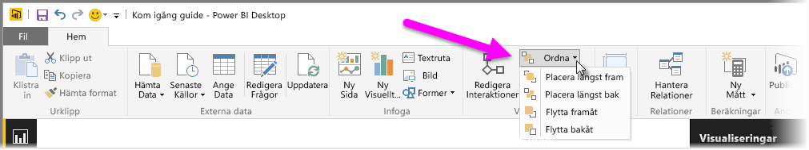
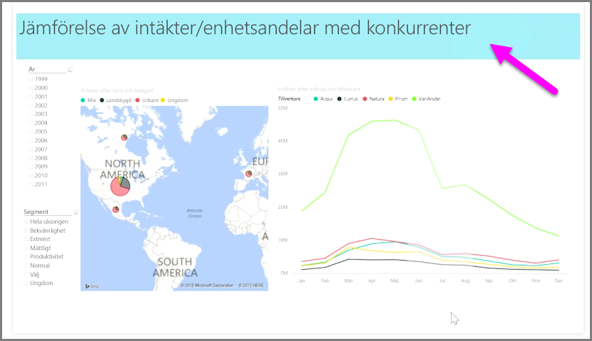

När du har många element i en rapport kan du med Power BI hantera hur de överlappar varandra. Sättet att lagra eller ordna objekt ovanpå varandra kallas ofta för z-ordning.

Om du vill hantera z-ordningen för elementen i en rapport markerar du ett element och använder sedan knappen **Ordna** på fliken **Start** i menyfliksområdet för att ändra dess z-ordning.

Med hjälp av alternativen i knappmenyn **Ordna** kan du sortera elementen i rapporten precis som du vill ha dem. Du kan flytta ett visuellt objekt ett lager framåt eller bakåt, eller lägga det längst fram.

Knappen Ordna är särskilt användbar när du använder former som dekorativa bakgrunder eller kantlinjer, eller om du vill lyfta fram vissa delar i ett enskilt diagram. Du kan också använda dem för att skapa en bakgrund, till exempel följande ljusblå rektangel som används som bakgrund i en rapportrubrik.

