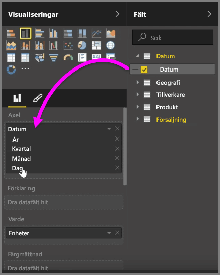
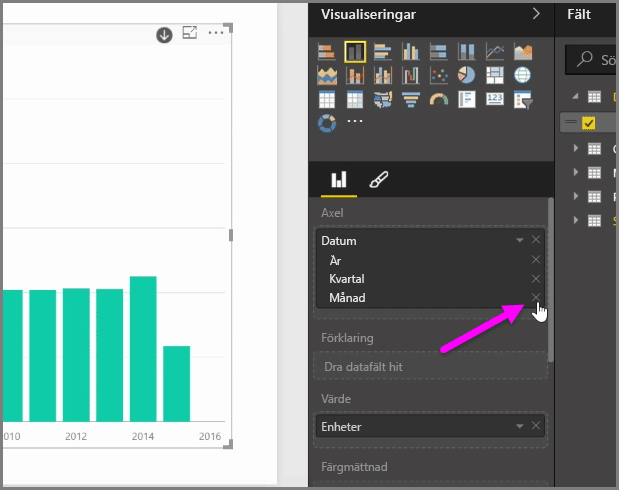
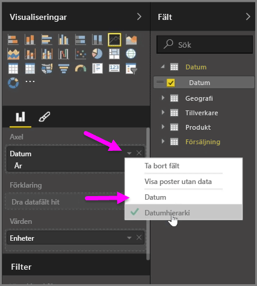
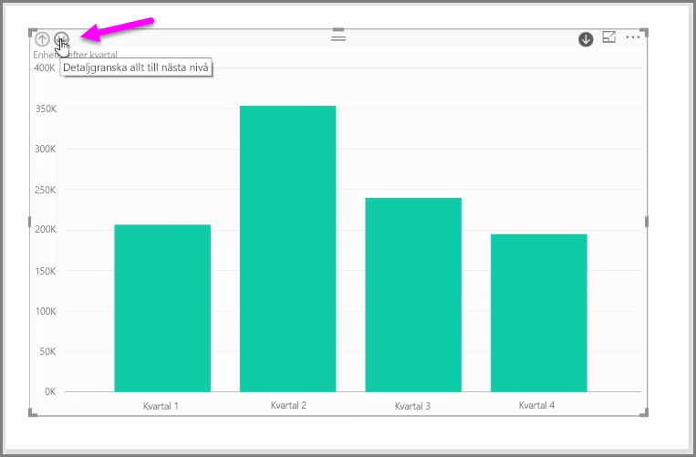

När du lägger till ett *datum*fält i ett visuellt objekt i fältet *Axel*, lägger Power BI automatiskt till en tidshierarki med *år*, *kvartal*, *månad* och *dag*. På så sätt kan Power BI låta de visuella objekten ha en tidsbaserad interaktion med de som läser dina rapporter, genom att användarna kan söka i dessa olika tidsnivåer.

När du har en hierarki på plats kan du börja granska nedåt i tidshierarkin. Om du i det här fallet klickar på ett år i diagrammet kan du granska nedåt till nästa nivå i hierarkin, i det här fallet *Kvartal* som därefter visas i det visuella objektet.

I den automatiskt skapade hierarkin kan du också hantera till vilken nivå personer ska kunna granska nedåt i den delade rapporten. Gör detta genom att klicka på X bredvid den hierarki som du vill ta bort i fönstret Visualiseringar. Den borttagna nivån tas bort från rapporten och det går inte längre att granska nedåt i den nivån.

Om du vill ha tillbaka nivån i hierarkin tar du bara bort fältet *Datum* och lägger sedan till det igen från fönstret **Fält**. Hierarkin skapas automatiskt en gång till.

Det kan finnas tillfällen när du inte vill att hierarkin ska användas för ett visuellt objekt. Du kan styra detta genom att välja nedåtpilen bredvid fältet *Datum* (när du har lagt till det i ett visuellt objekt) och sedan välja **Datum** i stället för **Datumhierarki**. Detta innebär att Power BI kommer att visa rådatavärden i det visuella objektet.

Du kan också expandera alla dataelement som just nu är synliga på en gång, i stället för att välja ett enda kvartal eller ett enda år. Gör detta genom att välja ikonen *Granska alla* i det övre vänstra hörnet i objektet, vilket är en dubbelriktad nedåtpil.

