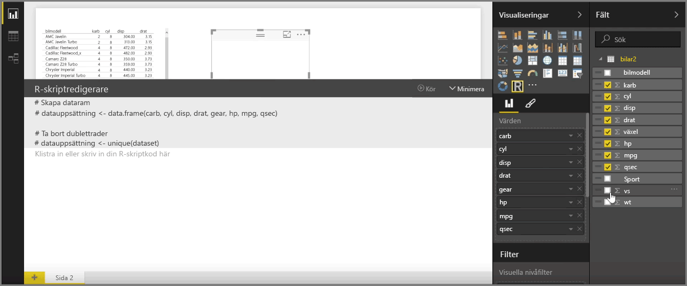
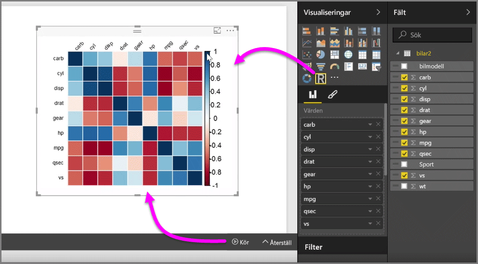
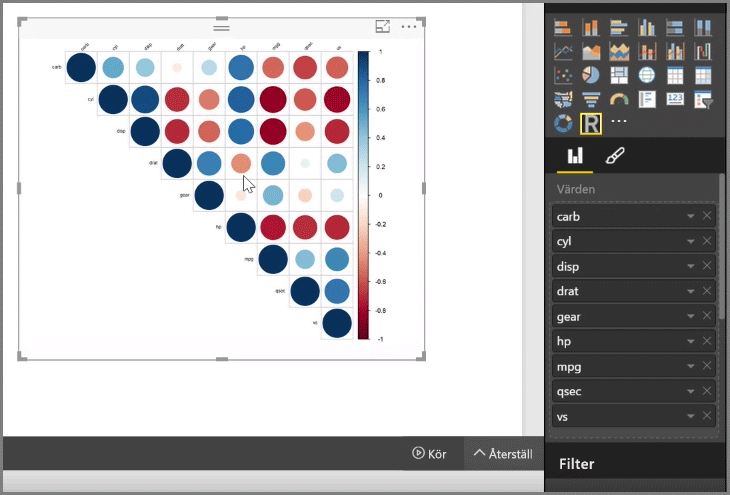

Med Power BI Desktop kan du utföra analytiska och statistiska analyser och skapa övertygande visuella objekt genom att integrera med R. Du kan vara värd för de R-visualiseringarna i Power BI Desktop-rapporten.

När du väljer ikonen för **visuellt R-objekt** från fönstret **Visualiseringar**, skapar Power BI en platshållare på arbetsytan som värd för ditt visuella R-objekt och visar sedan en R-skriptredigerare som du kan använda direkt på arbetsytan. När du lägger till fält för det visuella R-objektet, lägger Power BI Desktop till dem i fönstret för R-skriptredigeraren.

Nedanför det som Power BI genererar i R-skriptredigeraren, kan du börja skapa R-skriptet för att generera det visuella objektet. När skriptet är komplett, väljer du **Kör**. Då inträffar följande:

1. De data som lagts till för det visuella objektet (från fönstret **Fält**) skickas från Power BI Desktop till den lokala installation av R.
2. Skriptet som skapats i Power BI Desktops R-skriptredigerare körs på den lokala R-installationen.
3. Därefter får Power BI Desktop ett visuellt objekt tillbaka från R-installationen och visar det på arbetsytan.

Allt händer ganska snabbt och resultatet visas i visualiseringen för **visuellt R-objekt** på arbetsytan.

Du kan ändra det visuella R-objektet genom att justera R-skriptet och sedan välja **Kör** igen. I följande bild har vi ändrat det visuella objektet för att visa cirklar i stället för rutor.

Och eftersom det visuella R-objektet är precis som andra visuella objekt i Power BI Desktop, kan du interagera med det och även skapa anslutningar till andra visuella objekt på arbetsytan. När du interagerar med andra visuella objekt på arbetsytan via filtrering eller markeringar, reagerar det visuella R-objektet automatiskt precis som andra visuella Power BI-objekt, utan att R-skriptet behöver justeras.

Det är ett bra sätt att använda styrkan hos R, direkt i Power BI Desktop.

## Nästa steg
**Grattis!** Du har slutfört avsnittet **Visualiseringar** i den **interaktiva utbildningen** för Power BI. Nu vet du mycket om de många visualiseringar som erbjuds i Power BI och har även kunskap om hur du använder, ändrar och anpassar dem. Och goda nyheter: visualiseringarna är i stort sett desamma i Power BI Desktop som i Power BI-tjänsten, så det som du har lärt dig gäller för båda.

Nu är du redo att bege dig till molnet och fördjupa dig i Power BI-tjänsten där du kan **utforska data**. Som du vet ser arbetsflödet ut ungefär så här:

* Hämta data till **Power BI Desktop** och skapa en rapport.
* Publicera i Power BI-tjänsten där du kan skapa nya **visualiseringar** och instrumentpaneler
* **Dela** dina instrumentpaneler med andra, särskilt med personer som är i farten
* Visa och interagera med delade instrumentpaneler och rapporter i **Power BI Mobile**-appar

Oavsett om du skapar rapporter, eller bara visar dem och interagerar med dem, vet du nu hur alla dessa coola visuella objekt skapas och hur de ansluts till data. Härnäst kommer vi att titta närmare på hur de här visuella objekten och rapporterna fungerar i praktiken.

Vi ses i nästa avsnitt!

