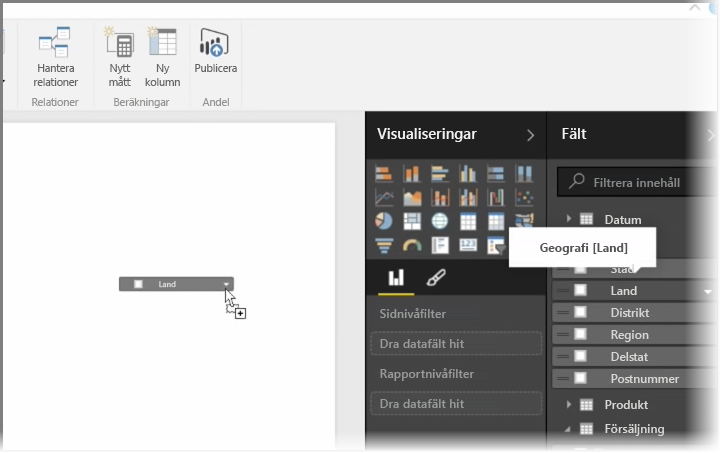
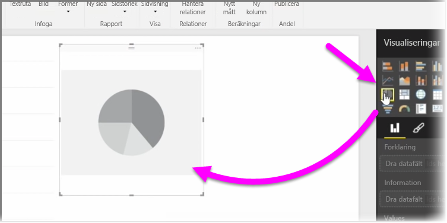
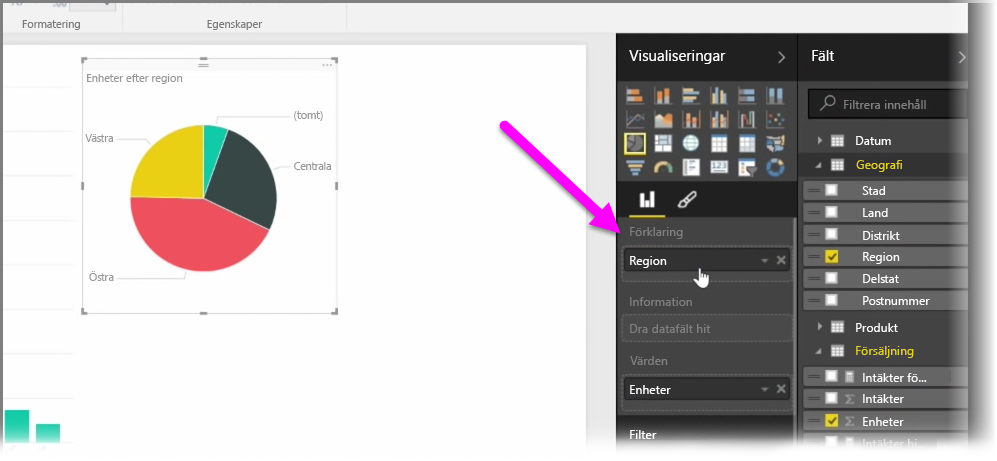
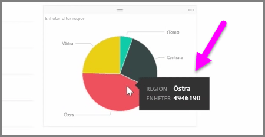
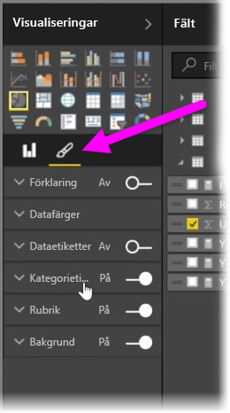

Lär dig att skapa nya stapeldiagram, cirkeldiagram och träddiagram och anpassa dem efter dina rapporter i den här artikeln.

Det finns två sätt att skapa en ny visualisering i Power BI Desktop:

* Du kan dra fältnamn från fönstret **Fält** och släppa dem på rapportarbetsytan. Som standard visas din visualiseringen som en tabell med data.
  
  
* Du kan också klicka på typen av visualisering som du vill skapa i fönstret **Visualiseringar**. Med den här metoden är standardvisualiseringen en tom platshållare som påminner om den visualisering som du har valt.
  
  

När du har skapat kartan eller diagrammet kan du börja dra fält till den nedre delen av fönstret **Visualisering** för att skapa och organisera din grafik. Tillgängliga fält ändras baserat på typen av visualisering som du har valt. När du drar och släpper datafält uppdaterar din visualisering automatiskt för att återspegla dessa ändringar.

Du kan ändra storlek på visualiseringen genom att markera den och sedan dra handtagen in eller ut. Du kan också flytta visualiseringen var som helst på arbetsytan genom att klicka och dra den. Om du vill konvertera mellan olika typer av visualiseringar väljer du den visualisering som du vill ändra och väljer en annan från ikonerna i fönstret **Visualisering**. Power BI försöker konvertera dina valda fält till den nya visualiseringstypen så exakt som möjligt.

När du håller muspekaren över delar av visualiseringen kan du se en knappbeskrivning med information om segmentet, till exempel etiketter och det totala värdet.

Välj **penselikonen** i fönstret **Visualiseringar** för att ändra visualiseringens utseende, till exempel bakgrundsplacering, rubriktext och datafält.

De tillgängliga ändringsalternativen beror på vilken sorts visualisering du har valt.

