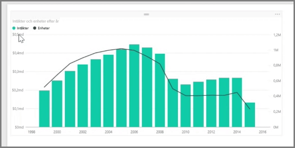
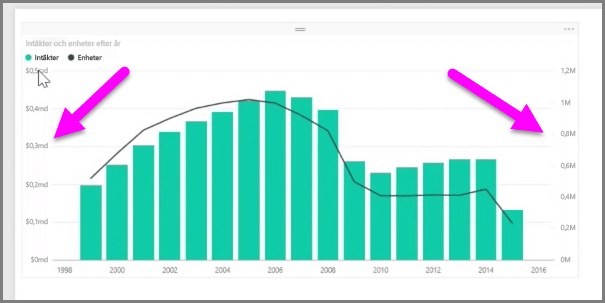
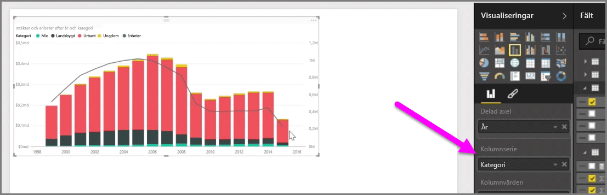

När du vill visualisera två mått med helt olika skalor, till exempel intäkter och enheter, kan ett **kombinationsdiagram** med en rad och ett fält med olika axelskalor vara användbart. Power BI stöder många olika typer av kombinationsdiagram som standard, inklusive de populära diagrammen **Linje** och **Staplade staplar**.

När du skapar ett kombinationsdiagram visas ett fält för **Delad axel** (X-axeln) och sedan värden för dina två fält, i detta fall med en stapel och en linje. Förklaringarna till de två Y-axlarna visas på varsin sida av visualiseringen.

Du kan också dela upp varje kolumn efter kategori, genom att dra en kategori till fältet Kolumnserie i fönstret Visualiseringar. När du gör detta blir varje stapel proportionellt färgad baserat på värdena i varje kategori.

Kombinationsdiagram är ett effektivt sätt att visualisera flera mått med helt olika skalor i en enda visualisering.

