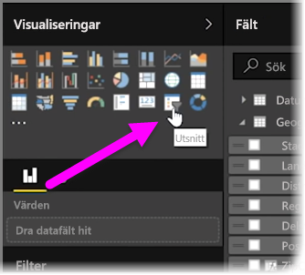
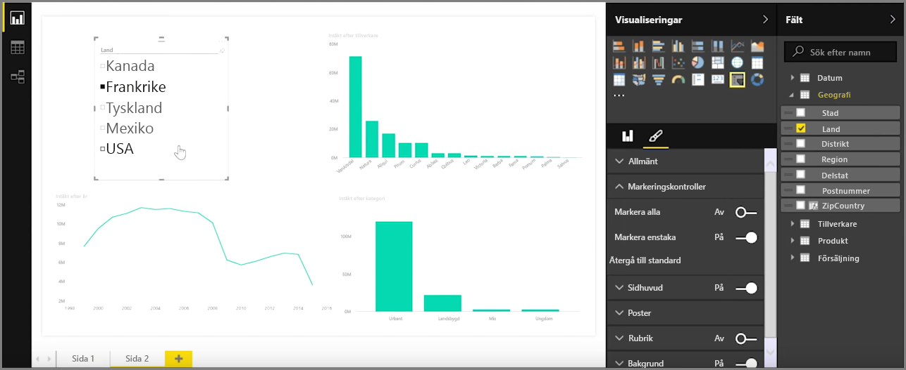
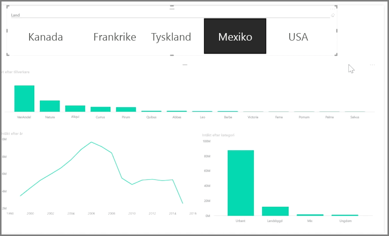

Utsnitt är en av de mest kraftfulla typerna av visualiseringar, i synnerhet när det gäller faktafyllda rapporter. Ett **utsnitt** är ett visuellt arbetsytefilter i **Power BI Desktop** som du kan använda för att titta på data i ett visst rapportsegment, t.ex. avseende ett visst år eller en viss geografisk plats.

Om du vill lägga till ett utsnitt i rapporten väljer du **Utsnitt** i fönstret **Visualiseringar**.

Dra det fält som du vill skapa ett utsnitt för och släpp det på utsnittsplatshållaren. Visualiseringen ändras till en lista över element med kryssrutor. Dessa element är dina filter. Markera kryssrutan intill det som ska segmenteras, och alla andra visualiseringar på samma rapportsida filtreras, eller *segmenteras*, genom ditt val.

Det finns några olika alternativ med vilka du kan formatera ditt utsnitt. Du kan ange att det ska acceptera flera inmatningar samtidigt, eller så kan du välja läget **Markera enstaka** om du bara vill använda en åt gången. Du kan också lägga till alternativet **Markera alla** till dina utsnittselement, vilket är användbart om du har en mycket lång lista. Om du ändrar utsnittets standardorientering från lodrät till vågrät blir det till ett markeringsfält snarare än en checklista.

