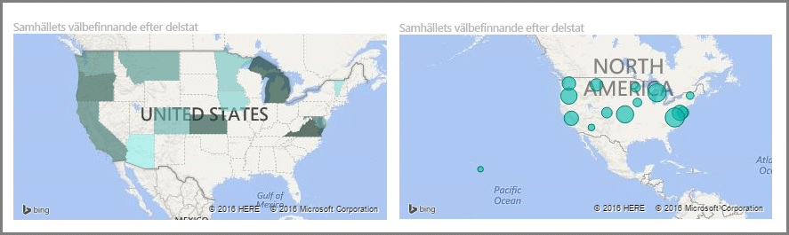
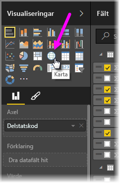
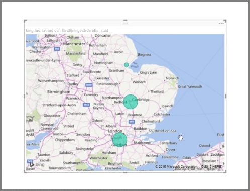
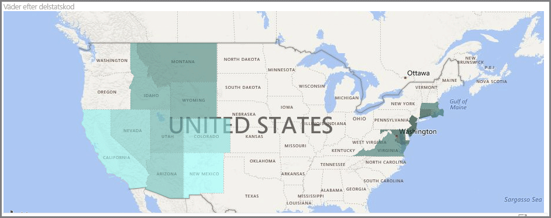
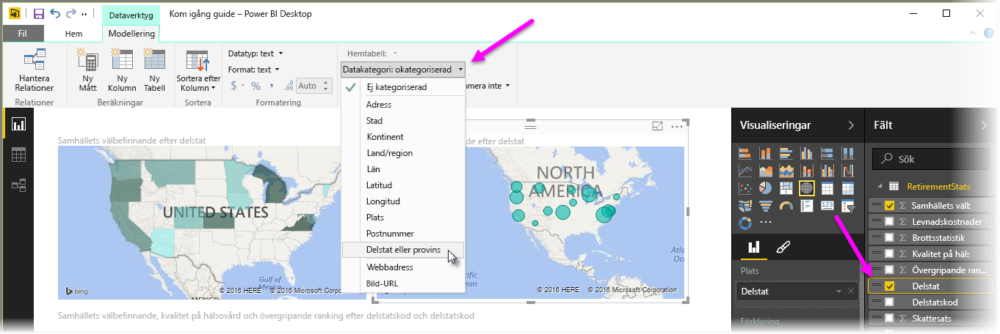

Power BI erbjuder två olika typer av kartvisualiseringar: en bubblelkarta som placerar en bubbla över en geografisk plats, och en formkarta som faktiskt visar konturerna för det område som du vill visualisera.

> [!NOTE]
> När du arbetar med länder eller regioner, så använd ländernas trebokstavsförkortningar, vilket säkerställer att geokodningen fungerar korrekt i kartvisualiseringarna. Använd *inte* tvåbokstavsförkortningar, eftersom vissa länder eller regioner i så fall kanske inte kan identifieras.
> Om du bara har tvåbokstavsförkortningar, så läs [det här externa blogginlägget](https://blog.ailon.org/how-to-display-2-letter-country-data-on-a-power-bi-map-85fc738497d6#.yudauacxp) med stegvisa anvisningar om hur du kan associera dina tvåbokstavsförkortningar för länder/regioner med motsvarande trebokstavsförkortningar.
> 
> 

## Skapa bubbelkartor
Om du vill skapa en bubbelkarta väljer du alternativet **Karta** i fönstret **Visualisering**. Om du vill använda ett visuellt kartobjekt måste du lägga till ett värde i bucketen *Plats* för alternativet **Visualiseringar**.

Power BI är flexibelt när det gäller vilken typ av platsvärden som accepteras, från vanliga kännetecken som ortnamn eller flygplatskoder till mer specifika saker som latitud- och longituddata. Om du vill ändra storlek på bubblan för respektive kartplats så lägg till ett fält i bucketen **Storlek**.

## Skapa formkartor
Om du vill skapa en formkarta väljer du alternativet **Koropletkarta** i fönstret Visualisering. Precis som med bubbel kartor, så måste du lägga till någon typ av värde i bucketen Plats om du vill använda det här visuella objektet. Om du vill ändra fyllningsfärgens intensitet så lägg till ett fält i bucketen Storlek.

En varningsikon i det visuella objektets övre vänstra hörn visar att kartan behöver mer platsinformation för att kunna rita ut värdena korrekt. Detta är ett mycket vanligt problem när informationen i ett platsfält är tvetydig, som t.ex. när ett namn som *Washington* används, vilket kan syfta på såväl en stat som ett distrikt. Ett sätt att lösa det här problemet är att byta namn på kolumnen till något mer specifikt, t.ex. *Stat*. Ett annat sätt att lösa problemet är att manuellt återställa datakategorin genom att välja **Datakategori** på fliken Modellering. Därifrån kan du tilldela dina data en kategori, t.ex. Stat eller Ort.

