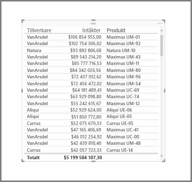
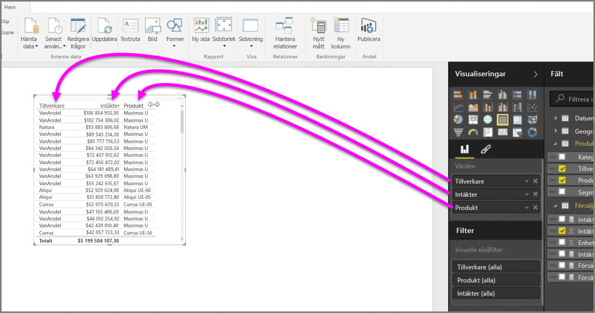
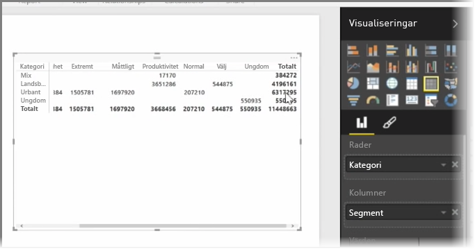

Förutom den stora mängden diagram stöder Power BI Desktop också en mängd tabeller. När du hämtar ett kategorifältet eller textfält och drar det till rapportarbetsytan hämtar du en resultattabell som standard. Du kan rulla uppåt och nedåt i tabellen och ursprungligen kommer att den sorteras alfabetiskt.

Om du har numerisk information i en tabell, till exempel intäkter, visas totalsumman längst ned. Du kan manuellt sortera efter varje kolumn genom att klicka på rubriken att växla mellan stigande eller fallande ordning. Om en kolumn är för liten för att visa dess innehåll, klicka och dra rubriken åt sidan för att expandera den.

Ordningen på fälten i gruppen *Värden* i fönstret **Visualiseringar** avgör i vilken ordning de visas i tabellen.

En **matris** liknar en tabell, men den har en andra kategorirubriker för kolumner och rader. Precis som med tabeller, summeras numerisk information automatiskt längst ner till höger sida på matrisen.

Det finns många estetiska alternativ för matriser, till exempel automatisk storleksjustering för kolumner, växla rad och kolumnsummor, ställa in färger, med mera. När du skapar en matris ska du kontrollera att kategoridata (icke-numeriska data) är till vänster i matrisen och de numeriska filerna till höger så att den vågräta rullningslisten visas. Kontrollera att rullningsbeteendet fungerar korrekt.

