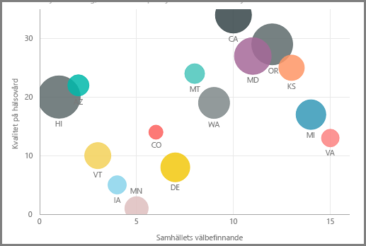
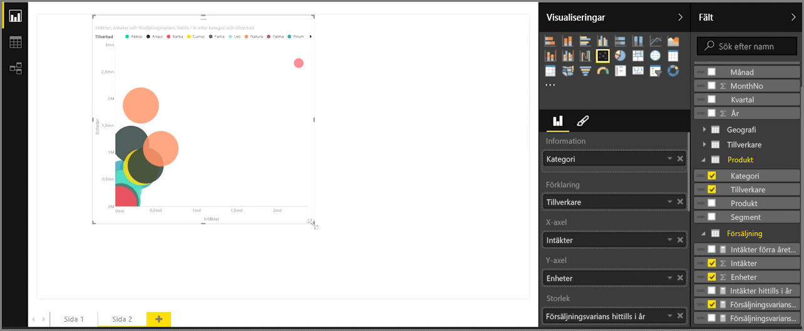
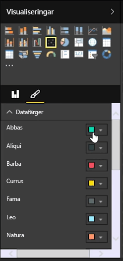

Om du vill jämföra två olika mått, till exempel enhetsförsäljning med intäkter, är det vanligt att använda ett punktdiagram.

Skapa ett tomt diagram genom att välja **Punktdiagram** i fönstret **Visualiseringar**. Dra och släpp de två fält som du vill jämföra från fönstret **Fält** till *X-axeln* och *Y-axeln*. Just nu har ditt punktdiagram antagligen bara en liten bubbla i mitten, eftersom du måste lägga till ett mått i *Information* som visar hur du vill segmentera dina data. Om du till exempel jämför försäljning och intäkter, vill du kanske dela upp informationen per kategori, tillverkare eller försäljningsmånad.

Om du lägger till ytterligare ett fält i *Förklaring* färgkodas dina bubblor enligt det fältets värde. Du kan också lägga till ett fält i *Storlek* för att ändra bubbelstorleken enligt det värdet.

Punktdiagram har dessutom många visuella formateringsalternativ, till exempel att använda en kantlinje för varje färgad bubbla och växla mellan enskilda etiketter. Du kan även ändra datafärgerna för andra typer av diagram.

Du kan skapa en animering av ditt bubbeldiagrams ändringar över tid genom att lägga till ett tidsbaserat fält i *Uppspelningsaxel*. Klicka på en bubbla under animeringen för att se en spårning av dess sökväg.

>[!NOTE]
>Kom ihåg att om du bara ser en bubbla i ditt punktdiagram beror det på att Power BI sammanställer dina data, vilket är standardbeteendet. Lägg till en kategori i *Information* i fönstret **Visualiseringar** om du vill ha fler bubblor.
> 
> 

