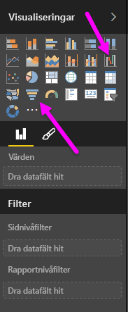
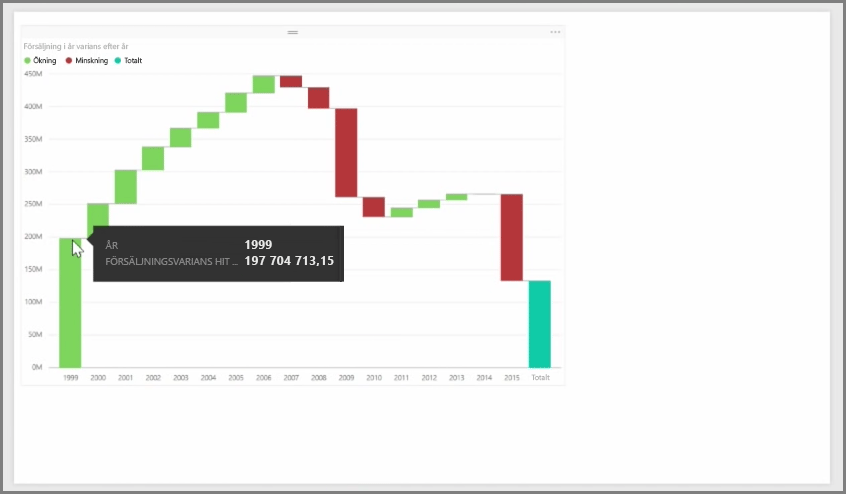
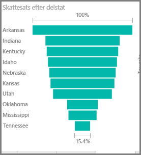

Vattenfall- och trattdiagram är två mer intressanta (och kanske ovanliga) standardvisualiseringar som ingår i Power BI. Om du vill skapa ett tomt diagram med någon av dessa typer, väljer du motsvarande ikon i fönstret **Visualiseringar**.

**Vattenfallsdiagram** används vanligtvis för att visa ändringar i ett visst värde över tid.

Waterfalls har bara två bucket-alternativ: *kategori* och *Y-axel*. Dra ett fält som baseras på en tidpunkt som *år* till bucketen *kategori* och värdet som du vill spåra för bucketen *Y-axel*. Tidsperioder där det skedde en ökning i värde visas i grönt som standard och perioder med en minskning i värde visas i rött.

**Trattdiagram** används vanligtvis för att visa ändringar över en viss process, till exempel en försäljningspipeline eller arbete med en webbplats besökslängd.

Både **vattenfall-** och **tratt**diagram kan delas upp och anpassas visuellt.

