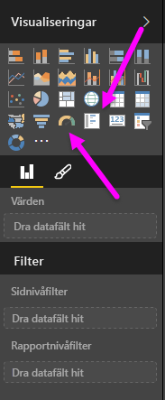
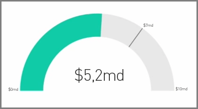
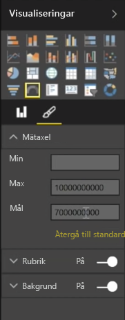
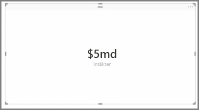
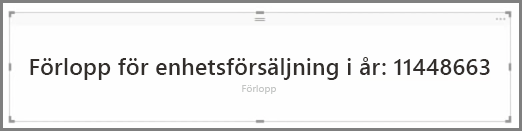

I allmänhet används visualiseringar för att jämföra två eller flera olika värden. Men ibland när du skapar en rapport vill du kunna spåra ett mått eller ett nyckeltal (KPI) över tid. I Power BI Desktop sker detta med en **Mätare** eller ett kort med ett **enkelt nummer**. Om du vill skapa ett tomt diagram med någon av dessa typer, väljer du motsvarande ikon i fönstret **Visualiseringar**.

Mätare är särskilt användbara när du skapar instrumentpaneler och vill visa framsteg mot mål. Om du vill skapa en mätare väljer du ikonen från fönstret **Visualiseringar**. Dra fältet som du vill spåra i bucketen *Värde*.

Mätare visas som standard på 50 % eller dubbla det *värdet* och det finns två sätt att ändra den här inställningen. Ange värdena dynamiskt genom att dra fält till buckets för *minsta*, *maximala* och *mål*-värden. Du kan också använda formateringsalternativ för visualiseringar för att manuellt anpassa intervallet för mätaren.

Kortvisualiseringar visar bara en numerisk representation av ett fält. Som standard används visningsenheter för att hålla värdena korta, till exempel visa ”5 md $” i stället för ”5 000 000 000 $”. Använd alternativ för visualiseringsformatering för att ändra vald enhet eller för att avaktivera den helt.

En intressant tillämpning av kort är att använda ett anpassat mått som du har sammanfogat med texten. I det tidigare exemplet, kan ett anpassat mått kortet omfatta avancerade DAX-funktioner och visa något i stil med ”Totalt antal intäkter i år: 5 md $” eller ”säljtal hittills i år”. Värdena som representerar utvecklingen läggs sedan till.

