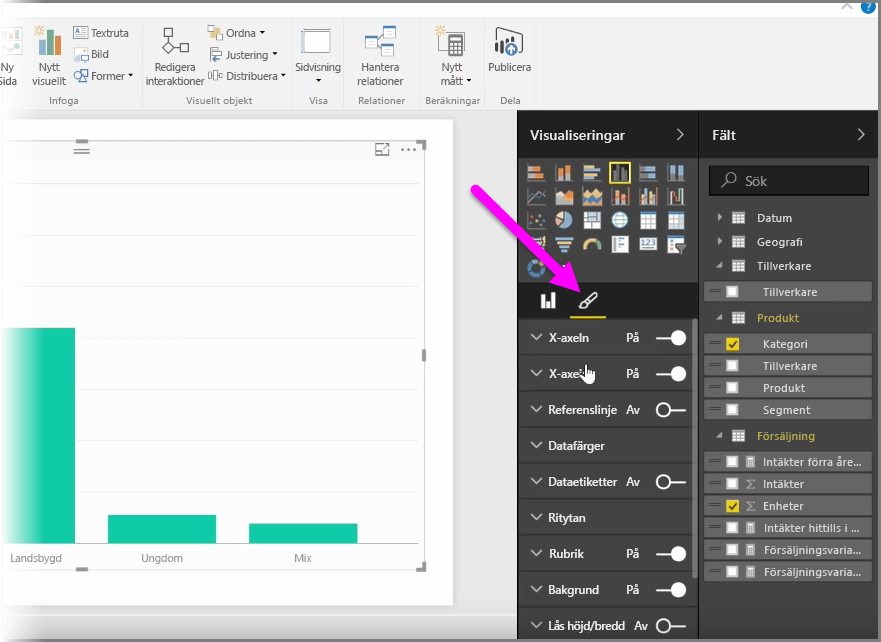
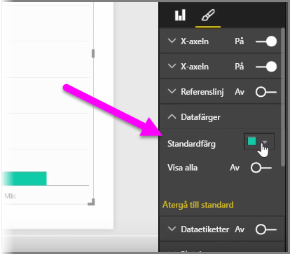
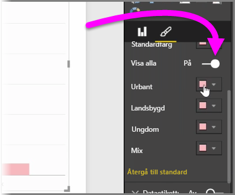
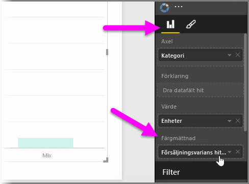
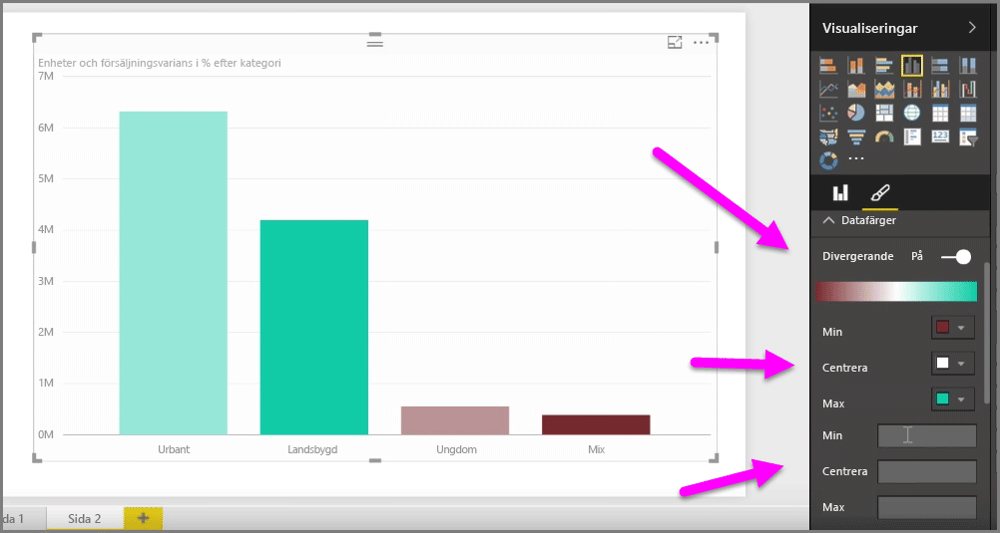
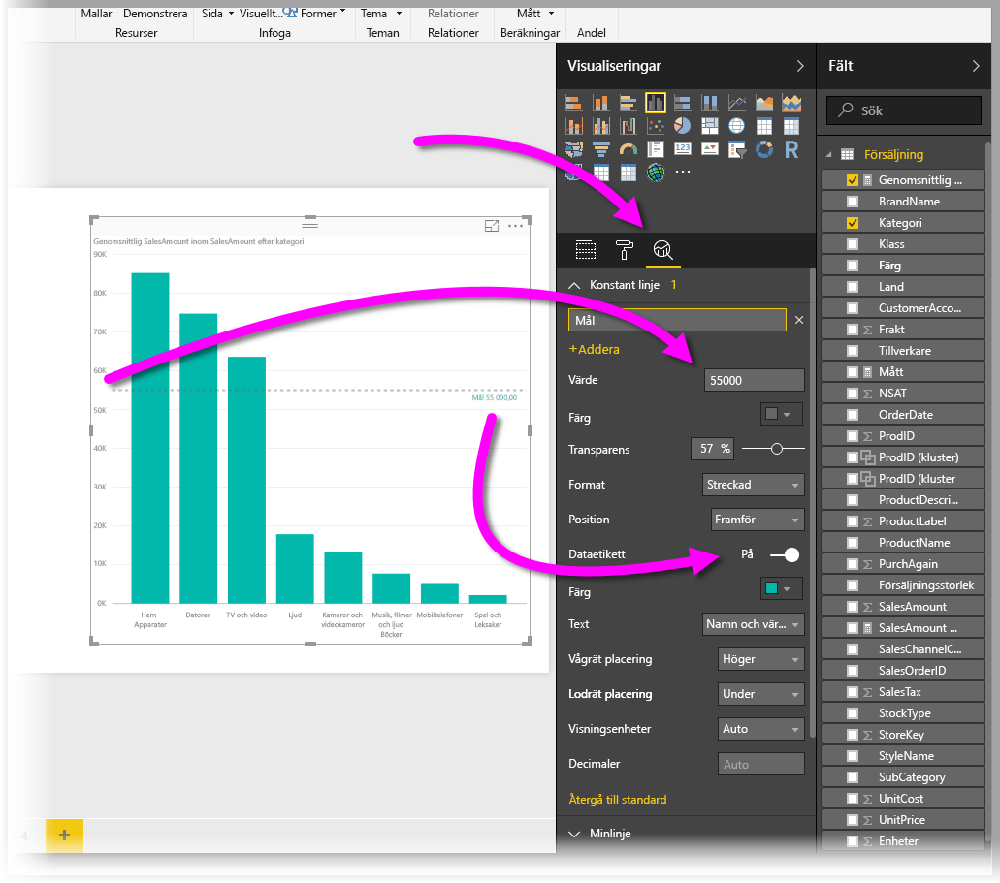
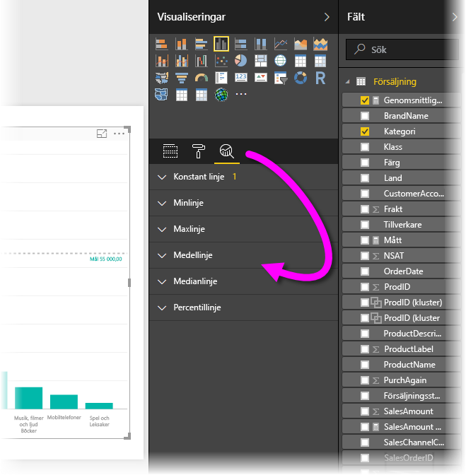

Kanske händer det ofta att du vill ändra de färger som används i diagram och visuella objekt. Power BI ger dig massor av kontroll över hur färgerna visas. Kom igång genom att markera ett visuellt objekt i fönstret **Visualiseringar** och sedan klicka på **penseln**.

Det finns många alternativ för att ändra det visuella objektets färger eller formatering. Du kan ändra färg på alla staplar i ett visuellt objekt genom att markera färgväljaren intill **standardfärgen** och sedan välja den färg du önskar.

Du kan också ändra färg på varje enskild stapel (eller andra element, beroende på vilken typ av visuellt objekt du har valt) genom att förflytta skjutreglaget **Visa alla**. När du gör det visas en färgväljare för varje element.

Du kan också ändra färgen utifrån ett värde eller ett mått. Det gör du genom att dra ett fält till bucketen **Färgmättnad** i fönstret Visualiseringar (observera att det är tillgängligt i avsnittet **fältkälla**, inte i avsnittet **pensel**).

Du kan dessutom ändra skalan och vilka färger som ska används när du fyller dataelement med färger. Du kan också välja en avvikande skala med hjälp av skjutreglaget Divergerande, med vilket du kan förskjuta färgskalan mellan tre färger. Och du kan också ange *Minimum*, *Normalt* och *Maximum* för de värden som visas i diagrammet.

Du kan också använda dessa värden för att skapa regler. Du kan t.ex. ställa in värden över noll för en viss färg och värden under noll för en annan färg.

Med ett annat användbart färgverktyg kan du ställa en *konstant linje*, som ibland även kallas *referenslinje*. Du kan ange den konstanta linjens värde och färg, och du kan även ange att den ska innehålla en etikett. Om du vill skapa en konstant linje (och andra intressanta linjer) väljer du fönstret **Analys** (det ser ut som ett förstoringsglas) och expandera sedan avsnittet **Referenslinje**.

Det finns många andra linjer som du kan skapa för ett visuellt objekt, och som också finns i fönstret **Analys**, t.ex. Min, Max, Medel, Median och Percentil.

Till sist ska du kan skapa en kantlinje runt en enskild visualisering, och liksom fallet är med andra kontroller, så kan du även ange kantlinjens färg.

