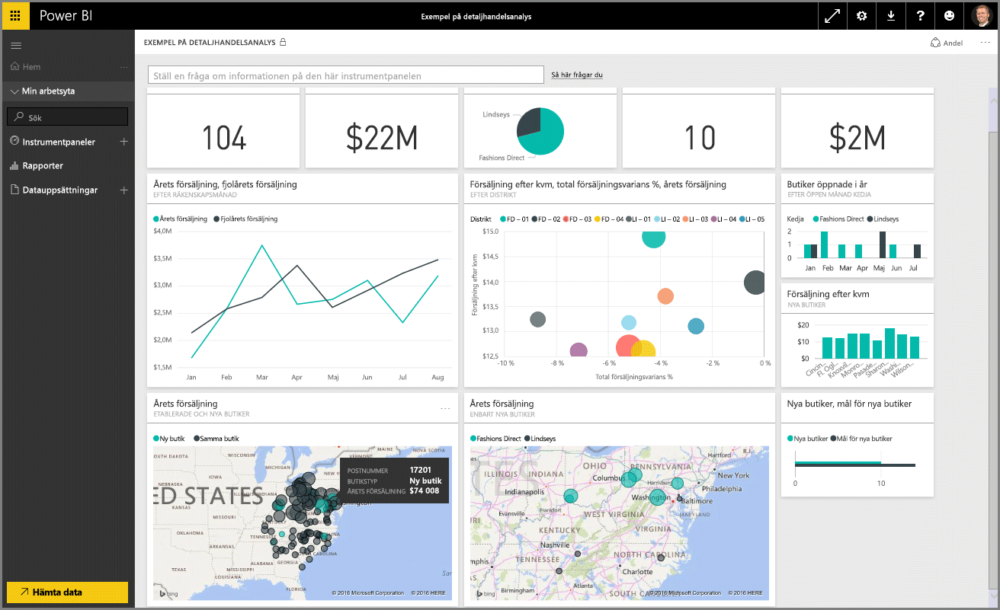
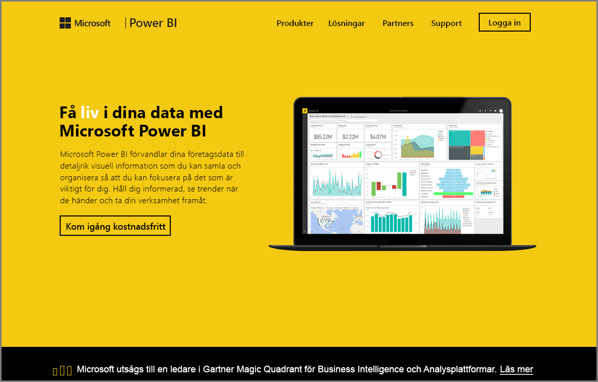

Välkommen till avsnittet **Utforska data** i den **interaktiva utbildningen** för Power BI. Nu när du har bekantat dig med Power BI Desktop och hur du hämtar och visualiserar data är du redo att utforska data i Power BI-tjänsten.

Det finns en mängd olika saker att lära dig i det här avsnittet och det är här som interaktionen och delningen som är styrkan hos Power BI verkligen framträder. Gör dig redo för ett intressant och spännande avsnitt.

## Introduktion till Power BI-tjänsten
*Se vad Power BI-tjänsten kan göra för din organisation*

Power BI-tjänsten är en naturlig förlängning av **Power BI Desktop** och dess funktioner inkluderar att ladda upp rapporter, skapa instrumentpaneler och ställa frågor om dina data med hjälp av naturligt språk. Du kan använda tjänsten för att ange tider för uppdatering av data, dela data med din organisation och skapa anpassade servicepaket.

I följande avsnitt kommer vi utforska Power BI-tjänsten och visa hur den kan omvandla dina business intelligence-data till datainsikter och en samarbetsfokuserad beslutsmiljö.

