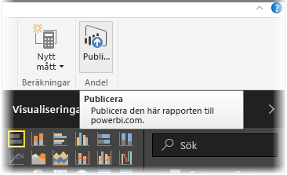
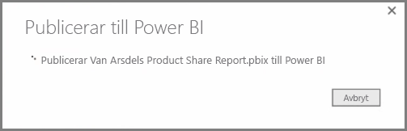
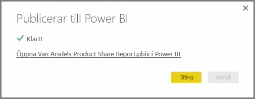
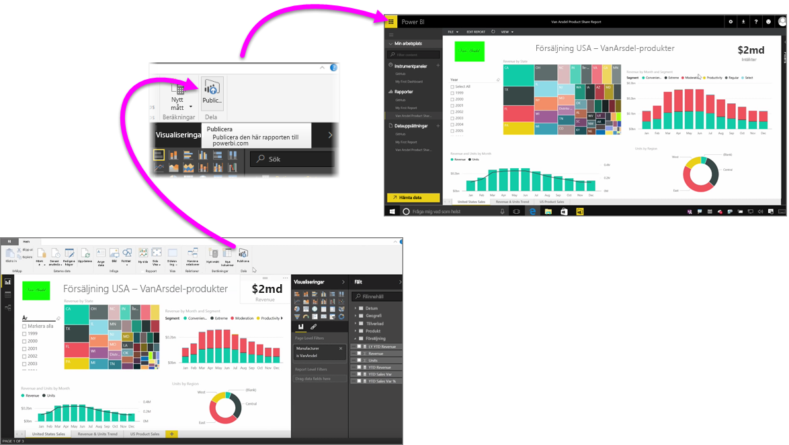

Det går snabbt och enkelt att publicera dina rapporter till Power BI-tjänsten.

När du har slutfört rapporten i **Power BI Desktop** är det bara att välja knappen **publicera** på fliken **Start** i Power BI Desktop så påbörjas processen.

Rapporten och data, inklusive grafik, frågor och anpassade mått är packade tillsammans och har överförts till Power BI-tjänsten.

> [!NOTE]
> Det är vanligt att referera till Power BI Desktop-rapporter som **.pbix** filer, vilket är tillägget de får i Windows.
> 

När överföringen är klar, anger en dialogruta att publiceringsprocessen lyckades och en länk har visas i dialogrutan som leder dig direkt till rapporten i Power BI-tjänsten i en webbläsare.

Så enkelt är det att Publicera rapporter från Power BI Desktop till Power BI-tjänsten.

