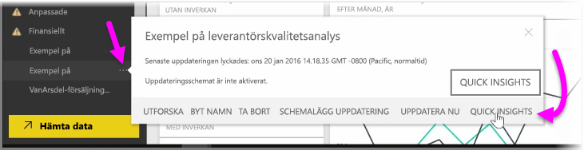
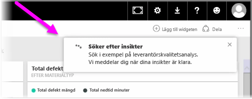
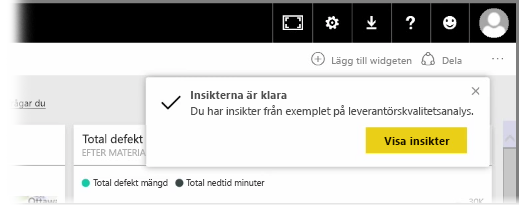
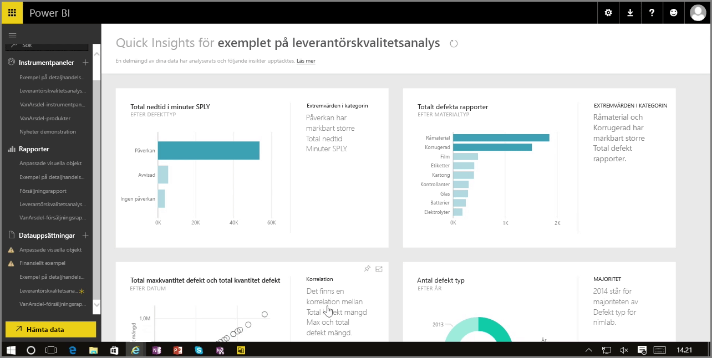

När du arbetar med en instrumentpanel, en rapport eller en datauppsättning i Power BI-tjänsten kan Power BI leta efter snabba insikter i dina data. I Power BI går du till avsnittet **Datauppsättningar** i det vänstra fönstret och väljer *ellipsen* (tre punkter) bredvid den datauppsättning som du är intresserad av. En meny med alternativ visas och längst till höger ser du alternativet **Snabba insikter**.

När du väljer Snabba insikter utför Power BI viss maskininlärning, söker igenom datan och analyserar den sedan för att hitta snabba insikter. Ett meddelande visas längst upp till höger i tjänsten om att Power BI arbetar med att söka efter insikter.

Efter cirka femton sekunder ändras meddelandet och visar att Power BI hittade några insikter.

När du väljer knappen **Visa insikter** i meddelandet visas en sida med visuella objekt för de insikter som Power BI hittade, ungefär som i nedanstående bild. Det finns flera insikter och du kan bläddra nedåt på sidan för att se och fundera över dem.

Precis som i andra visuella objekt kan du interagera med objekten på sidan Snabba insikter. Du kan även fästa något av dem på en instrumentpanel eller ytterligare filtrera ett eller flera av dem för att söka efter fler insikter.

Med **Snabba insikter** kan du låta Power BI upptäcka extremvärden och trender i dina data och sedan använda dessa upptäckter i dina instrumentpaneler för att ytterligare förfina eller filtrera dem till de insikter som är viktigast för dig.

