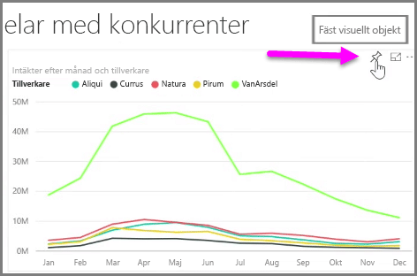
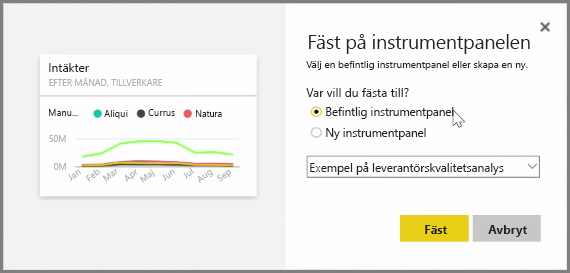
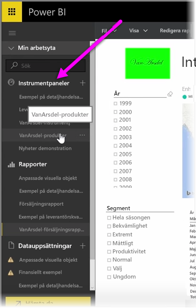
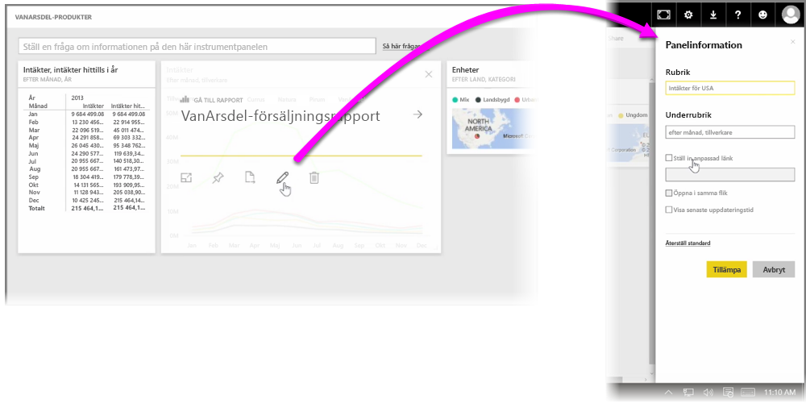

**Instrumentpaneler** i Power BI är sidor med samlingar av visualiseringar som har skapats i Power BI-tjänsten. Du kan skapa instrumentpaneler genom att **fästa** visualiseringar från rapporter som du har skapat och publicerat med hjälp av Power BI Desktop, eller visualiseringar som du har skapat i Power BI-tjänsten. Att **fästa** ett visuellt objekt på en instrumentpanel påminner mycket om att fästa en bild på väggen, så att andra kan se den. Om du vill fästa ett visuellt objekt, så öppna dess rapport i Power BI-tjänsten. Hovra över det visuella objekt som du vill fästa och välj **fästikonen**.

En dialogruta visas där du väljer en målinstrumentpanel för det visuella objektet från den nedrullningsbara menyn, eller så kan du skapa en ny instrumentpanel. Du kan också få en förhandsvy av hur det fästa visuella objektet kommer att se ut på instrumentpanelen. Du kan fästa visualiseringar från flera rapporter och sidor på en enda instrumentpanel, vilket innebär att du kan kombinera olika datauppsättningar och källor på en gemensam sida med insikter.

På **Instrumentpaneler** kan du lägga till alla slags visualiseringar, t.ex. diagram, kartor, bilder och former, genom att fästa dem. När ett visuellt objekt väl har fästs på en instrumentpanel kallas det för en **panel**.

Dina instrumentpaneler, inklusive eventuella nya, visas i instrumentpanelsavsnittet på vänster sida i Power BI-tjänsten. Välj en instrumentpanel från listan så att du kan visa den.

Du kan ändra de visuella objektens layout på en instrumentpanel precis som du vill. Du ändrar storlek på en panel genom att dra dess handtag in eller ut. Om du vill flytta en panel klickar du på den och drar den till en annan plats på instrumentpanelen. Hovra över en panel och öppna **Panelinformation** genom att klicka på **pennikonen**. Där kan du ändra **rubrik** och **underrubrik**.

Klicka på en instrumentpanel om du vill visa den rapport den kommer från. På så sätt kan du snabbt visa det visuella objektets underliggande data. Du kan också ändra länken med hjälp av fältet **Ange anpassad länk** i **Panelinformation**.

Du kan fästa paneler från en instrumentpanel på en annan, om du t.ex. har en samling med instrumentpaneler och vill skapa en sammanfattande instrumentpanel. Processen är densamma: hovra över ikonen och välj **fästikonen**. Instrumentpaneler är enkla att skapa och ändra. Och du kan anpassa dem så att din ensidesinstrumentpanel visar exakt det den ska.

