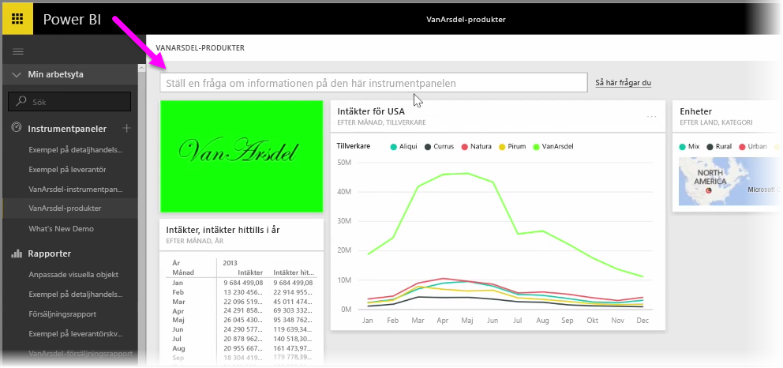
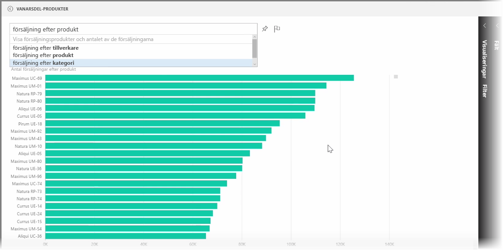
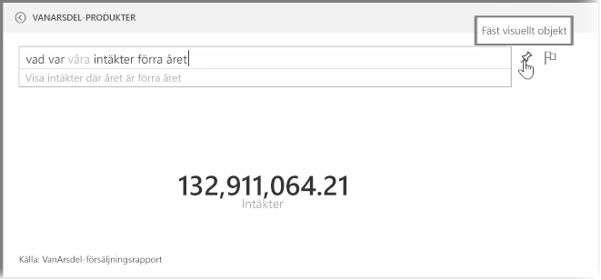
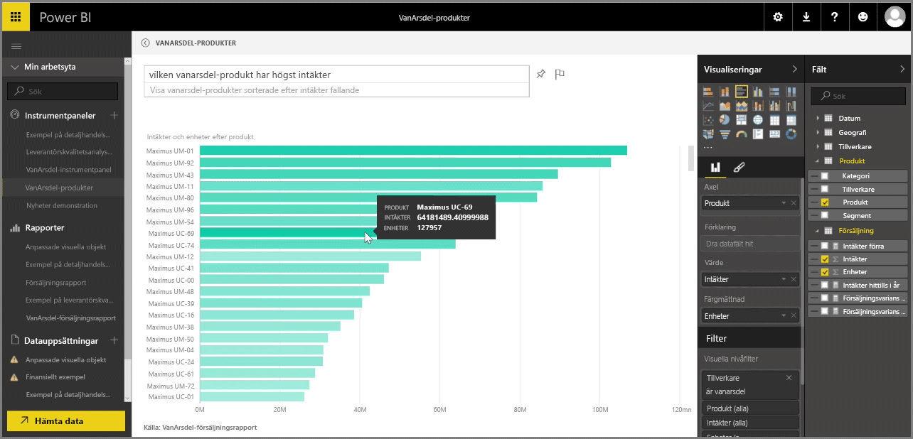

Power BI levereras med ett kraftfullt verktyg för taligenkänning där du ställa frågor om dina data med vanliga meningar och frågor. Så utöver att skapa rapporter och visualiseringar med Power BI, kan du skapa tabeller och diagram genom att ställa enkla frågor.

Öppna en instrumentpanel i Power BI om du vill ställa en fråga för dina data. Längst upp på skärmen ser du en textruta där du kan ställa frågor om data som visas. Den här funktionen är kallas ibland *frågor och svar*, eller oftare kallas den bara **Q&A** (questions and answers).

Om du klickar på rutan visar Power BI uppmaningar med vissa föreslagna villkor baserat på dina data, till exempel ”intäkter hittills i år”. Du kan klicka på en föreslagen term och se resultatet, som ofta visas som en enkel tabell eller ett kort. När du väljer en av de föreslagna fraserna skapar Power BI automatiskt en visualisering baserat på ditt val i realtid.

Du kan även ställa frågor med naturligt språk, till exempel ”Vad var våra intäkter i fjol?” eller ”Vilken produkt sålde mest i mars 2014?”. Power BI visar dess tolkning av din fråga och väljer den bästa typen av visualisering för att representera svaret. Precis som alla andra visualiseringar i Power BI kan du **fästa** den till instrumentpanelen du väljer genom att välja ikonen **Fäst**.

Du kan när som helst redigera visualiseringen som skapas av en fråga eller mening med naturligt språk. Använd fönstren **Visualiseringar** och **Fält** på höger sida av skärmen. Precis som med alla andra visualiseringar i Power BI kan du ändra layouten, justera filter och ändra fältets data.

Om du vill spara visualiseringen på en instrumentpanel när du har skapat den perfekta visualiseringen väljer du ikoner **Fäst** bredvid textrutan.

