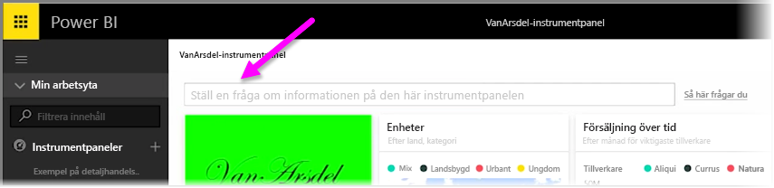
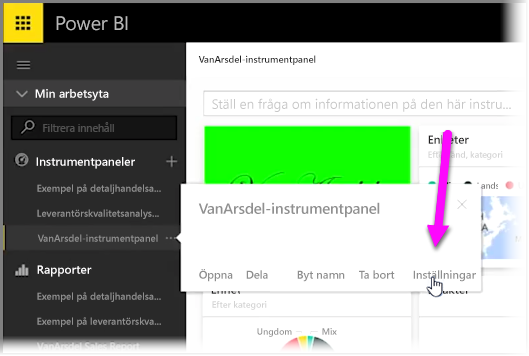
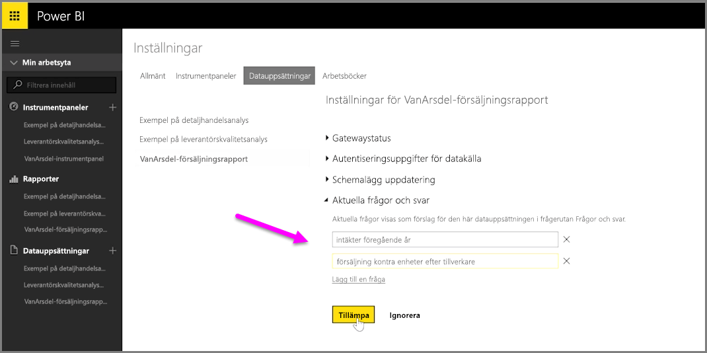

Med Power BI kan du lägga till egna föreslagna frågor för andra användare som använder rutan för frågor med naturligt språk i en instrumentpanel, det vill säga **Q&A**-rutan. Frågeförslagen är vad användarna ser när de klickar på textrutan längst upp i en instrumentpanel.

Om du vill lägga till egna frågor, väljer du ellipsen (tre punkter...) bredvid namnet på den instrumentpanel du vill använda och därefter **Inställningar** på menyn.

 Då öppnas sidan **inställningar** för instrumentpanelen och underliggande datauppsättningar eller arbetsböcker. Du kan inaktivera sökrutan helt från **Instrumentpanelerna** på sidan **Inställningar**, men vi vill lägga till frågor, så vi väljer området **Datauppsättningar**.

I området **Datauppsättningar** visas alla datauppsättningar som är kopplade till instrumentpanelen. Välj sedan datamängden som är associerad med din instrumentpanel i listan, välj **aktuella frågor**och välj länken **Lägga till en fråga**. Ange din fråga eller uppmaning i inmatningsrutan och välj **Verkställ**.

När någon därefter klickar på sökrutan på den valda instrumentpanelen visas de föreslagna posterna överst i listan och de kan se ett svar om de väljer den frågan. Detta är ett bra sätt att vänja instrumentpanelanvändare vid att tänka på vilken typ av data som är tillgänglig och hur de bäst kan använda den.

